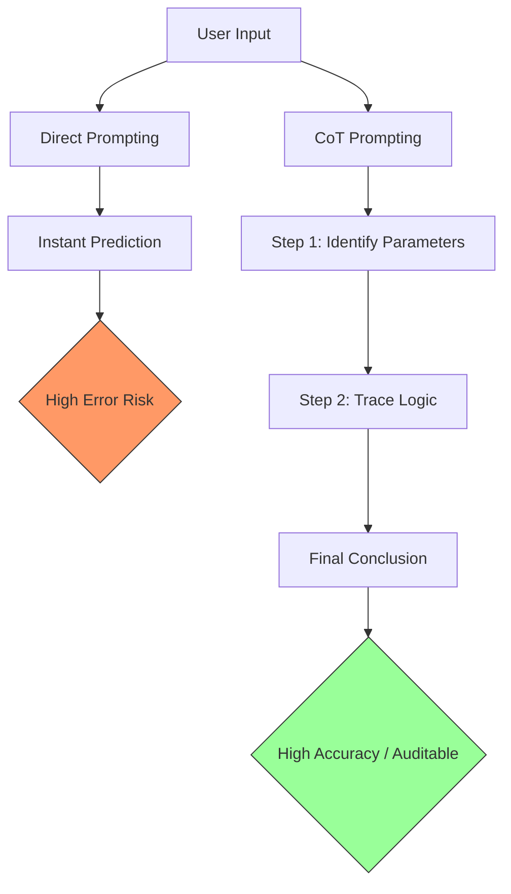

# Chain-of-thought (CoT) prompting

> A prompt engineering technique that directs AI models to generate intermediate reasoning steps, improving accuracy in multi-step logical tasks

---

## The logic of intermediate steps

Standard large language model (LLM) interactions often fail when applied to multi-step logical problems because the model attempts to predict the final answer in a single pass. Chain-of-thought (CoT) prompting shifts this behavior, forcing the model to articulate its internal logic as a series of sequential steps. 

By exposing these intermediate calculations, CoT reduces "hallucinations." It acts as a structural safeguard, ensuring the system verifies its own logic before committing to a final token. For developers and information architects, this turns the "black box" of AI generation into an auditable trail, making it easier to identify exactly where a logical failure occurs.

---

## Why auditability matters

Accuracy is the baseline for a functional developer experience (DX). If an AI-assisted tool generates invalid code or broken error message architecture, it creates more work than it saves. CoT prompting provides a "reasoning trace" that serves two purposes:
1. **Accuracy:** It slows the model down, allowing it to allocate more compute (tokens) to the reasoning process.
2. **Verification:** It allows a "human in the loop" to audit the model’s path. If the conclusion is wrong, the reviewer can see whether the error stemmed from a misunderstanding of the prompt or a breakdown in logic.

---

## Core principles

CoT prompting relies on three primary mechanics:

*   **Task Deconstruction:** Explicitly requiring the model to split a compound problem into distinct, manageable subtasks.
*   **State Tracking:** Using each step of reasoning to provide the context for the next, ensuring the final output is grounded in the previous deductions.
*   **Prompt Activation:** Triggering this behavior via zero-shot instructions (e.g., "Think through this step-by-step") or few-shot examples that demonstrate the specific reasoning style required.

---

## Design pattern implementation

The following diagram demonstrates how CoT restructures the path from input to output:



To implement this, move away from open-ended queries toward structured, sequential instructions:

=== "Before: Direct Prompting"
    ```text
    [ User Prompt ]
    Analyze this code snippet and tell me if the API endpoint supports pagination.
    
    [ Model Output ]
    Yes, it does.
    ```

=== "After: Chain-of-Thought (CoT) Prompting"
    ```text
    [ User Prompt ]
    Analyze this code snippet by following these steps: 
    1. Identify parameters related to limits, offsets, or cursors. 
    2. Explain how those parameters interact with the data payload. 
    3. Determine if the endpoint supports pagination based on those findings.
    
    [ Model Output ]
    1. **Parameter identification:** The code utilizes `pageSize` and `startingAfter`.
    2. **Payload analysis:** `pageSize` defines the record limit per request, while `startingAfter` serves as a cursor for the next set of results.
    3. **Conclusion:** Yes, the API supports cursor-based pagination.
    ```

---

## Best practices and anti-patterns

### Effective Application
*   **Use Imperative Verbs:** Structure instructions with clear actions: "Extract," "Verify," "Calculate," then "Conclude."
*   **Isolate the Answer:** To make outputs programmatically useful, instruct the model to wrap its final answer in a specific format (e.g., JSON or a separate Markdown header) after the reasoning block.
*   **Model Scaling:** CoT is most effective on larger models (e.g., GPT-4, Claude 3.5 Sonnet). Smaller models may "hallucinate" the reasoning itself.

### Pitfalls to Avoid
*   **Over-Reasoning Simple Tasks:** Do not force a chain of thought for binary or trivial questions (e.g., "What is the current year?"). This adds unnecessary latency and token cost.
*   **The "Silent" Thought Trap:** Avoid telling the model to "think" without instructing it to *write* those thoughts down. Most models cannot effectively utilize "hidden" reasoning; the logic must be part of the text stream to influence the final tokens.
*   **Unformatted Streams:** Without instructions to use lists or headers, the reasoning chain can become a "wall of text" that is difficult for users to scan.