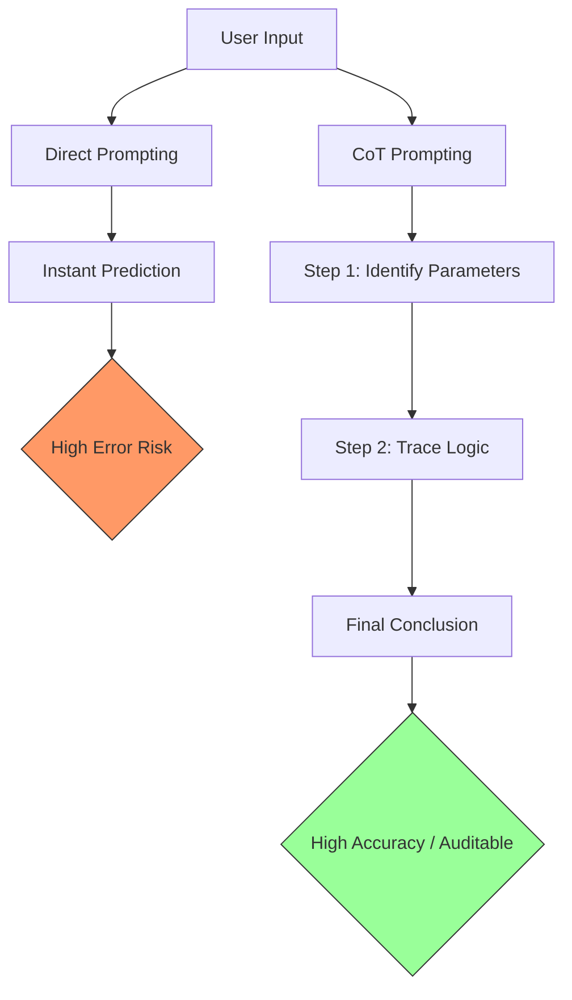

# Chain-of-thought (CoT) prompting

> An AI prompt engineering pattern that directs models to output their logical reasoning steps before delivering a final answer

---

## What is CoT prompting?

In technical communication, interacting with artificial intelligence (AI) requires precise and structured instructions. A raw large language model (LLM) is trained to predict the most likely next word in a sequence. While this approach works well for simple tasks, it often fails when applied to multi-step logical problems. To address this, prompt engineering provides patterns to structure your inputs. One of the most effective patterns is chain-of-thought (CoT) prompting, which mimics how people break a complex task into manageable steps.

From an information design perspective, CoT prompting acts as a structure for machine reasoning. Instead of treating the generation process as an invisible transition from input to output, it applies structured writing principles directly to the model's logic. This approach reduces hallucinations—where the model generates false data—by forcing the system to calculate intermediate steps before committing to a final answer.

---

## Why it matters

In software development, providing an excellent developer experience (DX) is essential. When you build a knowledge base or integrate AI-assisted features into a product, output accuracy is critical. Without CoT prompting, models might rush to conclusions on complex data, which harms the user experience (UX). If your automated systems rely on direct model outputs without a reasoning trace, users may encounter errors, such as broken error message architecture or invalid code snippets.

CoT prompting also assists human reviewers who edit AI outputs. By exposing the reasoning chain, a human in the loop can easily audit and verify the logical path. This transparency builds user trust. If documentation and API tools ignore these patterns, product teams may face higher support costs and documentation lag.

---

## Core principles and anatomy

CoT prompting relies on a step-by-step framework. The pattern uses the following characteristics:

- **Deconstruction:** The prompt instructs the model to break a compound task into distinct, sequential subtasks.
- **Exposition of reasoning:** The model articulates its logic in text before writing the final output, establishing a clear path from input to output.
- **Self-correction:** By generating a step-by-step trace, the model uses its own reasoning to guide subsequent steps, which limits logical errors.
- **Explicit instruction or examples:** You can activate the pattern through zero-shot instructions (such as "think step-by-step") or through few-shot examples that demonstrate the desired reasoning path.

---

## Design pattern example

This diagram illustrates how CoT prompting restructures the path from user input to final output compared to standard, direct prompting:



You can implement this transformation by moving from a direct prompt style to a structured, sequential prompt style:

=== "Before: Direct Prompting"
    ```text
    [ User Prompt ]
    Analyze this code snippet and tell me if the API endpoint supports pagination.
    
    [ Model Output ]
    Yes, it does.
    ```

=== "After: Chain-of-Thought (CoT) Prompting"
    ```text
    [ User Prompt ]
    Analyze this code snippet. 
    1. Identify any parameters related to limits, offsets, or cursors. 
    2. Explain how those parameters affect the data payload. 
    3. Conclude whether the API endpoint supports pagination and justify your answer based on your analysis.
    
    [ Model Output ]
    1. Parameter identification: The code contains parameters `pageSize` and `startingAfter`.
    2. Payload analysis: `pageSize` limits the total records in the JSON response, while `startingAfter` acts as a cursor for sequential page retrieval.
    3. Conclusion: Yes, the API endpoint supports cursor-based pagination.
    ```

### Breakdown of the pattern

- **Explicit sequencing:** The prompt directs the model to perform tasks in a specific order, preventing it from jumping to a conclusion.
- **Intermediate state tracking:** Each logical step provides context for the next step, creating a path of token dependencies.

---

## Cognitive impact and user experience

CoT prompting improves how users interact with and evaluate automated systems:

- **Reduced cognitive load:** By presenting steps logically, the reviewer doesn't have to guess how the model arrived at an answer.
- **Improved trust:** Users can verify the steps of a complex calculation or system design, increasing confidence in the accuracy of the system.
- **Error isolation:** When a failure occurs, you can identify exactly where the logic failed, making debugging easier.

---

## Implementation best practices

To apply this pattern effectively in your content and design, follow these rules:

- **Use direct verbs:** Use clear, imperative verbs such as "identify," "explain," and "conclude" to structure your instructions.
- **Include reasoning examples:** Provide the model with one or two examples that show both the reasoning path and the final output format.
- **Request a standard output structure:** Instruct the model to use Markdown headers or numbered lists for its reasoning steps to make the output easy to scan.
- **Isolate final answers:** Ask the model to place its final conclusion or code block in a separate section at the end of its response.

---

## Common anti-patterns

Avoid these mistakes when implementing CoT prompting:

- **The reasoning dump:** Forcing the model to show complex reasoning for simple, binary questions (such as "Is the server running?"), which increases latency.
- **The hidden reasoning trap:** Instructing the model to "think" without writing it down. Most models cannot process intermediate states effectively without generating text.
- **Unstructured output:** Allowing the model to output an unformatted wall of text, which makes the documentation difficult to read.

---

## How to validate and test usability

Verify that your prompting pattern works for your users with these strategies:

- **Manual output audits:** Compare model outputs from standard prompts against CoT prompts across several test cases to verify accuracy.
- **Task testing:** Have engineers use the generated outputs to complete a task. Measure if the reasoning steps helped them debug errors faster.