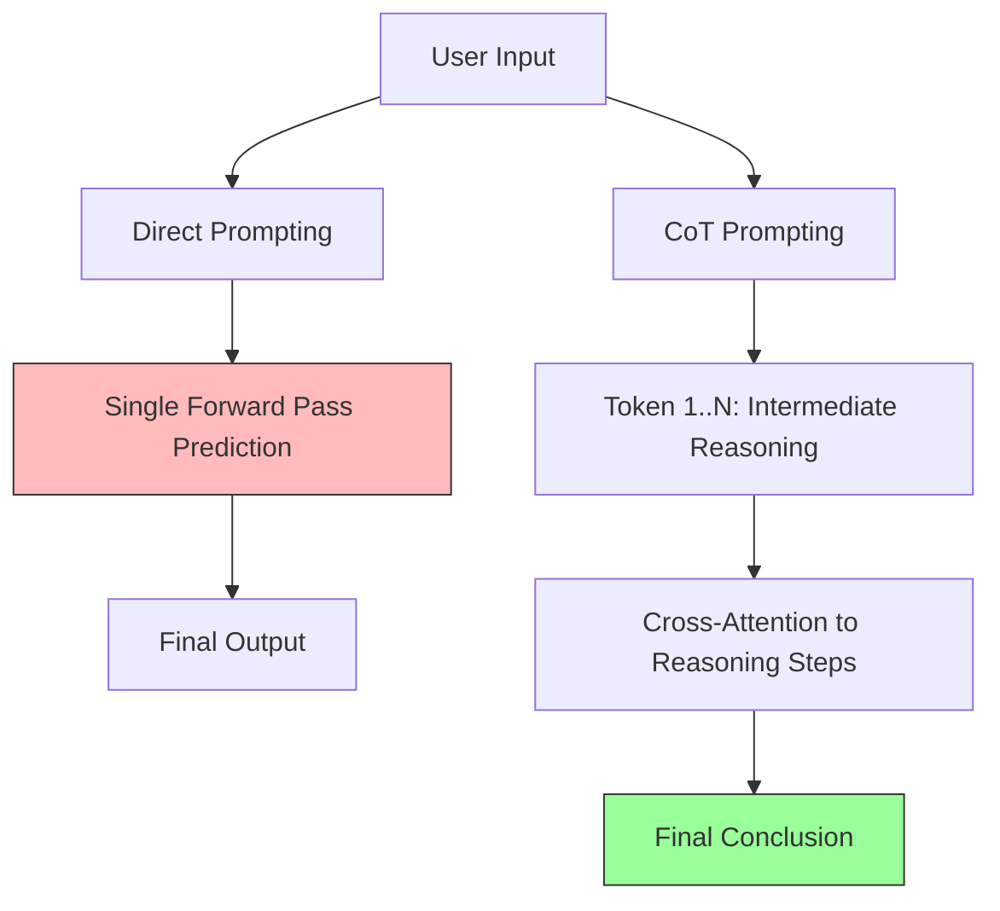

# Chain-of-thought (CoT) prompting

> *A prompt engineering technique that directs AI models to generate intermediate reasoning steps, improving accuracy in multi-step logical tasks*

---

## The logic of intermediate steps

Standard large language model (LLM) interactions often fail when applied to multi-step logical problems because the transformer architecture is limited by the computation performed during a single forward pass. Without intermediate steps, the model must map a complex input to a final answer in a fixed number of layers. 

Chain-of-thought (CoT) prompting shifts this behavior by allowing the model to decompose the problem into a sequence of tokens that serve as external working memory. By generating these intermediate calculations, the model can attend to its own prior reasoning in the context window. 

This reduces logical hallucinations and ensures that the final token prediction is conditioned on a valid sequence of deductions rather than just the initial prompt. For developers, this provides a reasoning trace, transforming a probabilistic output into an auditable sequence.

---

## Why auditability matters

Accuracy is the baseline for a functional developer experience (DX). If an AI-assisted tool generates invalid code or broken architecture, it creates technical debt. Chain-of-thought prompting provides a reasoning trace that serves two purposes:

1.  **Computation Expansion:** It allows the model to allocate more total compute (floating-point operations per second or FLOPs) to a problem by generating more tokens. Each new token generated is a serial computation step that informs the next.
2.  **Verification:** It allows human review to audit the path of the model. If the conclusion is incorrect, the reviewer can pinpoint whether the error occurred during the initial decomposition (input parsing) or during a specific step of the logical derivation.

---

## Core principles

Chain-of-thought prompting relies on three primary mechanics:

-   **Task Deconstruction:** Forcing the model to break a compound problem into discrete, sequential sub-problems.
-   **Recursive Context:** Using the output of Step $N$ as the grounded context for Step $N+1$, ensuring the final answer is a mathematical consequence of the preceding tokens.
-   **Prompt Activation:** Triggering this behavior via Zero-Shot CoT (for example, adding "Let us think step by step") or Few-Shot CoT, where the model is provided with examples of problems and their corresponding reasoning chains.

---

## Design pattern implementation

The following diagram demonstrates how CoT restructures the path from input to output:



To implement this, move away from open-ended queries toward structured, sequential instructions:

=== "Before: Direct Prompting"
    ```text
    [ User Prompt ]
    Analyze this code snippet and tell me if the application programming interface (API) endpoint supports pagination.
    
    [ Model Output ]
    Yes, it does.
    ```

=== "After: Chain-of-Thought (CoT) Prompting"
    ```text
    [ User Prompt ]
    Analyze this code snippet by following these steps: 
    1. Identify parameters related to limits, offsets, or cursors. 
    2. Explain how those parameters interact with the data payload. 
    3. Determine if the endpoint supports pagination based on those findings.
    
    [ Model Output ]
    1. Parameter identification: The code utilizes `pageSize` and `startingAfter`.
    2. Payload analysis: `pageSize` defines the record limit per request, while `startingAfter` serves as a cursor for the next set of results.
    3. Conclusion: Yes, the API supports cursor-based pagination.
    ```

---

## Best practices and anti-patterns

### Effective Application

-   **Instructional Directives:** Use imperative verbs to define the reasoning structure: Identify, Verify, and Calculate before Conclude.
-   **Delimiter usage:** Instruct the model to separate reasoning from the final answer (for example, using Extensible Markup Language (XML) tags such as `<reasoning>` or JavaScript Object Notation (JSON) keys) to allow for programmatic extraction of the result without the unnecessary information of the thought process.
-   **Model Suitability:** CoT is most effective on models with high parameter counts. While smaller models (such as Llama 3 8B) can perform CoT, they are more susceptible to logical drift, where an error in an early reasoning step cascades into a confidently wrong conclusion.

### Pitfalls to Avoid

-   **The Silent Thought Trap:** For standard autoregressive models (GPT-4o, Claude 3.5), thoughts must be output as tokens to influence the final result. Note: This differs from reasoning models (such as OpenAI o1), which use a hidden, internal chain of thought before outputting the first visible token.
-   **Token Overhead:** Do not use CoT for low-complexity or high-throughput tasks. Generating reasoning steps increases latency and costs (input and output tokens).
-   **Unconstrained Reasoning:** Without a structured format, the model may diverge into irrelevant tangents. Use a numbered list or specific headers to keep the reasoning path relevant to the objective.