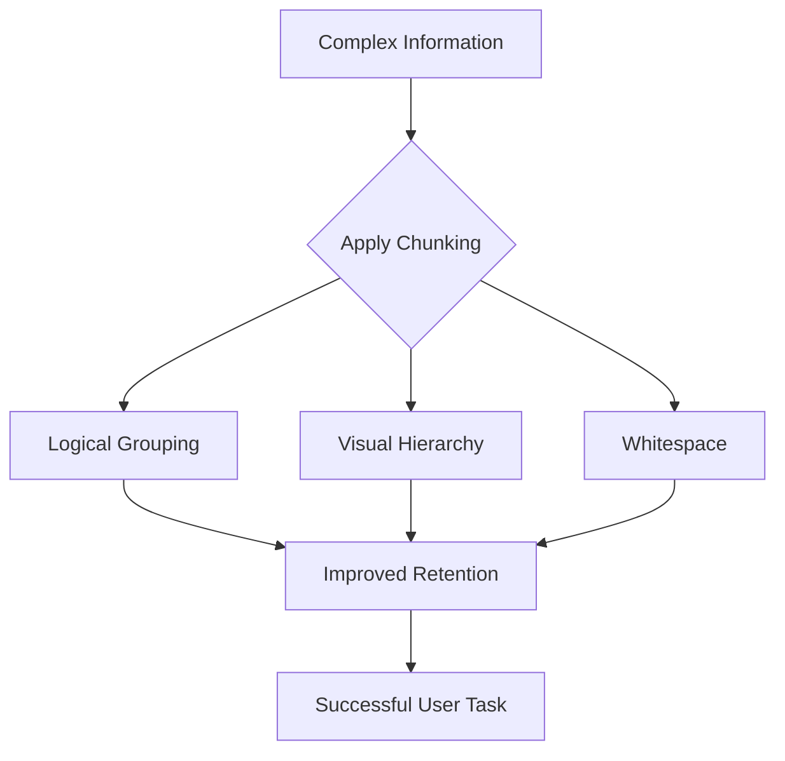

# Chunking

> A content organization strategy that breaks complex information into small, logical units to improve scannability and reduce user cognitive load

---

## The mechanics of information processing

Chunking groups related information into manageable packages. It acknowledges a fundamental constraint of human psychology: working memory is a bottleneck. When documentation presents long, unstructured blocks of text, it exceeds a reader's mental processing limit. By dividing data into logical segments, you align the content with how the brain naturally absorbs information.

In technical communication, this creates a bridge between dense engineering specifications and human comprehension. Effective chunking uses paragraphs, lists, and tables to establish a visual hierarchy, transforming "walls of text" into accessible, functional documentation.

---

## Why structure dictates usability

Technical documentation is rarely read cover-to-cover. Instead, users scan for immediate solutions. Without clear breaks, readers encounter a cognitive barrier that makes finding answers difficult. This friction leads to hesitation and, eventually, document abandonment.

Strategic chunking reduces this mental effort. A structured layout guides the eye from one concept to the next, significantly increasing readability. For product teams, this isn't just about aesthetics—well-organized documentation accelerates troubleshooting, drives product adoption, and directly reduces the volume of support tickets.

---

## Core anatomy of a chunk

Effective chunking relies on four key characteristics:

*   **Logical grouping:** Each unit should focus on a single task, concept, or step. If a section covers two different functions, split it.
*   **Visual hierarchy:** Use H2 and H3 headings to signal the importance of information. This creates a map for the scanning eye.
*   **Whitespace:** Don't fear empty space. Strategic gaps between paragraphs, lists, and code blocks provide the "breathing room" necessary for the eye to rest.
*   **Brevity:** Keep paragraphs focused. Aim for five sentences or fewer, ensuring every line supports the central topic of that specific block.

---

## Pattern transformation

The following example demonstrates how restructuring a dense paragraph into a scannable format improves utility.

### Before / Poor Pattern

To configure the integration, you must first verify that your API key is active. Once verified, open the config.json file in your project directory. Inside this file, look for the "auth" object. You need to insert your key into the "token" field. Ensure you do not commit this raw key to your repository. After pasting the key, save the file and restart your local server by running the command 'npm run dev' in your terminal window. If you see a green success message, the authentication process was successful. If an error occurs, verify your network settings and confirm that you copied the key correctly from the developer console.

### After / Applied Pattern

#### Step 1: Configure the local auth settings

Before starting, confirm that your API key is active in the developer console.

1. Open your project's `config.json` file.
2. Locate the `auth` object.
3. Paste your API key into the `token` field.

!!! warning "Keep your keys secure"
    Never commit plaintext API keys to public code repositories.

4. Save the file.
5. Restart your local server: `npm run dev`.

---

## Implementation best practices

To refine your technical communication, apply these standards:

*   **Convert lists to bullet points:** If a sentence contains three or more items separated by commas, move them into a vertical list.
*   **Audit paragraph length:** If a paragraph introduces a second concept, it’s time to split it.
*   **Use the active voice:** Direct, action-oriented sentences keep content blocks concise and reduce fluff.
*   **Avoid "Over-chunking":** Breaking text into too many single-sentence blocks can feel disjointed and interrupt the logical flow.
*   **Beware of visual-only chunking:** Subheadings are useless if the underlying ideas aren't actually grouped by logic.

---

## Validating usability

The most effective way to test a chunking strategy is the **5-second squint test**. Look at the document and squint until the text becomes a blur. If you can no longer distinguish where one section ends and another begins, you need more whitespace or stronger headings. 

Additionally, watch a user attempt a task using your documentation. If they hesitate, reread paragraphs multiple times, or miss warnings buried in the text, your information chunks are likely too large or poorly defined.