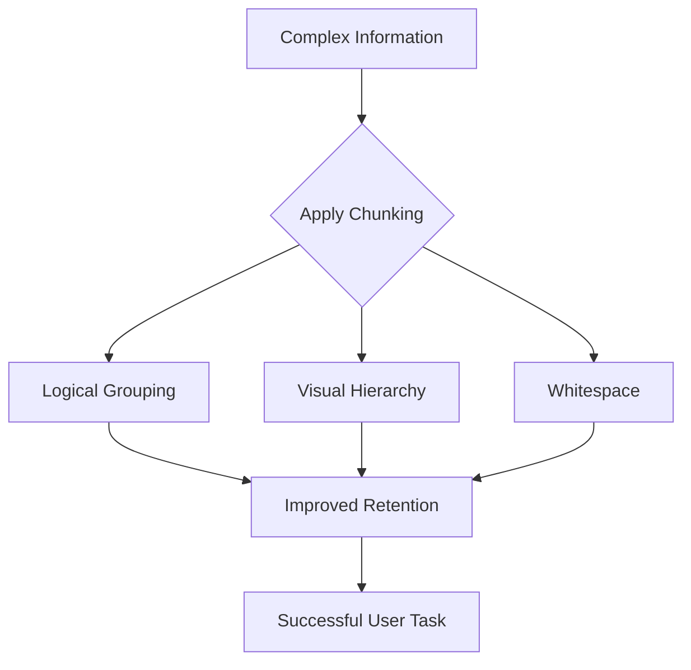

# Chunking

> The method of breaking complex information into small, distinct units to improve how users process, understand, and remember technical content

---

## What is chunking?

Chunking is a method of organizing content by grouping related information into manageable packages. It is based on cognitive psychology, which suggests that human working memory can only hold a limited amount of information at once. When you present users with long, unstructured blocks of text, you exceed their mental processing limits. By chunking data, you divide it into logical pieces that the brain can process more easily.

In technical writing, chunking connects complex technical systems to human comprehension. It helps you structure paragraphs, lists, and tables to establish a clear visual hierarchy. Applying this pattern transforms dense engineering specifications into accessible documentation that aligns with natural reading patterns.

---

## Why it matters

Users rarely read technical documentation from beginning to end. Instead, they scan the page to find solutions to immediate problems. Without chunking, readers encounter a "wall of text" that makes finding answers difficult. This lack of structure increases hesitation and makes content harder to find, often leading users to abandon the document.

Chunking your content reduces the reader's mental effort. A structured layout guides the reader's eye from one concept to the next, which improves readability. For product teams and software engineers, well-chunked documentation ensures that users can solve issues quickly. This improves the user experience, helps product adoption, and reduces support tickets.

---

## Core principles and anatomy

Effective chunking uses a consistent framework to organize information. Use these four characteristics:

- **Logical grouping:** Group information by functional relationships. Ensure each unit focuses on a single task, concept, or step.
- **Visual hierarchy:** Use clear headings (H2, H3), subheadings, and distinct margins to separate each chunk.
- **Whitespace:** Use whitespace between paragraphs, lists, and code blocks to give the reader's eyes a resting point.
- **Brevity and focus:** Keep paragraphs short—typically under five sentences. Ensure every sentence supports the primary topic of that chunk.

---

## Design pattern example

The following example shows how to transform a poorly formatted paragraph into a scannable format.

### [ Before / Poor Pattern ]

To configure the integration, you must first verify that your API key is active. Once verified, open the config.json file in your project directory. Inside this file, look for the "auth" object. You need to insert your key into the "token" field. Ensure you do not commit this raw key to your repository. After pasting the key, save the file and restart your local server by running the command 'npm run dev' in your terminal window. If you see a green success message, the authentication process was successful. If an error occurs, verify your network settings and confirm that you copied the key correctly from the developer console.

### [ After / Applied Pattern ]

#### Step 1: Configure the local auth settings

Before starting, confirm that your API key is active in the developer console.

To configure your local authentication settings:

1. Open your project's `config.json` file.
2. Locate the `auth` object.
3. Paste your API key into the `token` field.

!!! warning "Keep your keys secure"
    Never commit your plaintext API keys to public code repositories.

4. Save the file.
5. Restart your local server by running `npm run dev`.

### Breakdown of the pattern

- **Numbered lists:** Using a numbered list instead of prose makes the sequence of actions clear.
- **Visual callouts:** Placing a security warning inside a dedicated box ensures the reader notices critical safety information.
- **Short intro sentence:** A brief introductory line prepares the reader for the task without unnecessary fluff.

---

## Cognitive impact and user experience

Chunking influences user behavior by targeting specific cognitive goals:

- **Enhanced scannability:** Users can jump to a specific step or code block because headings and lists make the structure visible.
- **Better retention:** Presenting information in isolated steps allows the reader to process one concept before moving to the next.

---

## Implementation best practices

To implement chunking in your technical communication, follow these rules:

- **Limit paragraph length:** Keep paragraphs to a maximum of four sentences. If a paragraph introduces a new concept, split it.
- **Convert lists to bullet points:** If a sentence contains items separated by commas, convert it into a vertical bulleted list.
- **Use standard heading levels:** Maintain a logical hierarchy (H1 for page titles, H2 for main concepts, H3 for subtasks).
- **Write in the active voice:** Use direct, action-oriented sentences. Active verbs keep content blocks concise.

---

## Common anti-patterns

Avoid these mistakes when organizing content:

- **Over-chunking:** Breaking text into blocks that are too small—such as consecutive single-sentence paragraphs. This breaks the logical flow and confuses the reader.
- **Visual-only chunking:** Adding subheadings without restructuring the underlying ideas into logical units.

---

## How to validate and test usability

Evaluate your chunking strategy using these methods:

- **The 5-second squint test:** Look at your document and squint until the text is blurry. If you cannot identify where sections start and stop, you need more whitespace and hierarchy.
- **Usability testing:** Observe a user from your target audience as they perform a task. Note if they hesitate, reread paragraphs, or miss warnings buried in the text.