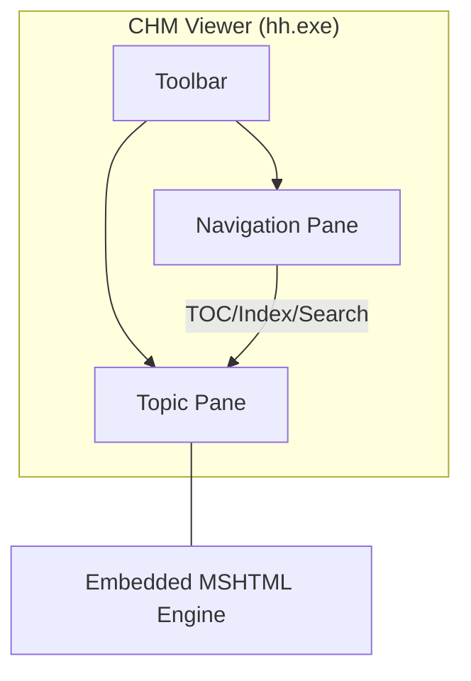

# Compiled HTML Help (CHM)

> *A proprietary Microsoft format that packages HTML content, navigation data, and indexing into a single, searchable binary file for offline documentation*

---

## What is CHM?

Microsoft introduced Compiled HTML Help (CHM) alongside Windows 98 as the successor to the WinHelp format. It functions as a container (using ITS storage technology), bundling multiple source files, such as HTML, CSS, images, and specialized navigation data, into one .chm binary. For decades, it served as the standard for distributing help content with Windows desktop applications.

While modern systems generally favor web-based documentation or static site generators (SSGs), CHM remains relevant in closed-network environments and legacy enterprise software. Its primary advantages are its self-contained nature and the ability to run natively on Windows without an active internet connection.

---

## Why CHM persists

CHM is most frequently encountered when maintaining legacy software or migrating archival documentation. The strength of the format lies in its performance; it condenses hundreds of individual files into a high-speed binary package. 

Technical writers benefit from a pre-built user interface that includes a search engine, hierarchical table of contents (TOC), and index lookups. Furthermore, context-sensitive help allows developers to link software dialog boxes directly to specific help topics using numeric IDs.

However, the format introduces specific operational challenges:

- **Security restrictions:** Windows security updates, specifically the Mark of the Web, often block CHM files accessed via network shares or those downloaded from the web. This results in **Navigation Canceled** errors.
- **Version control friction:** .chm files are compiled binaries and do not support code diffs. This makes it difficult to track changes within the binary itself. Teams must version the source files instead in a version control system (VCS).

??? note "Legacy window layout"
    The classic Compiled HTML Help interface uses a tripane layout:
    1. **Navigation Pane:** Houses the TOC, index, and search functionality.
    2. **Topic Pane:** Renders the HTML page using the `shdocvw.dll` library (the MSHTML/Internet Explorer engine).
    3. **Toolbar:** Provides standard controls such as Home, Back, and Print.



---

## Syntax and structure

As a compiled format, CHM relies on plain-text configuration files to guide the compiler.

- **HTML Help Project (.hhp):** The primary configuration file (INI format). It defines window attributes, default pages, and includes references to other project files.
- **Table of Contents (.hhc):** An HTML-style file using sitemap `<OBJECT>` tags to build the hierarchical tree in the navigation pane.
- **Index (.hhk):** A companion to the .hhc that maps keyword search terms to specific HTML files.
- **Map/Header File (.h):** A C-style header file that maps symbolic names (for example, `IDH_WELCOME`) to numeric Context IDs.
- **Compiler (hhc.exe):** The command-line engine within the Microsoft HTML Help Workshop that generates the final package.

---

## Code example

The .hhp file acts as the project controller, using an INI-style syntax to manage compiler settings and source lists. To support context-sensitive help, the `[MAP]` and `[ALIAS]` sections must be defined.

```ini
[OPTIONS]
Compatibility=1.1 or later
Compiled file=sample.chm
Contents file=sample.hhc
Default Window=main
Default topic=welcome.htm
Index file=sample.hhk
Language=0x409 English (United States)
Title=User Guide

[WINDOWS]
main="User Guide","sample.hhc","sample.hhk","welcome.htm","welcome.htm",,,,,0x63520,,0x387e,,,,,,,,0

[FILES]
welcome.htm
getting-started.htm

[ALIAS]
IDH_WELCOME=welcome.htm
IDH_GETTING_STARTED=getting-started.htm

[MAP]
#include sample.h
```

### Breakdown of keys

- **Compiled file:** Defines the output name for the binary.
- **Default topic:** Determines which page displays automatically upon opening the file.
- **`[WINDOWS]`:** Controls UI behavior and toolbar visibility via hexadecimal bitmasks (for example, `0x63520` defines which tabs and buttons appear).
- **`[ALIAS]`:** Maps the symbolic IDs used in the code to the specific HTML file paths within the CHM.
- **`[MAP]`:** Includes the header file that assigns numeric values to the symbolic IDs.

---

## Common pitfalls

### Navigation to the webpage was canceled

This typically occurs when Windows applies the Mark of the Web attribute to a file downloaded from an untrusted zone.

**Resolution:** Right-click the .chm file, select **Properties**, and then select **Unblock**. In managed environments, CHM files should be installed to the local hard drive (for example, `%ProgramFiles%`) to avoid security zone restrictions associated with network drives.

### Broken context-sensitive links

If a software UI calls a context ID but the viewer displays **Topic Not Found**, there is likely a mismatch between the application calls and the CHM mapping.

**Resolution:** Ensure that the numeric values in the developer resource file match the .h header and that the .hhp includes the `[MAP]` and `[ALIAS]` sections.

---

## Tooling and ecosystem

- **Parsers:** While `hh.exe` is the Windows default, cross-platform users can access content via `KChmViewer` or `GnoCHM`.
- **Automation:** The `hhc.exe` compiler is unique because it returns an exit code of 1 for success and 0 for failure. This is the inverse of standard command-line interface (CLI) conventions, where 0 typically indicates success. Build scripts must be configured to interpret a return code of 1 as a successful compilation.

---

## Best practices

- **Keep binaries out of VCS:** Commit only the raw source files (.hhp, .hhc, .htm, etc.). Storing the compiled .chm in a version control system leads to repository bloat and merge conflicts.
- **Path Consistency:** While the CHM internal file system is case-insensitive, use lowercase paths for all source files to ensure compatibility with modern web-based build tools that may process the same source files.
- **Design for Accessibility:** The legacy MSHTML engine has limited support for modern Accessible Rich Internet Applications (ARIA) attributes. Use simple, semantic HTML and ensure high-contrast CSS is tested within the viewer.
- **Integrate with CI/CD:** Call `hhc.exe` within your continuous integration and continuous delivery (CI/CD) pipeline. Since `hhc.exe` does not output to `stderr` on failure, you must parse the compilation log file to identify missing files or broken links.