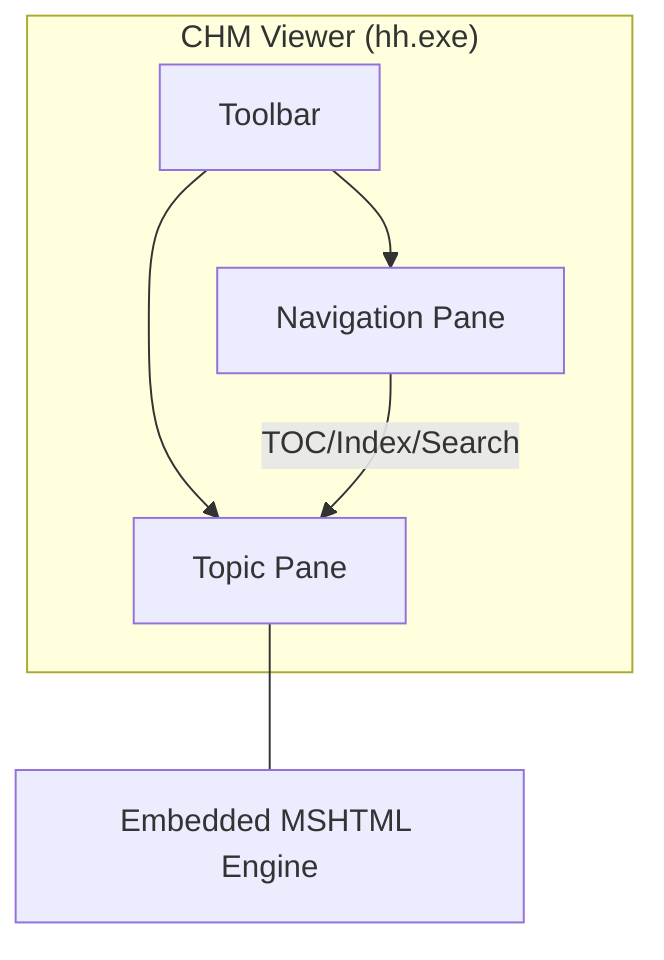

# Compiled HTML Help (CHM)

> A legacy Microsoft format that compresses HTML, CSS, and navigation files into a single searchable binary deliverable

---

## What is CHM?

Microsoft released Compiled HTML Help (CHM) in 1997 with Windows 98 to replace the WinHelp format. It is a proprietary format that groups multiple source files—typically HTML files, Cascading Style Sheets (CSS), images, and specialized navigation files—into a single file with a `.chm` extension. For decades, technical communicators used CHM files to distribute help content alongside Windows desktop applications.

Although CHM is a classic desktop-centric deliverable, it is now a legacy format. Modern web-based documentation and static site generators (SSGs) have largely replaced it for cloud-native systems. However, legacy software suites, internal enterprise applications, and closed-network environments still use CHM files because they are self-contained, fast, and run natively on Windows without an internet connection.

---

## Why CHM is used

Understanding the CHM format is necessary when you maintain legacy software or migrate older documentation to modern formats. It combines hundreds of text files into a single, high-performance binary package. For technical writers, CHM introduced a unified user interface (UI) with a built-in search engine, hierarchical navigation, and index lookups. It also simplified context-sensitive help through numeric map files linked to software dialog boxes.

If you misconfigure CHM standards in systems that require them, you might encounter operational issues. For example, Windows security updates block CHM files downloaded from the web or accessed via network shares, which results in empty content panes. From a development perspective, CHM files do not work well with version control systems (VCS) because they are compiled binaries. You cannot perform code diffs on a `.chm` file, which can lead to broken references if changes are compiled without verification.

??? note "Select to expand legacy window details"
    The classic tripane window layout of Compiled HTML Help consists of three main elements:
    1. **The Navigation Pane:** Contains the table of contents, index, and search tabs.
    2. **The Topic Pane:** Displays the rendered HTML page using an embedded Internet Explorer (MSHTML) engine.
    3. **The Toolbar:** Provides buttons such as Home, Back, Print, and Options.



---

## Syntax and structure

Because CHM is a compiled binary, its structure is defined within the text-based source files provided to the compiler. These configuration and navigation files define how the compiler processes metadata and structures the interface.

*   **HTML Help Project (.hhp) file:** The primary plain-text configuration file that defines compile-time variables, window attributes, default pages, and file maps.
*   **HTML Help Table of Contents (.hhc) file:** An HTML-based structure using nested `<OBJECT>` tags to map the hierarchical tree in the navigation pane.
*   **HTML Help Index (.hhk) file:** A companion file that uses `<OBJECT>` tags to list keyword search terms and pair them with target HTML files.
*   **Context Map (.h) file:** A header file that maps application context IDs (numeric constants) to specific HTML file paths to enable context-sensitive help.
*   **Compiler (hhc.exe):** The command-line engine included in the Microsoft HTML Help Workshop that packages the project files.

---

## Code example

The main controller of a CHM project is the `.hhp` file. It uses an INI-style structure to establish compiler options and identify source files.

```ini
[OPTIONS]
Compatibility=1.1 or later
Compiled file=sample.chm
Contents file=sample.hhc
Default Window=main
Default topic=welcome.htm
Index file=sample.hhk
Language=0x409 English (United States)
Title=User Guide

[WINDOWS]
main="User Guide","sample.hhc","sample.hhk","welcome.htm","welcome.htm",,,,,0x63520,,0x387e,,,,,,,,0

[FILES]
welcome.htm
getting-started.htm
troubleshooting.htm
```

### How to read this example

- **`Compiled file=sample.chm`:** Directs the compiler to name the final binary `sample.chm`.
- **`Default topic=welcome.htm`:** Sets the HTML file that appears when the user opens the CHM file.
- **`[WINDOWS]` line:** Configures the behavior, toolbar buttons, and size of the tripane window using hexadecimal values. For example, `0x63520` controls which navigation tabs are visible.
- **`[FILES]` block:** Lists the relative paths of the content files that the compiler must package.

---

## Common pitfalls and errors

Working with legacy compiler systems often produces build and display errors. Below are the common issues found in CHM files.

### "Navigation to the webpage was canceled"

- **Cause:** This occurs when a user opens a CHM file from a network drive or after downloading it. Windows applies the "Mark of the Web" (MotW) attribute to block remote script execution for security.
- **Resolution:** If you download the file, right-click the `.chm` file, select **Properties**, select the **Unblock** check box, and then select **OK**. For enterprise distribution, install the CHM on the local hard drive (such as the `Program Files` directory) instead of running it from a server.

### Broken context-sensitive links

- **Cause:** The developer calls a context ID from the software UI, but the help viewer displays a "Page cannot be displayed" error. This is caused by a mismatch between the map file definitions in the `.hhp` project and the resource IDs in the application code.
- **Resolution:** Verify that your developer’s resource file and your `.h` header file match. Ensure you have mapped the correct IDs in the `[MAP]` and `[ALIAS]` sections of your `.hhp` file before you compile.

---

## Tooling and ecosystem

The tools for compiling and reading CHM files have remained largely unchanged, but several utilities help manage them in modern pipelines.

- **Parsers and engines:** The Microsoft HTML Help Viewer (`hh.exe`) is built into Windows. Linux users can read CHM files using tools such as `KChmViewer` or `GnoCHM`.
- **Linters and validators:** The Microsoft HTML Help Workshop compiler outputs error logs during builds. Note that `hhc.exe` returns a return code of `1` for success and `0` for failure, which is the opposite of most modern CLI tools. You can write scripts to parse these `.log` files to flag missing files.

---

## Best practices

To maintain stable and secure CHM build pipelines, follow these practices:

1.  **Use a version control system (VCS):** Do not commit the compiled `.chm` binary to your active development branches. Store the raw configuration files (`.hhp`, `.hhc`, `.hhk`) and source HTML documents so your team can track changes and avoid binary merge conflicts.
2.  **Use lowercase relative file paths:** The CHM compiler is case-sensitive regarding paths. If an HTML file is named `Troubleshooting.htm` but referenced as `troubleshooting.htm` in the `.hhc` map, the compiler might build the file, but the links will fail in the viewer. Use lowercase for all file and folder names.
3.  **Design for accessibility:** The HTML Help Viewer uses a legacy rendering engine, and modern assistive technologies might struggle with the navigation pane. Use standard semantic tags in your source HTML files so that screen readers can parse the topic pane.
4.  **Integrate builds into CI/CD pipelines:** You can run the legacy compiler in automated environments. Use a script to call `hhc.exe` silently, capture the output, and fail the build if the compiler flags missing documents.