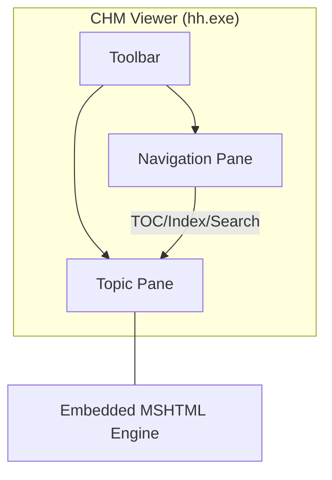

# Compiled HTML Help (CHM)

> A proprietary Microsoft format that packages HTML content, navigation data, and indexing into a single, searchable binary file for offline documentation

---

## What is CHM?

Microsoft introduced Compiled HTML Help (CHM) alongside Windows 98 as the successor to the WinHelp format. It functions as a container, bundling multiple source files—including HTML, CSS, images, and specialized navigation data—into a single `.chm` binary. For decades, it served as the standard for distributing help content with Windows desktop applications.

While modern cloud-native systems generally favor web-based documentation or static site generators (SSGs), CHM remains relevant in closed-network environments and legacy enterprise software. Its primary advantages are its self-contained nature and the ability to run natively on Windows without an active internet connection.

---

## Why CHM persists

CHM is most frequently encountered when maintaining legacy software or migrating archival documentation. The format's strength lies in its performance; it condenses hundreds of individual files into a high-speed binary package. Technical writers benefit from a pre-built user interface that includes a search engine, hierarchical table of contents, and index lookups. Furthermore, numeric map files allow developers to link software dialog boxes directly to specific help topics for context-sensitive assistance.

However, the format introduces specific operational challenges:
*   **Security restrictions:** Windows security updates often block CHM files accessed via network shares or those downloaded from the web, resulting in empty content panes.
*   **Version control friction:** Because `.chm` files are compiled binaries, they do not support code diffs. This makes it difficult to track changes or identify broken references without re-compiling and manual verification.

??? note "Legacy window layout"
    The classic Compiled HTML Help interface uses a "tripane" layout:
    1. **Navigation Pane:** Houses the table of contents, index, and search functionality.
    2. **Topic Pane:** Renders the HTML page using an embedded MSHTML (Internet Explorer) engine.
    3. **Toolbar:** Provides standard controls like Home, Back, and Print.



---

## Syntax and structure

As a compiled format, CHM relies on plain-text configuration files to guide the compiler. These files dictate how the final binary processes metadata and organizes the user interface.

*   **HTML Help Project (.hhp):** The primary configuration file. it defines window attributes, default pages, and compile-time variables.
*   **Table of Contents (.hhc):** An HTML-based file using nested `<OBJECT>` tags to build the hierarchical tree in the navigation pane.
*   **Index (.hhk):** A companion to the `.hhc` that maps keyword search terms to specific HTML files.
*   **Context Map (.h):** A header file mapping numeric application context IDs to HTML file paths.
*   **Compiler (hhc.exe):** The command-line engine within the Microsoft HTML Help Workshop that generates the final package.

---

## Code example

The `.hhp` file acts as the project controller, using an INI-style syntax to manage compiler settings and source lists.

```ini
[OPTIONS]
Compatibility=1.1 or later
Compiled file=sample.chm
Contents file=sample.hhc
Default Window=main
Default topic=welcome.htm
Index file=sample.hhk
Language=0x409 English (United States)
Title=User Guide

[WINDOWS]
main="User Guide","sample.hhc","sample.hhk","welcome.htm","welcome.htm",,,,,0x63520,,0x387e,,,,,,,,0

[FILES]
welcome.htm
getting-started.htm
troubleshooting.htm
```

### Breakdown of keys

- **`Compiled file`:** Defines the output name for the binary.
- **`Default topic`:** Determines which page displays automatically upon opening the file.
- **`[WINDOWS]`:** Controls UI behavior and toolbar visibility via hexadecimal values (e.g., `0x63520` toggles navigation tabs).
- **`[FILES]`:** Lists every relative path the compiler must include in the package.

---

## Common pitfalls

Legacy systems often trigger build or display errors that require manual intervention.

### "Navigation to the webpage was canceled"
This typically occurs when Windows applies the "Mark of the Web" (MotW) attribute to a file, blocking remote script execution. 
**Resolution:** Right-click the `.chm` file, open **Properties**, and check **Unblock**. To prevent this in production, ensure the file is installed to the local hard drive (e.g., `Program Files`) rather than run from a server.

### Broken context-sensitive links
If a software UI calls a context ID but the viewer displays an error, there is likely a mismatch between the map file and the application's resource IDs.
**Resolution:** Verify that the developer’s resource file matches the `.h` header. Ensure all IDs are correctly mapped in the `[MAP]` and `[ALIAS]` sections of the `.hhp` file before compiling.

---

## Tooling and ecosystem

*   **Parsers:** While `hh.exe` is the Windows default, Linux users can access content via `KChmViewer` or `GnoCHM`.
*   **Automation:** The `hhc.exe` compiler is unique because it returns a code of `1` for success and `0` for failure—the inverse of standard CLI conventions. Scripts must be configured to interpret these logs correctly to flag missing source files.

---

## Best practices

*   **Keep binaries out of VCS:** Commit only the raw source files (`.hhp`, `.hhc`, `.htm`). Storing the compiled `.chm` in version control leads to unnecessary repository bloat and merge conflicts.
*   **Standardize on lowercase paths:** The CHM compiler is case-sensitive. A mismatch between a file named `User-Guide.htm` and a reference to `user-guide.htm` will break links in the viewer.
*   **Design for accessibility:** The legacy rendering engine has limited support for modern screen readers. Use semantic HTML tags to ensure assistive technologies can still parse the topic pane effectively.
*   **Integrate with CI/CD:** Call `hhc.exe` silently within your build pipeline. Use scripts to parse the compiler's output and fail the build if any documents are missing or references are broken.