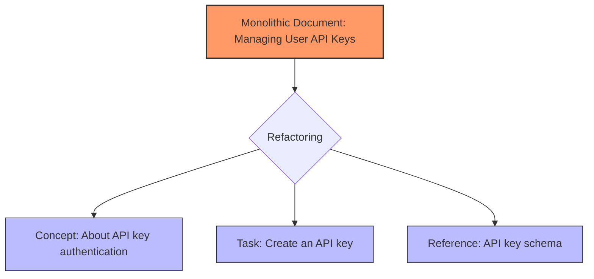

# Concept-Task-Reference (CTR) model

> *A documentation framework that organizes technical content into conceptual, procedural, and factual topics to improve clarity and reduce cognitive load*

---

## What is the CTR model?

The CTR model is an information architecture strategy that classifies content based on its communicative intent. Technical writers can deliver precisely what a user needs at a specific moment by separating information into three distinct categories: what something is (concept), how to perform it (task), and technical specifications (reference). While often associated with the Darwin Information Typing Architecture (DITA), this modular approach is now a standard practice for modern documentation and developer portals.

The framework draws from cognitive psychology and user-centered design (UCD). Complex systems require users to process abstract explanations, sequential instructions, and raw data. Mixing these types into a single, undifferentiated stream forces the reader to filter the content manually. Topic-based authoring eliminates this friction by isolating content types to match natural information-seeking behaviors.

---

## Why it matters

Without a structural model such as CTR, documentation tends to devolve into dense, chronological narratives. A developer seeking a specific API port, for instance, should not have to search through architectural theory and installation prerequisites to find a single value. This lack of structure increases the time required to resolve issues and frustrates users.

The CTR model utilizes progressive disclosure to manage cognitive load. By isolating different information types, you ensure users encounter only the details relevant to their current goal. This separation also benefits machine readability; search engines and internal tools can index a concise how-to page more effectively than a sprawling, multi-purpose guide.

---

## Core principles and anatomy

CTR divides documentation into three archetypes, each governed by its own structural rules:

- **Concept topics:** Provide context and mental models. They define the "what" and "why" of a subject, explaining system architecture, component relationships, and background theory through descriptive prose and diagrams.
- **Task topics:** Provide goal-oriented, step-by-step instructions (the "how"). Following minimalist instruction principles, tasks focus on a single procedure using numbered lists and the imperative mood. For example, use "Enter the command" rather than "The command should be entered."
- **Reference topics:** Provide quick lookups of objective facts (the data). This includes API schemas, configuration properties, and system requirements. Structured layouts such as tables and code blocks are required here to maximize scannability.

---

## Design pattern example

Refactoring a monolithic guide into the CTR model clarifies the path for the user.



The following examples show how these components appear in practice:

=== "Concept File"
    ```markdown
    # About API key authentication
    
    API keys authenticate requests by associating your integration with your account. 
    The gateway validates this unique token on every request to ensure secure data transfer.
    
    !!! danger "Security Warning"
        Treat your API keys as sensitive credentials. Never commit keys to public repositories or share them in unencrypted logs.
    ```

=== "Task File"
    ```markdown
    # Create an API key
    
    This procedure describes how to generate a token to authenticate your API requests.
    
    **Prerequisites**
    
    - An active developer account.
    
    **Steps**
    
    1. Sign in to the **Developer Portal**.
    2. In the sidebar, go to **Settings** > **API Keys**.
    3. Select **Generate New Key**.
    4. Enter a label for the key, and then select **Confirm**.
    5. Copy the generated secret key.
    
    **Next steps**
    
    - Add the key to your application environment variables.
    ```

=== "Reference File"
    ```markdown
    # API key reference schema
    
    The following table defines the response properties for the key generation endpoint.
    
    | Property | Type | Description |
    | :--- | :--- | :--- |
    | `id` | `string` | The public unique identifier for the key. |
    | `secret` | `string` | The private authorization credential token. |
    | `created_at` | `timestamp` | The ISO 8601 date-time string when the key was created. |
    ```

### Structural advantages
- **Contextual isolation:** Readers who already understand the theory can skip directly to the steps or the schema.
- **Actionable instructions:** Task files remain focused on execution, free from distracting additional background information.
- **Scannable data:** Tabular reference data allows for instant fact-finding.

---

## Implementation best practices

Effective CTR implementation requires discipline in the team style guide:

- **One topic, one goal:** Avoid mixing tutorials and deep-dive schemas in one Markdown file. Keep them separate and use cross-links to provide a path for users who need more detail.
- **Purposeful titling:** Use imperative verbs for tasks, such as "Configure the database," and nouns or gerunds for concepts, such as "Database architecture" or "About database configuration."
- **Folder organization:** Reflect the model in your repository structure with directories such as /concepts/, /tasks/, and /reference/.

---

## Common anti-patterns

Avoid these pitfalls during the document development life cycle (DDLC):

- **The mixed-purpose topic:** A single page that starts with a definition, shifts into a tutorial, and concludes with a data table. This format is difficult to scan and maintain.
- **The empty task:** A how-to page that contains only descriptions without actionable steps. If no physical action is required, the content is a concept, not a task.

---

## Validation and usability testing

To ensure your CTR implementation works, use these diagnostic methods:

- **The visual hierarchy test:** Review the page to ensure the hierarchy of the headings clearly indicates whether the page is a list of steps or a data set.
- **Targeted retrieval testing:** Challenge a user to find a specific technical limit or error code. If they must read a narrative tutorial to find it, the reference information is not properly isolated.