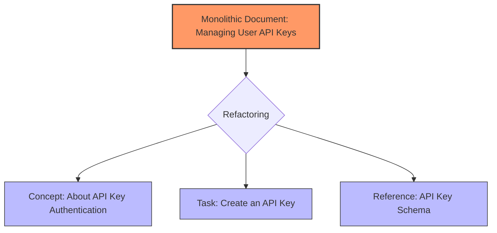

# Concept-Task-Reference (CTR) model

> A structural framework that separates content into distinct conceptual, task, and reference topics

---

## What is the CTR model?

The CTR model is a framework for **information design** and **information architecture (IA)**. It organizes information by separating content based on its communicative intent. This model uses **information typing** to classify content into three distinct categories: what something is (concept), how to do something (task), and technical specifications (reference). While popularized by the **Darwin Information Typing Architecture (DITA)** standard, this separation is a standard strategy for modern documentation and help systems.

This model is based on cognitive psychology and **user-centered design (UCD)**. When users interact with complex systems, they process explanations, instructions, and factual data differently. Mixing these types into a single document forces users to filter the content manually, increasing cognitive load. By using **topic-based authoring** to isolate these content types, the CTR model aligns with how people naturally seek and consume information.

---

## Why it matters

When technical writers, software engineers, and product teams ignore the CTR model, the user experience suffers. Documentation often becomes a "wall of text." For example, a user looking for a specific API port might have to read several paragraphs of architectural theory and multiple installation steps first. This lack of structure makes it difficult to find information and increases the time required to complete a task.

The CTR model applies **cognitive load theory** by reducing unnecessary mental processing. By separating conceptual, task-based, and reference details, you can use **progressive disclosure**. This technique shows users only the information they need at a specific time. For search engines and internal tools, this separation improves indexing. A search for an installation step returns a concise task page instead of a long guide, reducing user frustration.

---

## Core principles and anatomy

The CTR model divides documentation into three archetypes. Each has specific structural rules and goals:

*   **Concept topics (The "Why" and "What"):** These topics provide background, context, and mental models. They explain definitions, system architecture, and component relationships. Use descriptive headings and prose to build understanding.
*   **Task topics (The "How"):** These topics provide step-by-step instructions to help users complete a goal. Focus on a single procedure and use **minimalist instruction** principles. Use numbered lists, action-oriented headings, and **active voice** with the **imperative mood** (for example, "Enter the command" instead of "The command should be entered").
*   **Reference topics (The "What facts"):** These topics provide quick-lookup, objective data. This includes API schemas, command-line flags, configuration properties, and system requirements. Use structured layouts like tables and code blocks to make the content easy to scan.

---

## Design pattern example

The following diagram shows how to refactor a single, long document into the CTR model.



The following example demonstrates how to format these components in your documentation files:

=== "Concept File"
    ```markdown
    # About API Key Authentication
    
    API keys authenticate requests by associating your integration with your account. 
    The gateway validates this unique token on every request to ensure secure data transfer.
    
    !!! danger "Security Warning"
        Treat your API keys as sensitive credentials. Never commit keys to public repositories or share them in unencrypted logs.
    ```

=== "Task File"
    ```markdown
    # Create an API Key
    
    This procedure describes how to generate a token to authenticate your API requests.
    
    **Prerequisites**
    
    *   An active developer account.
    
    **Steps**
    
    1. Sign in to the **Developer Portal**.
    2. In the sidebar, go to **Settings** > **API Keys**.
    3. Select **Generate New Key**.
    4. Enter a label for the key, and then select **Confirm**.
    5. Copy the generated secret key.
    
    **Next steps**
    
    *   Add the key to your application environment variables.
    ```

=== "Reference File"
    ```markdown
    # API Key reference schema
    
    The following table defines the data structure for the key generation endpoint.
    
    | Parameter | Type | Description |
    | :--- | :--- | :--- |
    | `id` | `string` | The public unique identifier for the key. |
    | `secret` | `string` | The private authorization credential token. |
    | `created_at` | `timestamp` | The ISO 8601 date-time string when the key was created. |
    ```

### Breakdown of the pattern

- **Concept separation:** The explanation of what the key is lives on its own page. Readers who already understand API authentication can skip this.
- **Task actionability:** The task file uses clear, numbered steps and action verbs. It contains no background theory.
- **Reference structure:** The reference data is in a table for fast scanning.

---

## Cognitive impact and user experience

This model changes how users interact with your technical resources:

- **Reduced search friction:** Users looking for reference data don't want to read a tutorial. Isolated reference data helps users find answers faster.
- **Improved task completion:** By removing conceptual explanations from tutorials, you help users focus on actions, which prevents errors.

---

## Implementation best practices

Incorporate these rules into your team's **style guide**:

- **One topic, one goal:** A single Markdown file should not contain both a tutorial and a detailed schema table. Keep them in separate files and link them.
- **Write distinct titles:** Use gerunds or action verbs for tasks (for example, "Configuring the database") and nouns for concepts or reference pages (for example, "Database architecture").
- **Establish a folder hierarchy:** Organize your repository using folders like `/concepts/`, `/tasks/`, and `/reference/`.

---

## Common anti-patterns

Avoid these mistakes during the **document development life cycle (DDLC)**:

- **The Frankenstein topic:** This happens when a page starts as a concept, includes a tutorial in the middle, and ends with a reference table. This makes the content hard to scan.
- **The empty task:** This happens when a task topic contains only conceptual descriptions instead of physical actions. If there are no steps for the user to take, the content belongs in a concept topic.

---

## How to validate and test usability

To test your CTR implementation, perform these checks:

- **The heading squint test:** Squint at the page until the text is blurry. You should still be able to identify the hierarchy of the headings.
- **Task-based navigation testing:** Ask a user to find a specific fact, such as an API limit. If they have to read a conceptual tutorial to find it, the reference information is not properly isolated.