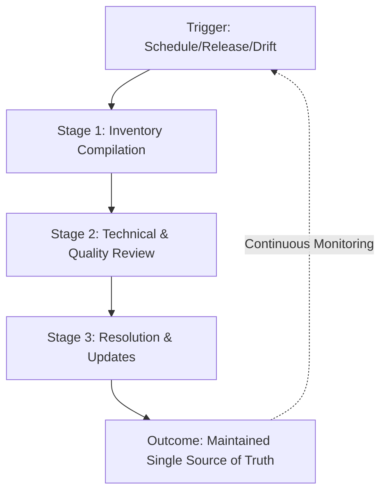

# Content audit

> A systematic evaluation of documentation to identify inaccuracies, eliminate content debt, and ensure help resources align with current product features

---

## Defining the audit process

A content audit systematically catalogs and evaluates documentation to assess its accuracy, completeness, and structural health. It functions as a governance phase within the software development life cycle (SDLC)—occurring during the **Maintenance** phase or as a prerequisite to major product refactoring.

While technical writers typically drive the process, success requires cross-functional input. Product managers, engineers, and QA teams provide the technical verification necessary to align documentation with the actual behavior of the software. The end goal is a clear decision for every page: keep, update, consolidate, or archive.

---

## The cost of content debt

Neglecting documentation leads to "content debt." As UIs change, APIs evolve, and features are deprecated, unmaintained pages become a liability. Stale content misleads users, triggers unnecessary support tickets, and obscures the information users actually need.

A formal audit workflow resolves these issues by:

*   **Refining findability:** Removing duplicate or obsolete pages clarifies the information architecture and improves search indexing.
*   **Enforcing consistency:** Ensuring all articles follow the current style guide, taxonomy, and brand voice.
*   **Lowering support overhead:** Identifying documentation gaps or broken instructions before they turn into repetitive engineering support queries.

Ad hoc reviews rarely achieve these results, as they often overlook deep-linked errors and fragmented user journeys.

---

## Implementation triggers

Adopt a formal audit workflow if your team experiences any of the following:

- **Continuous deployment/Aggressive release cycles:** The delta between the production environment and the documentation grows too large.
- **Contribution sprawl:** Multiple authors from different teams (e.g., Product, Engineering, Marketing) have created a patchwork of inconsistent tones and layouts.
- **Support spikes:** Customer success teams report high volumes of tickets involving broken code samples, incorrect schema definitions, or outdated setup guides.
- **Localization shifts:** The need to audit the source (English) content to ensure accuracy before investing in translation for new locales.

---

## The four-stage workflow

The audit follows a logical path from initial discovery to final resolution.



### 1. Inventory compilation
Catalog your active documentation. If you store docs in a [Git](https://git-scm.com/){: target="_blank" rel="noopener" } repository, use `git ls-files` to ensure you are only auditing tracked files, avoiding local artifacts or ignored directories.

??? note "Automating the inventory stage"
    Run this command in your repository root to generate a list of all tracked Markdown files for your audit tracker:
    
    ```bash
    git ls-files "*.md" > audit-inventory.txt
    ```

### 2. Technical and quality review
Verify each page against your quality standards. Technical writers focus on style and metadata, while subject matter experts (SMEs) validate technical accuracy and code logic.

- [ ] **Technical Accuracy:** Does the content reflect the current state of the UI and API behavior?
- [ ] **Code Validation:** Do the code snippets execute without errors in the current environment?
- [ ] **Link Integrity:** Are internal, external, and deep-linked URLs functional (no 404s)?
- [ ] **Metadata:** Is the front matter (e.g., `revision_date`, `status`, `author`) accurate and complete?
- [ ] **Accessibility:** Does the page use semantic HTML/Markdown (e.g., alt text for images, proper heading levels) to support screen readers?

### 3. Resolution and updates
Assign a specific action to every reviewed page:
*   **Keep:** The content is accurate and requires no changes.
*   **Update:** The page needs a rewrite, technical correction, or UI screenshot refresh.
*   **Consolidate:** Merge the information with a related page to reduce redundancy and improve the user journey.
*   **Archive:** Remove the page and implement a 301 redirect or update the `aliases` in the front matter to prevent broken links.

---

## Team roles (RACI)

Clear ownership prevents the audit from stalling during the review phase.

| Role | Responsibility |
| :--- | :--- |
| **Responsible** | **Technical writers**: Compile the inventory, run automated scans (links/linting), and apply Markdown updates. |
| **Accountable** | **Documentation Lead/Manager**: Defines the scope, sets the deadline, and approves major deletions or structural changes. |
| **Consulted** | **SMEs (Engineers/Product)**: Conduct technical reviews and verify the accuracy of code logic and system behavior. |
| **Informed** | **Support/QA**: Notified of major content removals, structural changes, or new guide paths to align their workflows. |

---

## Automation and pipeline integration

Integrate audit checks into your CI/CD pipeline to catch regression errors between formal audits.

=== "CI/CD link checking"
    Automate link validation on every pull request. If using a tool like `lychee`, ensure it is installed in the runner or use a pre-built action.
    
    ```yaml
    # Example GitHub Actions snippet using Lychee
    - name: Link Checker
      uses: lycheeverify/lychee-action@v1.8.0
      with:
        args: --verbose --no-progress "docs/**/*.md"
    ```

=== "Metadata and Style Linting"
    Use tools like **Vale** or **Markdownlint** to ensure every page contains mandatory front matter and adheres to the style guide.

---

## Managing bottlenecks

*   **Scope Creep:** Trying to audit thousands of pages at once leads to "audit paralysis." **Solution:** Prioritize batches based on page views (analytics), high-churn product areas, or critical "Getting Started" paths.
*   **SME Availability:** Developers often lack the bandwidth for long reviews. **Solution:** Provide "diffs" of changes rather than full articles, or host a "Doc-a-thon" to consolidate review time into a single session.

---

## Success metrics

Track these KPIs to justify the time investment:

- **Ticket Deflection:** A reduction in support queries related to audited documentation categories.
- **Freshness Index:** The percentage of high-traffic pages updated within the last 6–12 months.
- **Search Success Rate:** Improvement in "Search-to-Click" ratios after removing redundant or obsolete content.