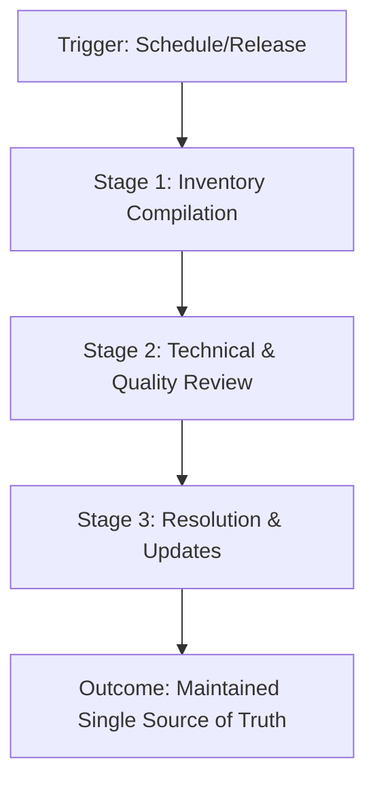

# Content audit

> A systematic evaluation of documentation to identify inaccuracies, eliminate content debt, and ensure help resources align with current product features

---

## Defining the audit process

A content audit systematically catalogs and evaluates documentation to assess its accuracy, completeness, and structural health. Rather than a one-time fix, it functions as a governance phase within the software development life cycle (SDLC)—ideally occurring between major releases or during product refactoring.

While technical writers typically drive the process, success requires cross-functional input. Product managers, engineers, and QA teams provide the technical verification necessary to align documentation with the actual capabilities of the software. The end goal is a clear decision for every page: update, consolidate, archive, or leave as-is.

---

## The cost of content debt

Neglecting documentation leads to "content debt." As UIs evolve and code is deprecated, unmaintained pages become a liability. Stale content misleads users, triggers unnecessary support tickets, and obscures the information users actually need.

A formal audit workflow resolves these issues by:

*   **Refining findability:** Removing duplicate or obsolete pages clarifies the information architecture.
*   **Enforcing consistency:** Ensuring all articles follow the current style guide and brand voice.
*   **Lowering support overhead:** Identifying documentation gaps before they turn into repetitive engineering support queries.

Ad hoc reviews rarely achieve these results, as they often overlook deep-linked errors and fragmented user journeys.

---

## Implementation triggers

Adopt a formal audit workflow if your team experiences any of the following:

- **Aggressive release cycles:** Documentation cannot keep pace with the production environment.
- **Contribution sprawl:** Multiple authors from different teams have created a patchwork of inconsistent tones and layouts.
- **Support spikes:** Customer success teams report high volumes of tickets involving broken code samples or outdated setup guides.
- **Localization shifts:** You need to audit the source English content before spending the budget on translating outdated pages.

---

## The four-stage workflow

The audit follows a linear path from initial discovery to final resolution.



### 1. Inventory compilation
Catalog your active documentation. If you store docs in a [Git](https://git-scm.com/){: target="_blank" rel="noopener" } repository, you can programmatically list file paths rather than manually typing them into a spreadsheet.

??? note "Automating the inventory stage"
    Run this command in your repository to generate a list of Markdown files for your audit tracker:
    
    ```bash
    find docs/ -name "*.md" > audit-inventory.txt
    ```

### 2. Technical and quality review
Verify each page against your quality standards. Technical writers focus on style and metadata, while subject matter experts (SMEs) validate code logic.

- [ ] **Style compliance:** Does the article follow the latest style guide?
- [ ] **Link integrity:** Are internal and external URLs functional?
- [ ] **Metadata:** Is the front matter (e.g., `revision_date`) accurate?
- [ ] **Accessibility:** Does the page structure support screen readers?

### 3. Resolution and updates
Assign a specific action to every reviewed page:
*   **Keep:** The content is accurate and requires no changes.
*   **Update:** The page needs a rewrite or technical correction.
*   **Consolidate:** Merge the information with a related page to reduce redundancy.
*   **Archive:** Remove the page and implement a 301 redirect.

---

## Team roles (RACI)

Clear ownership prevents the audit from stalling during the review phase.

| Role | Responsibility |
| :--- | :--- |
| **Responsible** | **Technical writers**: Compile the inventory, run scans, and apply Markdown updates. |
| **Accountable** | **Documentation Lead**: Defines the scope, sets the schedule, and approves deletions. |
| **Consulted** | **SMEs**: Conduct technical reviews and verify code behavior. |
| **Informed** | **Support/QA**: Notified of major content removals or new guide structures. |

---

## Automation and pipeline integration

Integrate audit checks into your CI/CD pipeline to catch errors before the next formal review.

=== "CI/CD link checking"
    Automate link validation on every pull request to prevent "link rot."
    
    ```yaml
    # Example GitHub Actions snippet
    - name: Run Link Checker
      run: lychee "docs/**/*.md"
    ```

=== "Metadata validation"
    Use linters to ensure every page contains mandatory front matter like `description` and `revision_date`.

---

## Managing bottlenecks

*   **Scope Creep:** Trying to audit thousands of pages at once leads to "audit paralysis." **Solution:** Group docs into batches based on traffic or product area.
*   **SME Availability:** Developers often lack the bandwidth for long reviews. **Solution:** Host a "doc-a-thon" or send specific, deep-linked requests that highlight only the sections requiring technical sign-off.

---

## Success metrics

Track these KPIs to justify the time spent on auditing:

- **Ticket Deflection:** A measurable drop in support queries related to the audited topics.
- **Freshness Index:** The percentage of top-tier pages updated within the last six months.
- **Search Success Rate:** Improvements in internal search accuracy following the removal of redundant pages.