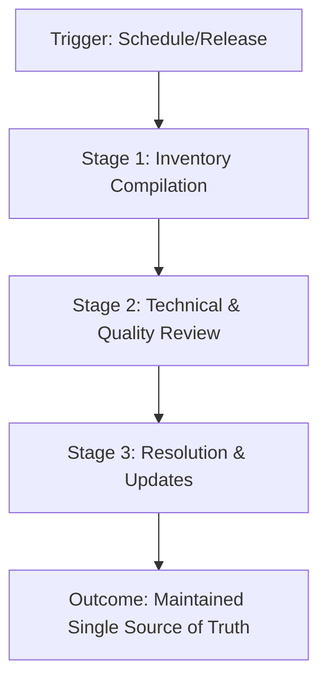

# Content audit

> Evaluating your existing documentation to identify gaps, correct inaccuracies, and prioritize ongoing content maintenance

---

## What is a content audit?

A content audit is the process of evaluating your documentation to assess its accuracy, completeness, and overall health. As a part of the documentation lifecycle, an audit helps ensure your documentation remains a reliable asset. The process involves cataloging published articles, evaluating them against quality standards, and determining whether to update, consolidate, or archive the content.

In the software development life cycle (SDLC), a content audit serves as a governance phase between major releases or during product refactoring. While technical writers usually lead the audit, it is a cross-functional effort. Product managers, software engineers, and quality assurance (QA) teams help verify technical accuracy, identify outdated information, and align documentation with current product capabilities.

---

## Why content audits matter

Failing to audit documentation leads to content debt. Over time, features change, UIs evolve, and code is deprecated. Without a formal audit, documentation becomes cluttered with stale content that misleads users and increases support costs. 

A systematic audit workflow provides several benefits:

*   **Improves findability:** Streamlines information architecture by removing duplicate or obsolete pages.
*   **Ensures consistency:** Verifies that articles align with the current style guide and brand voice.
*   **Reduces engineering support:** Prevents engineers from answering the same support questions by identifying documentation gaps early.

Manual, ad hoc reviews often result in inconsistent quality, overlooked errors, and a fragmented user experience.

---

## When to use an audit workflow 

Establish a content audit workflow if you encounter any of the following issues:

- **Rapid product iteration:** The software release cycle is fast, creating a gap between the production environment and the documentation.
- **Multiple contributors:** Various developers, technical writers, and product managers update docs, leading to inconsistent tone and page layouts.
- **High support volume:** Customer support reports frequent tickets related to outdated setup guides or broken code examples.
- **Localization preparation:** You plan to translate documentation. Auditing first prevents spending the budget on translating outdated pages.

---

## How the workflow works

A standard content audit includes four stages: trigger, inventory, evaluation, and resolution.



### 1. Inventory compilation

First, catalog all active documentation files. If you use a static site generator (SSG) and a version control system (VCS) like [Git](https://git-scm.com/){: target="_blank" rel="noopener" }, you can programmatically generate this inventory. Use scripts to export file paths from your repository into a tracking spreadsheet.

??? note "Automating the inventory stage"
    Run a command-line script in your repository to list all active Markdown file paths for your audit spreadsheet:
    
    ```bash
    find docs/ -name "*.md" > audit-inventory.txt
    ```

### 2. Technical and quality review

Review each prioritized page. Technical writers check for style compliance, while a subject matter expert (SME) ensures that technical concepts and code samples are accurate.

- [ ] Verify the article complies with the style guide.
- [ ] Use a link checker to fix broken internal or external URLs.
- [ ] Verify that the front matter metadata is complete.
- [ ] Ensure the page aligns with accessibility standards.

### 3. Resolution and updates
Based on the review, assign one of four actions to each page: 
*   **Keep:** No changes needed.
*   **Update:** Rewrite for accuracy.
*   **Consolidate:** Merge with another page.
*   **Archive:** Remove and redirect the page.

---

## RACI and team roles

To keep the audit on track, define clear ownership across teams.

| Role | Responsibility |
| :--- | :--- |
| **Responsible** | **Technical writers**: Perform the initial inventory, run quality scans, and update Markdown files. |
| **Accountable** | **Documentation lead or product manager**: Approves the audit scope, schedules reviews, and signs off on content deletions. |
| **Consulted** | **SMEs**: Provide technical reviews and clarify code behaviors. |
| **Informed** | **Support and QA teams**: Receive updates regarding deleted pages and new guides. |

---

## Pipeline integration and tools

You can automate parts of the workflow. Integrating auditing tools into your continuous integration and continuous deployment (CI/CD) pipeline helps maintain documentation health between formal audits.

=== "CI/CD link checking"
    Add an automated step in your deployment pipeline to run a link checker on every pull request.
    
    ```yaml
    # Example GitHub Actions snippet
    - name: Run Link Checker
      run: lychee "docs/**/*.md"
    ```

=== "Metadata validation"
    Use linter configurations to check that every page contains required front matter attributes, such as `revision_date` and `description`.

---

## Troubleshooting

- **Audit paralysis due to scope:** The audit stalls because the team tries to review too many pages at once. 
    *   *Solution:* Group documentation into smaller batches. Prioritize pages with high traffic or those linked to critical product areas.
- **SME bottlenecks:** Developers do not have time to review assigned articles.
    *   *Solution:* Schedule short "doc-a-thon" sessions or set up automated reminders. Make review requests specific by highlighting only the sections that need verification.

---

## Key metrics

To measure the effectiveness of your content audit, track these performance metrics:

- **Support ticket deflection:** A decrease in customer issues related to outdated documentation.
- **Documentation freshness index:** The percentage of high-traffic pages verified or updated within the last six months.
- **Page count reduction:** Removing dead pages simplifies the site structure, improving usability and search success.