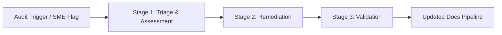

# Content debt

> The hidden, compounding cost of outdated, unmaintained, or poorly structured documentation within a system

---

## What is content debt?

Content debt is the effort required to fix or update inaccurate, disorganized, or obsolete documentation. As with technical debt in software engineering, content debt grows when teams prioritize shipping new features over maintaining existing informational assets. In the software development life cycle (SDLC), this debt appears as stale content that no longer matches the application. It turns helpful resources into obstacles, making the developer experience (DX) and user experience (UX) more difficult.

Managing content debt is a cross-functional process integrated into the document development life cycle (DDLC). While technical writers usually lead the effort to find and fix this debt, the process requires help from engineering, product management, and quality assurance (QA) teams. Product teams provide roadmap details to identify deprecated features, software engineers serve as subject matter experts (SMEs) for technical reviews, and QA ensures the documentation matches how the software actually works. Together, these teams create automated pipelines and governance frameworks to keep content debt from growing.

---

## Why it matters

If ignored, content debt reduces productivity and increases costs. When users find inaccurate or confusing documentation, they stop using self-service options and contact support instead. This decreases support deflection and increases the number of support tickets. For internal teams, outdated architecture docs slow down onboarding and can even lead to more technical debt in the codebase. Writers and engineers also waste time manually verifying the accuracy of undocumented API endpoints.

By using a structured workflow to monitor and resolve content debt, teams work more efficiently. A Docs as Code (DaC) methodology lets you treat documentation like software. You can run automated checks against a style guide to reduce manual reviews. Tracking content debt as a key performance indicator (KPI) helps product teams measure documentation health objectively. High-quality, current documentation reduces support costs and helps users adopt products faster.

!!! tip "The cost of neglect"
    Just as financial debt gains interest, content debt grows over time. Every outdated page increases the time users spend searching for correct answers, leading to frustration and a loss of trust in your product.

---

## When to adopt this workflow 

You should establish a content debt management workflow if your team faces any of these challenges:

- **High support volume:** Support teams report more tickets for issues already covered in the documentation, which means users can't find or understand the information.
- **Fast release cycles:** Teams deploy features through continuous integration and continuous deployment (CI/CD) pipelines, but the documentation falls behind.
- **Localization issues:** As you expand to global markets, translating stale or disorganized source files increases costs and leads to a poor experience for international users.
- **Difficult onboarding:** New engineers can't find reliable internal documentation and must rely on chat messages or old code comments to understand the system.

---

## How the workflow works

The content debt remediation process follows a path from identification to publication to ensure all changes are verified and automated.



1. **Stage 1: Triage and assessment:** The workflow begins when an automated audit tool or a manual review flags a page as stale. The technical writing team analyzes the page against the metadata schema to decide whether to update, consolidate, or archive the document. A ticket is created in the backlog to define the scope and identify the required SME.
2. **Stage 2: Content remediation:** The writer works with the SME to rewrite, restructure, or delete outdated content. If you use a Docs as Code model, the writer creates a new branch in the version control system (VCS) and drafts updates in a lightweight markup language like Markdown. They use active voice, clear sentences, and follow the style guide.
3. **Stage 3: Validation and release:** The draft undergoes peer and technical reviews. Automated linting scripts check for style violations, broken links, and formatting errors. When the checks pass, the pull request (PR) is merged. This triggers the CI/CD pipeline to publish the updated files to the developer portal or knowledge base.

---

## RACI and team roles

Define clear roles to keep the remediation pipeline moving:

- **Responsible:** Technical writers organize content audits, rewrite files, run style checks, and update metadata. Software engineers provide technical details and participate in reviews.
- **Accountable:** The documentation lead or product manager maintains documentation health metrics, prioritizes tickets, and sets governance policies.
- **Consulted:** SMEs, UX researchers, and support leads verify technical accuracy, clarify user journeys, and identify high-priority issues.
- **Informed:** QA, product marketing, and customer success teams are notified when major updates are published.

---

## Pipeline integration and tooling

You can automate content debt monitoring by integrating tools directly into your publishing pipelines.

=== "Static Site Generators (SSGs)"
    Tools like **Docusaurus** or **Hugo** convert text files into HTML. To manage content debt, your SSG can use YAML frontmatter to find pages that haven't been updated recently (for example, if the `revision_date` is older than 180 days). The system can then add a warning banner or flag the page for review.

=== "Automated Linting"
    Integrating tools like **Vale** into your Git workflow ensures content follows your style guide before you merge it. These scripts run during the pull request stage to check for passive voice, jargon, and accessibility issues.
    
    ```yaml hl_lines="2"
    # Example Vale configuration snippet
    StylesPath = styles
    MinAlertLevel = warning
    
    [*.md]
    BasedOnStyles = Microsoft
    ```

---

## Troubleshooting

Remediation workflows can slow down due to operational bottlenecks. Use these solutions to keep your pipeline running:

- **Waiting for SME input:** Writers often wait weeks for engineers to review pull requests. *Solution:* Use automated reminders in Slack or Jira, and include documentation tasks in the sprint's "definition of done."
- **Broken internal links:** The CI/CD pipeline might block a deployment because of a link to an archived page. *Solution:* Use a link checker in your local environment and use relative paths instead of hardcoded URLs.
- **"Ghost" features:** Engineering teams remove features without telling the writers. *Solution:* Add a documentation step to the product release checklist. If a code change alters the OpenAPI Specification (OAS), have it automatically trigger a documentation ticket.

---

## Key metrics

Track these indicators to measure the health of your documentation:

- **Documentation freshness index:** The percentage of pages updated or reviewed within the last 180 days. Aim for a score above 90%.
- **Support ticket deflection:** Check if updates to troubleshooting guides lead to fewer support tickets for those topics.
- **Pipeline success rate:** The percentage of pull requests that pass automated style and link checks without needing manual fixes.
