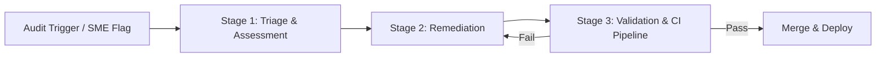

# Content debt

> The accumulated technical and operational cost of maintaining outdated, inaccurate, or poorly structured documentation that hinders user and developer experience

---

## Defining content debt

Content debt is the cumulative effort required to fix inaccurate, disorganized, or obsolete documentation. Similar to technical debt in software engineering, it accumulates when teams prioritize shipping new features over maintaining existing informational assets. 

In the software development life cycle (SDLC), this debt manifests as stale content that no longer reflects the actual state of the application, transforming helpful resources into friction points for both developers and end-users.

Managing this debt is a cross-functional responsibility integrated into the document development life cycle (DDLC). While technical writers typically lead remediation, the process relies on engineering, product management, and quality assurance (QA). Product teams provide roadmap insights to identify deprecated features, engineers serve as subject matter experts (SMEs) for technical validation, and QA ensures the documentation aligns with the latest build artifacts.

---

## Why it matters

Neglecting content debt creates a silent productivity drain. When users encounter inaccurate or confusing documentation, they abandon self-service options in favor of support tickets, driving up operational costs. Internally, outdated architecture docs slow down developer onboarding and can propagate technical debt into the codebase through the implementation of deprecated patterns.

Adopting a Docs as Code (DaC) methodology allows teams to treat documentation with the same rigor as software. Automated style checks and linting reduce the manual overhead of peer reviews, while tracking content debt as a key performance indicator (KPI) provides an objective measure of documentation health. Current, high-quality documentation doesn't just reduce support load; it accelerates product adoption.

!!! tip "The interest on neglect"
    Content debt functions like financial debt. Every outdated page increases the time users waste searching for correct answers, eventually eroding trust in the product itself.

---

## When to adopt this workflow 

Establish a content debt management workflow if your team experiences the following:

- **Increasing support pressure:** Support teams report high ticket volumes for issues already covered in the docs, signaling that users can no longer find or trust the information.
- **Desynchronized release cycles:** Features deploy through CI/CD pipelines faster than the documentation can be updated.
- **Scaling localization:** Translating stale or disorganized source files leads to wasted budget and a fragmented experience for international users.
- **Knowledge silos:** New hires struggle to find reliable internal documentation, relying instead on tribal knowledge or old code comments.

---

## How the workflow works

The remediation process moves from identification to publication to ensure every update is verified and automated.



1. **Triage and assessment:** The process begins when an automated audit or a manual review flags a page. The technical writing team evaluates the content against the metadata schema to decide whether to update, consolidate, or archive it. A backlog ticket then defines the scope and identifies the necessary SME.
2. **Content remediation:** Writers work with SMEs to restructure or delete outdated content. In a Docs as Code model, this happens in a new branch of the version control system (VCS). Writers focus on active voice and clarity while adhering to the project's style guide.
3. **Validation and release:** The draft undergoes technical and peer reviews. The CI/CD pipeline runs automated linting scripts to verify style, check for broken links, and catch formatting errors. Once all checks pass and the pull request (PR) is approved, it is merged into the main branch for deployment.

---

## RACI and team roles

Clear ownership prevents the remediation pipeline from stalling:

- **Responsible:** Technical writers (who organize audits and rewrite files) and Software engineers (who provide technical validation).
- **Accountable:** The documentation lead or product manager (who prioritizes the backlog and maintains governance policies).
- **Consulted:** Support leads (to highlight high-priority user pain points) and Product Owners.
- **Informed:** QA and customer success teams receive notifications when major updates go live.

---

## Pipeline integration and tooling

Automation is the most effective way to monitor content debt without increasing manual workload.

=== "Static Site Generators (SSGs)"
    Platforms like **Docusaurus** or **Hugo** use YAML frontmatter to store metadata like `revision_date`. While SSGs do not flag "stale" pages by default, custom build scripts or plugins can parse this metadata to trigger Slack alerts or inject "Outdated" warning banners into the UI when a page exceeds a defined threshold (e.g., 180 days).

=== "Automated Linting"
    Tools like **Vale** enforce style consistency during the CI/CD process. These scripts check for passive voice, jargon, and accessibility issues.
    
    ```ini hl_lines="2"
    # Example Vale configuration snippet (.vale.ini)
    StylesPath = styles
    MinAlertLevel = warning
    
    [*.md]
    BasedOnStyles = Microsoft
    ```

---

## Troubleshooting

If the remediation pipeline slows down, look for these common bottlenecks:

- **SME bottlenecks:** If engineers take weeks to review PRs, incorporate documentation tasks into the sprint’s "definition of done" and use automated Slack reminders.
- **Broken link blocks:** If the CI/CD pipeline fails due to links to archived pages, use a local link checker and prefer relative paths over hardcoded URLs.
- **Undocumented deprecations:** If features disappear without notice, add a documentation checkpoint to the product release checklist. Changes to the OpenAPI Specification (OAS) or Protobuf files should automatically trigger a documentation ticket.

---

## Key metrics

Measure documentation health through these indicators:

- **Freshness index:** The percentage of content reviewed or updated within a defined window (e.g., the last 180 days). Target: >90%.
- **Ticket deflection:** Correlation between documentation updates and a decrease in support tickets for those specific topics.
- **First-pass yield:** The percentage of documentation pull requests that pass automated linting and build checks without requiring manual fixes.