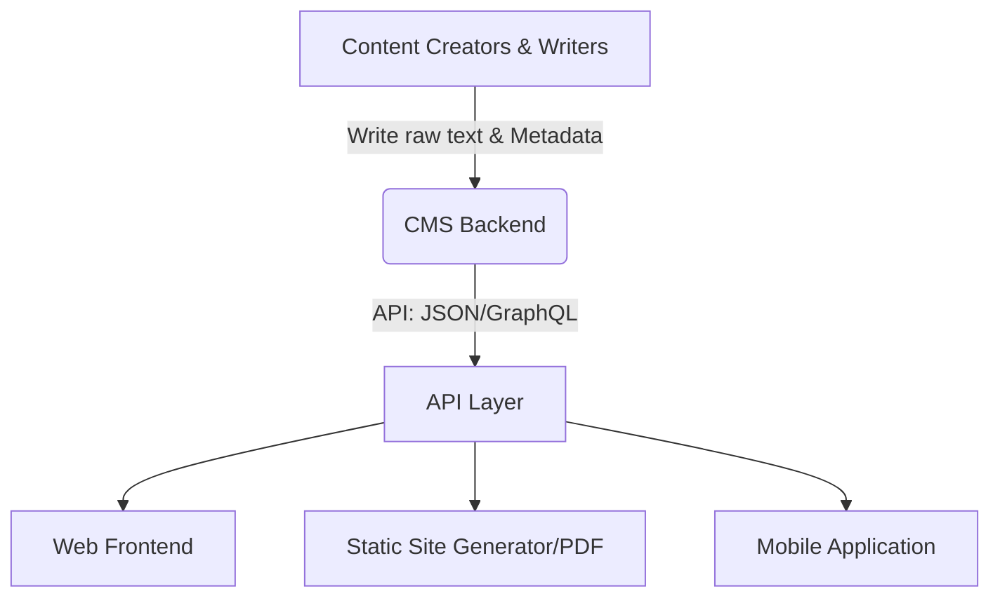
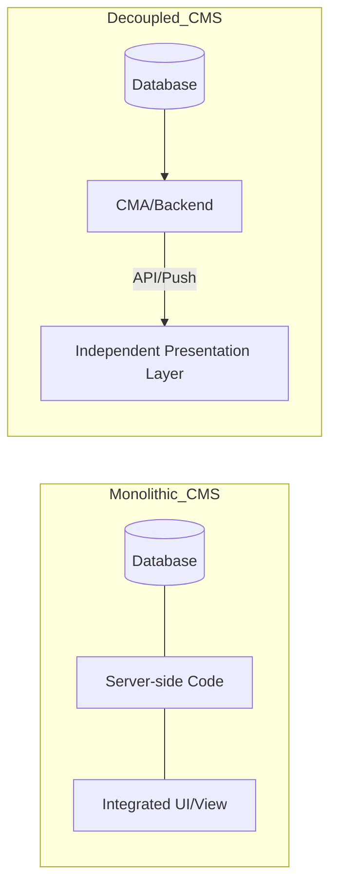

# Content Management System (CMS)

> *A software application used to manage the creation and modification of digital content, separating underlying data from its visual presentation*

---

## What is a CMS?

A CMS manages digital content throughout its lifecycle by decoupling content creation from its final presentation. This separation allows technical writers and subject matter experts (SMEs) to focus on the text without managing CSS, HTML, or layout logic. The system typically stores raw content in a database or flat-file system, using templates or application programming interfaces (APIs) to render the output.

While early systems focused on simple web publishing, modern iterations support complex technical documentation and structured writing. By offering both graphical user interfaces (GUIs) and programmatic APIs, a CMS helps product teams organize, tag, and distribute information to improve the user experience (UX) across multiple platforms.

---

## The impact of centralized management

Relying on manual updates often leads to content sprawl, where information is trapped in isolated repositories. When writers work in isolation, readers face the cognitive load of reconciling different formatting styles or conflicting instructions spread across various PDFs and web pages.

Centralizing these assets establishes automated workflow controls and a formal revision history (version control). This setup reduces the manual labor of editorial checks and ensures documentation remains discoverable. Furthermore, enforcing a unified content strategy through a CMS builds user trust by providing a predictable, high-quality information environment.

---

## Core principles and architecture

Standard CMS architecture relies on two distinct components: a Content Management Application (CMA) for the authoring interface and a Content Delivery Application (CDA) for processing and delivering the content to the end user.

- Decoupled and headless architecture: Content storage remains independent of the presentation layer. In headless models, the CDA is replaced by an API (REST or GraphQL) that serves raw data to any head or frontend.
- Structured authoring: Rather than creating monolithic documents, the system breaks content into modular components or nodes. This modularity enables granular metadata tagging and schema enforcement, such as Darwin Information Typing Architecture (DITA), Markdown, or custom JSON schemas.
- Governance engines: Built-in validation loops and role-based access control (RBAC) define strict permissions for creating, approving, and deploying content.
- Omnichannel delivery: A centralized source of information feeds multiple endpoints, including web portals, mobile apps, and generated PDFs, without requiring duplicate effort.

---

## Design patterns

Documentation teams typically choose between traditional (coupled), decoupled, or headless models. The headless approach, shown below, delivers content via API to various independent consumers.

### Comparison: Monolithic vs. Decoupled

Using plain text or structured formats ensures that authors never have to manage branding or visual design directly. For teams using [Git](https://git-scm.com/), a flat-file system combined with a version control system (VCS) provides a robust backend for developer-centric "Docs-as-Code" workflows.

---

## User-centric outcomes

Standardizing content delivery through a CMS provides two primary benefits for the end user:

1.  Lowered cognitive load: Consistent navigation patterns and styling allow readers to locate and absorb information faster.
2.  Reliability: Uniform headings, warning callouts, and code blocks allow for efficient scannability, ensuring users are not distracted by inconsistent layout shifts.

---

## Implementation best practices

- Enforce strict metadata schemas: Use automated validation to ensure content is tagged correctly. This prevents broken search results and improves discoverability.
- Define granular roles: Restrict publishing privileges to specific roles (RBAC) to keep review cycles organized and prevent unauthorized changes to live documentation.
- Prioritize localization: Choose systems that support XML Localization Interchange File Format (XLIFF) exports or API integrations for translation management systems (TMS) to handle global scaling.

!!! info "Tip"
    Keep the editor simple. Instruct writers to use structural semantic tags (such as H1, H2, and `<code>`) rather than manual formatting, such as bolding for headers, to ensure content renders correctly across different device viewports and screen readers.

---

## Common anti-patterns

- The monolithic dump: Avoid treating the CMS as a file repository for large, unformatted documents such as [Microsoft Word](https://www.microsoft.com/en-us/microsoft-365/word) files. This obscures data from search engines and prevents modular reuse.
- Over-customization: Prevent authors from inserting custom inline CSS styles or script blocks. These localized changes break design consistency and make future migrations difficult.

---

## Validation and usability testing

Verify your CMS structure with these targeted checks:

- [ ] Search indexing: Test common keywords and synonyms to ensure the system ranks articles correctly based on metadata and taxonomy.
- [ ] Analytics audit: Monitor page-level bounce rates and search-exit rates to identify confusing architecture or overly dense text.
- [ ] Workflow verification: Walk a draft through every stage of the approval pipeline to confirm that notifications, state transitions, and permissions are functioning as intended.