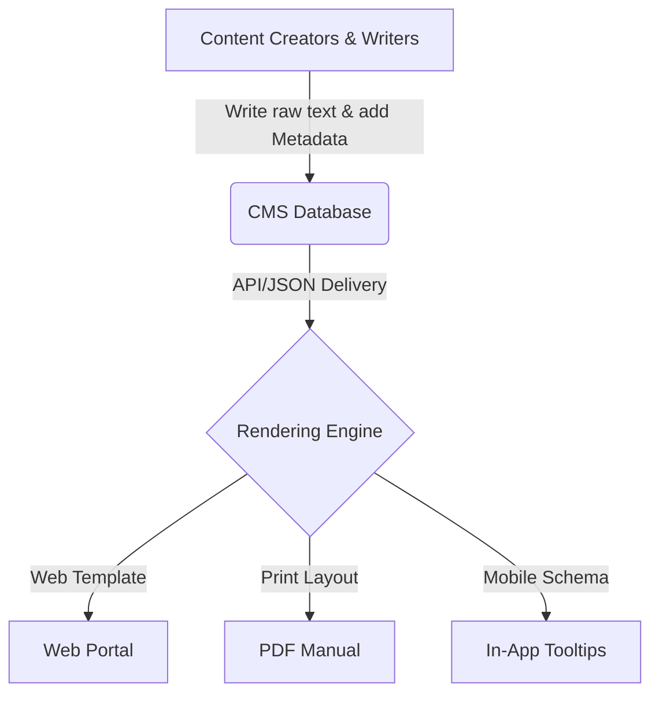
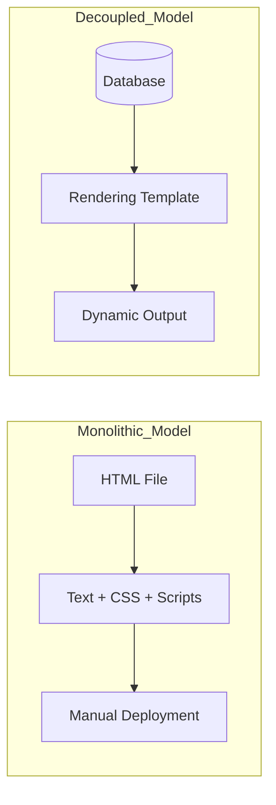

# Content Management System (CMS)

> A software platform that centralizes the creation, management, and publishing of digital content through collaborative professional workflows

---

## What is a CMS?

A CMS is an application or suite of programs used to manage digital content throughout its lifecycle. A CMS separates content creation from presentation. This allows technical writers and subject matter experts (SMEs) to write without managing code or visual layouts. The system stores raw content in databases or file systems and uses templates to render the final output. This process ensures design consistency and improves authoring efficiency.

Initially developed to scale web publishing, the CMS now supports complex technical documentation. Modern systems facilitate collaborative authoring and governance that align with ==structured writing== principles. By providing a graphical user interface or programmatic APIs, a CMS helps product teams and technical writers organize, tag, and deliver information to improve the ==user experience (UX)==.

---

## Why it matters

Without a CMS, teams often face content sprawl, inconsistency, and high manual update costs. Information stays trapped in silos, leading to outdated content and inconsistent messaging. This friction increases the cognitive load for readers who must reconcile different formatting styles or conflicting information across multiple PDFs and web pages.

A CMS mitigates these risks by establishing automated ==workflow== controls and formal revision history. It streamlines content delivery, reduces editorial work, and ensures that documentation remains discoverable. By enforcing a unified ==content strategy==, the system helps maintain user trust and supports customer success.

---

## Core principles and anatomy

A standard CMS includes two major components: a Content Management Application (CMA) for authoring and a Content Delivery Application (CDA) for processing and rendering pages. 

*   **Decoupled architecture:** Separates raw content storage from the rendering layers. This allows writers to focus on content while design systems handle layouts automatically.
*   **Structured authoring and database storage:** Breaks content into modular chunks or nodes rather than monolithic documents. This allows for targeted ==metadata== tagging and schema enforcement.
*   **Workflow and governance engines:** Includes validation loops, peer review systems, and publishing pipelines that define who can create, edit, approve, and deploy content.
*   **Extensible content delivery:** Delivers content to multiple channels—such as web portals, mobile apps, and PDFs—without rewriting the source material.

---

## Design pattern example

Modern documentation teams often choose between traditional, decoupled, or headless CMS patterns. The following diagram illustrates the headless model where you author content once but deliver it dynamically to multiple endpoints.

### Comparing monolithic and decoupled models

### Breakdown of the pattern

- **Raw content separation:** When you keep content in plain text or structured formats, authors do not need to manage visual design. This reduces errors and enforces branding standards.
- **Dynamic API delivery:** Separation allows one source of text to serve multiple channels simultaneously. For teams that use [Git](https://git-scm.com/){: target="_blank" rel="noopener" }, a flat-file system works well with a ==version control system (VCS)== as the storage backend while an external engine deploys the site.

---

## Cognitive impact and user experience

Implementing a CMS targets specific user goals:

- **Reduced cognitive load:** Readers can find and understand information quickly because formatting, styling, and navigation patterns are consistent.
- **Increased trust and scannability:** Uniform headings, warning callouts, and code layouts allow users to scan text efficiently without encountering unexpected layout changes.

---

## Implementation best practices

To ensure your CMS supports your content goals, follow these rules:

- **Enforce strict style guides and metadata schemas:** Use automated validation to ensure every author tags content correctly. This makes search results more reliable.
- **Establish clear user roles and permissions:** Restrict administrative and publishing privileges to keep review cycles organized and prevent unauthorized changes.
- **Plan for translation and localization:** Ensure your system supports automated exports and imports for translation management tools to facilitate global scalability.

!!! info "Tip"
    Avoid visual styling in the editor. Instruct your writers to use structural semantic tags rather than manual formatting to ensure seamless rendering across platforms.

---

## Common anti-patterns

Avoid these common pitfalls when you set up your system:

- **The monolithic dump:** Do not treat the CMS as a simple file repository by uploading giant, unformatted documents (such as [Microsoft Word](https://www.microsoft.com/en-us/microsoft-365/word){: target="_blank" rel="noopener" } files). This practice breaks search engines and navigation.
- **Over-customization:** Do not allow individual authors to insert custom inline styles or script blocks. This compromises design consistency and complicates future migrations.

---

## How to validate and test usability

To ensure your CMS structure works for readers, run these tests:

- [ ] **Evaluate search indexing:** Run search queries with common keywords and synonyms to verify the system correctly ranks and retrieves articles based on tags.
- [ ] **Track page-level bounce rates:** Use analytics to identify pages with low dwell times, which may indicate confusing architecture or dense content.
- [ ] **Run peer testing on workflows:** Verify the publishing workflow by taking a draft through the review and approval states to ensure notifications reach the correct stakeholders.