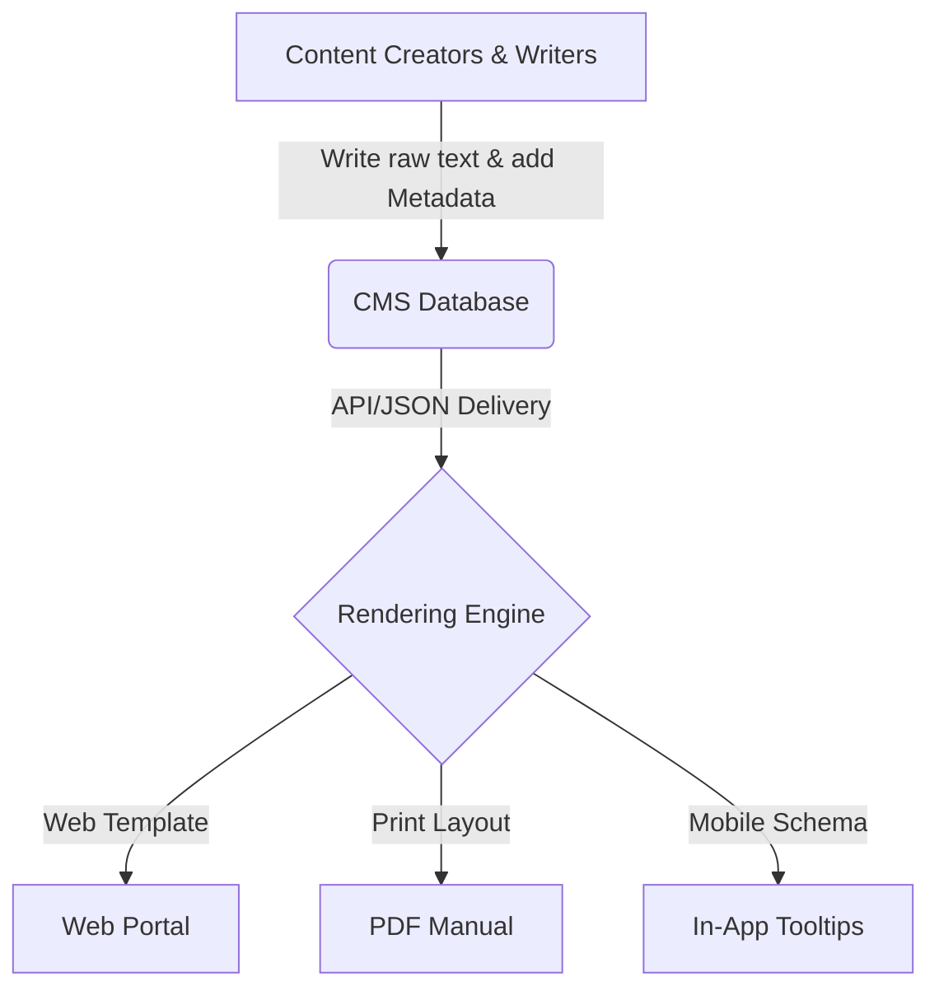
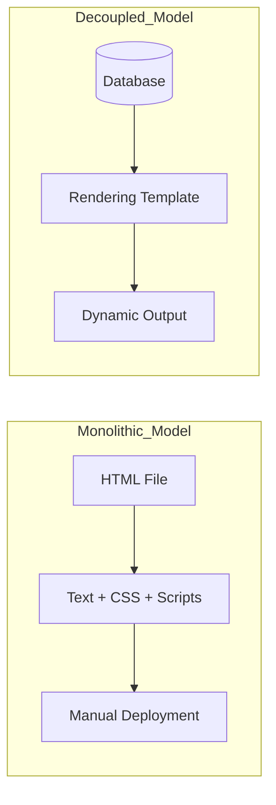

# Content Management System (CMS)

> A software application used to manage the creation and modification of digital content, separating underlying data from its visual presentation

---

## What is a CMS?

A CMS manages digital content throughout its lifecycle by decoupling content creation from its final presentation. This separation allows technical writers and subject matter experts (SMEs) to focus on the text without worrying about CSS, HTML, or layout logic. The system typically stores raw content in a database or file system, using templates to render the output dynamically.

While early systems focused on simple web publishing, modern iterations support complex technical documentation and ==structured writing==. By offering both graphical interfaces and programmatic APIs, a CMS helps product teams organize, tag, and distribute information to improve the ==user experience (UX)== across multiple platforms.

---

## The impact of centralized management

Relying on manual updates often leads to "content sprawl," where information is trapped in isolated silos. When writers work in a vacuum, readers face the cognitive load of reconciling different formatting styles or conflicting instructions spread across various PDFs and web pages.

Centralizing these assets establishes automated ==workflow== controls and a formal revision history. This setup reduces the manual labor of editorial checks and ensures documentation remains discoverable. Furthermore, enforcing a unified ==content strategy== through a CMS builds user trust by providing a predictable, high-quality information environment.

---

## Core principles and architecture

A standard CMS architecture relies on two distinct pillars: a Content Management Application (CMA) for the authoring interface and a Content Delivery Application (CDA) for processing and rendering the final pages. 

*   **Decoupled architecture:** Raw content storage remains independent of the rendering layer. Designers update the layout globally while writers focus on the source text.
*   **Structured authoring:** Rather than creating monolithic documents, the system breaks content into modular "nodes." This modularity enables granular ==metadata== tagging and schema enforcement.
*   **Governance engines:** Built-in validation loops and peer-review systems define strict permissions for creating, approving, and deploying content.
*   **Omnichannel delivery:** A single source of truth feeds multiple endpoints—including web portals, mobile apps, and generated PDFs—without requiring duplicate effort.

---

## Design patterns

Documentation teams typically choose between traditional, decoupled, or headless models. The headless approach, shown below, delivers content via API to various endpoints.

### Comparison: Monolithic vs. Decoupled

Using plain text or structured formats ensures that authors never have to manage branding or visual design directly. For teams using [Git](https://git-scm.com/){: target="_blank" rel="noopener" }, a flat-file system combined with a ==version control system (VCS)== provides a robust backend for developer-centric workflows.

---

## User-centric outcomes

Standardizing content delivery through a CMS provides two primary benefits for the end-user:

1.  **Lowered cognitive load:** Consistent navigation patterns and styling allow readers to locate and absorb information faster.
2.  **Reliability:** Uniform headings, warning callouts, and code blocks allow for efficient scannability, ensuring users aren't distracted by unexpected layout shifts.

---

## Implementation best practices

*   **Enforce strict metadata schemas:** Use automated validation to ensure content is tagged correctly. This prevents broken search results and improves discoverability.
*   **Define granular roles:** Restrict publishing privileges to specific roles to keep review cycles organized and prevent unauthorized changes to live documentation.
*   **Prioritize localization:** Choose systems that support automated exports for translation management tools to handle global scaling.

!!! info "Tip"
    Keep the editor "clean." Instruct writers to use structural semantic tags rather than manual formatting (like "bolding" for headers) to ensure content renders correctly on every device.

---

## Common anti-patterns

*   **The monolithic dump:** Avoid treating the CMS as a file repository for large, unformatted documents like [Microsoft Word](https://www.microsoft.com/en-us/microsoft-365/word){: target="_blank" rel="noopener" } files. This obscures data from search engines and prevents modular reuse.
*   **Over-customization:** Prevent authors from inserting custom inline styles or script blocks. These "one-off" changes break design consistency and make future migrations difficult.

---

## Validation and usability testing

Verify your CMS structure with these targeted checks:

- [ ] **Search indexing:** Test common keywords and synonyms to ensure the system ranks articles correctly based on metadata.
- [ ] **Analytics audit:** Monitor page-level bounce rates to identify confusing architecture or overly dense text.
- [ ] **Workflow verification:** Walk a draft through every stage of the approval pipeline to confirm that notifications and permissions are functioning as intended.