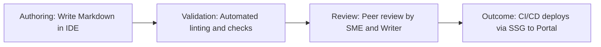

# Continuous documentation

> Integrating documentation updates directly into the agile software development lifecycle to maintain real-time accuracy, relevance, and software alignment

---

## What is continuous documentation?

Continuous documentation is the practice of treating documentation as a core deliverable that you develop, test, and deploy along with your software code. This workflow embeds your documentation processes into your software development life cycle (SDLC) by applying "Docs as Code" methodologies. Instead of writing documents after a product release, your team manages source files in a version control system (VCS) like [Git](https://git-scm.com/){: target="_blank" rel="noopener" }. This makes sure that every software change triggers a corresponding review, update, and deployment of the associated user guides or API references.

This pipeline integrates with your continuous integration and continuous deployment (CI/CD) environments. It requires active, cross-functional collaboration. Developers write code and inline comments, while the technical writing team manages structure and clarity. At the same time, the quality assurance (QA) team validates technical accuracy, and DevOps engineers maintain the build pipelines that compile and publish the files using a static site generator (SSG).

---

## Why it matters

Traditional publishing processes often lead to technical debt. When documentation is an afterthought, draft updates stall, release notes are missed, and users encounter outdated instructions. By automating your documentation pipeline, you reduce manual bottlenecks such as copying and pasting, PDF generation, or ad-hoc reviews.

Integrating docs into your software pipeline makes sure that no software feature is deployed without its accompanying documentation. This alignment helps reduce support tickets and prevents "knowledge gaps" that occur when developers try to explain features weeks after coding them. Without this automated process, your product team risks publishing inaccurate information, which can hurt the developer experience (DX) and user trust.

---

## When to adopt this workflow

To maintain high-quality deliverables, assess whether your current systems are falling behind your development pace. Consider adopting this process if you experience the following:

- **Rapid release cycles:** Your engineering team deploys updates multiple times a day or week, making traditional post-release documentation processes difficult to maintain.
- **Incomplete definition of done (DoD):** Features frequently pass quality assurance (QA) and ship to production while their guides remain unfinished drafts.
- **Stale content:** Users report that the documentation does not match the user interface (UI) or behavior of your software as a service (SaaS) application.
- **SME collaboration gaps:** Technical writers spend time waiting for information from subject matter experts (SMEs) rather than reviewing code changes directly in a pull request (PR).

---

## How the workflow works

This workflow synchronizes documentation updates with software changes, running automated checks on every commit to verify quality.

1. **Authoring and staging:** Developers or technical writers create or update content using [Markdown](https://daringfireball.net/projects/markdown/){: target="_blank" rel="noopener" } files in their integrated development environment (IDE). When they commit files to the VCS, they open a pull request (PR) containing both the code changes and the documentation updates.
2. **Automated validation:** The CI/CD pipeline triggers automated tests on the PR. This phase runs prose linting tools to enforce style guides, checks for broken links, and validates syntax so the SSG build does not fail.
3. **Peer review and publishing:** A technical writer and an SME perform a peer review in the repository management platform. Once approved, merging the PR triggers the deployment engine to build, render, and host the updated files on the developer portal.

---

## RACI and team roles

Establish clear ownership across your teams to make sure pull requests move quickly.

- **Responsible:** Technical writers and software engineers write and update the content. DevOps engineers build and maintain the CI/CD pipelines.
- **Accountable:** The documentation lead or product manager makes sure that no feature is considered "done" without approved documentation.
- **Consulted:** SMEs and product owners provide technical verification and clarify edge cases during the peer review.
- **Informed:** QA and customer support teams review the automated changelog to prepare for upcoming releases.

---

## Pipeline integration and tooling

Continuous documentation treats your text files like your application code. To automate this workflow, integrate your documentation repository with CI/CD engines. When a contributor pushes a commit, the pipeline executes automated checks. It runs a prose linter for formatting, a spell-checker, and a link-checker to prevent broken links.

If the checks pass, the system runs a build script using your SSG. You can use snippets or "partials" to reuse content blocks across multiple guides. Finally, the system deploys the compiled HTML files to your hosting platform, which makes sure users see the most up-to-date information on your developer portal.

---

## Troubleshooting and common points of failure

Automated workflows can encounter pipeline interruptions. Use these steps to resolve common issues:

- **Automated build fails due to syntax errors:** A contributor introduces broken Markdown syntax that prevents the SSG from building.  
    *Solution:* Configure your IDE with linting extensions and use local preview scripts to verify your site before you push your commits.
- **Peer review bottlenecks:** Engineers cannot merge code because they are waiting on a technical writer to review documentation changes.  
    *Solution:* Establish clear guidelines. Allow minor formatting fixes or internal linking updates to merge automatically. Reserve technical writer reviews for high-impact user guides.
- **Outdated content appears due to caching:** Your hosting server serves stale content even after a successful deployment.  
    *Solution:* Configure your hosting platform to clear the cache or update the cache-control headers during each CI/CD deployment cycle.

---

## Key metrics and success criteria

Measure the efficiency of your automated documentation lifecycle using these performance indicators:

- **Feature-to-doc release lag:** The time between a code deployment and the publication of its documentation. The goal is zero lag.
- **Automated build pass rate:** The percentage of pull requests that pass automated prose linting and SSG build tests without manual intervention.
- **Support ticket deflection:** The reduction in support tickets following a release, indicating that accurate documentation is helping users resolve issues.