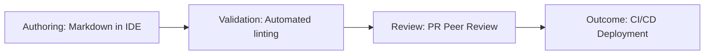

# Continuous documentation

> A "Docs as Code" practice that integrates documentation development, testing, and deployment into the software development lifecycle via CI/CD pipelines

---

## Defining continuous documentation

Continuous documentation treats documentation as a core deliverable, managed with the same rigor as software code. By adopting "Docs as Code" methodologies, teams move away from writing manuals as a post-release afterthought. Instead, documentation source files—typically Markdown—reside in a version control system (VCS) like [Git](https://git-scm.com/){: target="_blank" rel="noopener" }. 

This approach forces documentation into the software development life cycle (SDLC). When a developer modifies a feature, they (or a technical writer) update the corresponding documentation within the same pull request. This triggers a CI/CD pipeline that validates the prose, checks for broken links, and uses a static site generator (SSG) to build the final output. The result is a documentation portal that evolves in lockstep with the software.

---

## Signs your team needs a continuous workflow

Manual documentation processes often collapse under the weight of modern engineering speeds. You should consider automating your pipeline if you notice these friction points:

*   **Engineering outpaces writing:** Your team deploys multiple times weekly, leaving technical writers trapped in a perpetual state of "catching up."
*   **Documentation "Debt":** Features frequently reach production while their setup guides remain in draft status or reference obsolete UI elements.
*   **Knowledge Silos:** Technical writers spend more time chasing subject matter experts (SMEs) for interviews than they do reviewing actual code changes or pull requests.
*   **Broken trust:** Users or support agents report that the documentation is consistently out of sync with the live SaaS environment.

---

## The automated documentation pipeline

The workflow relies on automated triggers to verify quality before any content goes live.

1.  **Drafting and Staging:** Contributors use an IDE to update content. Every commit is bundled into a pull request (PR) that includes both the logic (code) and the explanation (docs).
2.  **Automated Validation:** The CI/CD engine runs "prose tests." This includes linting for style guide compliance, spell-checking, and verifying that every internal and external link is active. If a link is broken or a syntax error is found, the build fails, preventing the PR from being merged.
3.  **Collaborative Review:** Writers and SMEs perform a peer review directly within the repository platform. Once merged, the deployment engine renders the Markdown into HTML and pushes it to the production portal.

---

## Role-based responsibilities (RACI)

Clear ownership prevents pull requests from stagnating in the queue.

*   **Responsible:** Technical writers and software engineers (content creation); DevOps engineers (pipeline maintenance).
*   **Accountable:** The documentation lead or product manager, who ensures no feature is marked "Done" without verified documentation.
*   **Consulted:** SMEs who provide technical validation during the peer review process.
*   **Informed:** QA and support teams who use the automated build logs to prepare for upcoming changes.

---

## Overcoming common pipeline hurdles

Automated systems introduce new failure modes. Most can be mitigated with better local tooling:

*   **Build Failures:** Broken Markdown syntax is the most common cause of failed deployments. To fix this, teams should use IDE extensions (like Markdownlint) and local preview scripts to catch errors before pushing to the remote repository.
*   **Review Bottlenecks:** If engineers are waiting days for a writer to approve a minor typo fix, the workflow fails. Solve this by establishing "fast-track" rules: allow automated merges for formatting or internal links, while reserving manual reviews for high-impact conceptual guides.
*   **Cache Issues:** Sometimes users see old data because the hosting platform hasn't refreshed its edge locations. Ensure your CI/CD script includes a step to invalidate the CDN cache or update cache-control headers upon every successful build.

---

## Success metrics

Track these indicators to gauge the health of your documentation lifecycle:

*   **Feature-to-doc lag:** The time delta between a code deployment and its documentation appearing online. In a mature continuous model, this should be zero.
*   **Build Pass Rate:** The frequency at which PRs pass automated checks. Frequent failures suggest a need for better local linting tools.
*   **Ticket Deflection:** A downward trend in "how-to" support queries following a release, indicating that the documentation is keeping pace with user needs.