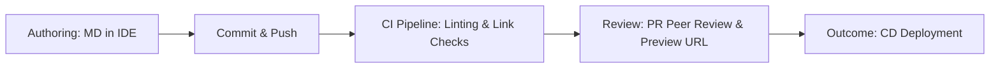

# Continuous documentation

> A "Docs as Code" practice that integrates documentation development, testing, and deployment into the software development lifecycle via CI/CD pipelines

---

## Defining continuous documentation

Continuous documentation treats documentation as a core deliverable, managed with the same rigor as software code. By adopting "Docs as Code" methodologies, teams move away from treating manuals as post-release afterthoughts. Instead, documentation source files—typically Markdown or AsciiDoc—reside in a version control system (VCS) like [Git](https://git-scm.com/){: target="_blank" rel="noopener" }. 

This approach integrates documentation into the software development life cycle (SDLC). When a developer modifies a feature, they (or a technical writer) update the corresponding documentation. In a monorepo, this occurs within the same pull request (PR); in decoupled architectures, cross-repository triggers synchronize the changes. This triggers a CI/CD pipeline that validates the prose via linters, checks for broken links, and uses a static site generator (SSG) to build the final output. The result is a documentation portal that evolves in lockstep with the software.

---

## Signs your team needs a continuous workflow

Manual documentation processes often collapse under the weight of modern engineering speeds. You should consider automating your pipeline if you notice these friction points:

*   **Engineering outpaces writing:** Your team deploys multiple times weekly, leaving technical writers in a perpetual state of "catching up."
*   **Documentation "Debt":** Features frequently reach production while their setup guides remain in draft status or reference obsolete UI elements.
*   **Knowledge Silos:** Technical writers spend more time chasing subject matter experts (SMEs) for interviews than they do reviewing actual code changes or pull requests.
*   **Broken trust:** Users report that the documentation is consistently out of sync with the live environment.

---

## The automated documentation pipeline

The workflow relies on automated triggers to verify quality before any content is merged into the main branch.

1.  **Drafting and Staging:** Contributors use an IDE to update content. Changes are pushed to a feature branch, triggering the CI pipeline.
2.  **Automated Validation:** The CI/CD engine runs automated tests. This includes linting for style guide compliance (e.g., Vale), spell-checking, and verifying that every internal and external link is active. If the build fails due to invalid YAML front matter or broken links, the PR is blocked from merging.
3.  **Collaborative Review:** Writers and SMEs perform a peer review. Most pipelines generate a "Deploy Preview" (a temporary staging URL) to allow reviewers to see the rendered HTML before approval. Once merged, the deployment engine pushes the updated site to production.

---

## Role-based responsibilities (RACI)

Clear ownership prevents pull requests from stagnating.

*   **Responsible:** Technical writers and software engineers (content creation); DevOps engineers (pipeline and infrastructure maintenance).
*   **Accountable:** The documentation lead or product manager, who ensures no feature is marked "Done" without verified documentation.
*   **Consulted:** SMEs who provide technical validation and verify accuracy during the peer review process.
*   **Informed:** QA and support teams who monitor **staging environments** or **release notes** to prepare for upcoming changes.

---

## Overcoming common pipeline hurdles

Automated systems introduce specific failure modes that can be mitigated with better local tooling:

*   **Build Failures:** Invalid YAML front matter or SSG-specific syntax errors (e.g., Hugo shortcodes or Jekyll Liquid tags) are the most common causes of failed builds. To fix this, teams should use IDE extensions and local preview scripts to catch errors before pushing.
*   **Review Bottlenecks:** If engineers wait days for a writer to approve a minor fix, the workflow fails. Solve this by establishing "fast-track" rules: allow automated merges for minor formatting fixes or internal link updates, while reserving manual reviews for conceptual guides.
*   **Cache Invalidation:** Users may see stale content if the CDN hasn't refreshed its edge locations. Ensure your CD script includes a step to invalidate the CDN cache (e.g., AWS CloudFront Invalidation) or utilizes content-addressed hashing for assets.

---

## Success metrics

Track these indicators to gauge the health of your documentation lifecycle:

*   **Feature-to-doc lag:** The time delta between a code deployment and its documentation appearing online. In a mature continuous model, this is zero.
*   **Build Pass Rate:** The frequency at which PRs pass automated CI checks. Frequent failures suggest a need for better local linting or pre-commit hooks.
*   **Ticket Deflection:** A downward trend in "how-to" support queries following a release, indicating that the documentation is keeping pace with user needs.