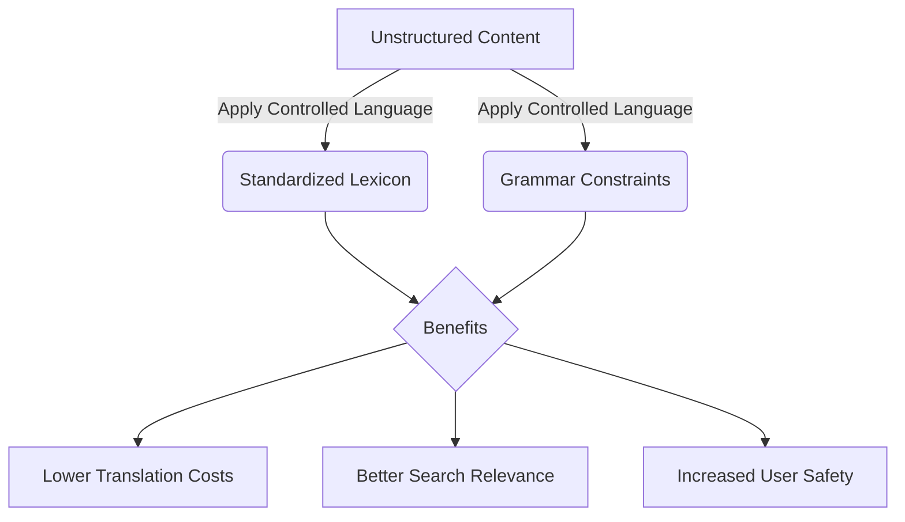

# Controlled language

> A restricted subset of a natural language that uses standardized vocabulary and grammar rules to optimize document clarity, accessibility, and translatability

---

## What is controlled language?

A controlled language is a simplified version of a natural language, such as English or Japanese. It eliminates ambiguity and complexity in technical documents. Originally developed for the aerospace and defense industries to ensure safety during maintenance, this practice uses a strict lexicon of approved terms and prescriptive grammar rules. By removing complex syntax and synonyms, it ensures that every approved word has a single meaning across a technical portfolio.

This approach reduces cognitive load for the reader. Complex structures, such as nested clauses and nominalization, force readers to spend mental energy parsing sentences rather than performing tasks. Controlled language typically uses a subject-verb-object (SVO) format and the imperative mood. This alignment helps the reader's visual scanning match their logical task execution, resulting in faster comprehension and fewer errors.

??? note "Historical Context: Simplified Technical English"
    One of the most famous implementations of this concept is [ASD-STE100](https://www.asd-ste100.org/){: target="_blank" rel="noopener" }. Developed for the aerospace industry, it limits English vocabulary to specific approved words. For example, the word "close" is approved only as a verb (as in "close the door"), never as an adjective ("do not go close to the landing gear"). To describe distance, writers must use the approved word "near."

---

## Why controlled language matters

Documentation serves global audiences, from experienced developers to non-native speakers. Using uncontrolled synonyms and complex idioms confuses readers. For human users, this leads to hesitation as they try to interpret instructions. For global organizations, inconsistent language increases the cost of translation and leads to errors when content is localized.

Standardized writing also improves automated workflows. Ambiguous writing undermines search relevance and content engineering. If an organization uses semantic tags or search engine optimization (SEO), unstructured descriptions create keyword conflicts. By standardizing language patterns, you improve scannability and ensure that search algorithms can index and retrieve articles accurately.

---

## Core principles

A successful controlled language relies on three architectural pillars:

*   **Grammar constraints:** Limit sentence length to 20 words for instructions and 25 words for descriptive text. Use the active voice and the imperative mood. Avoid complex verb tenses and gerunds.
*   **Lexical control:** Assign one meaning to each approved word. Create a list of banned synonyms. For example, use "start" but ban "initiate," "launch," and "boot."
*   **Structural consistency:** Use predictable formats, such as the subject-verb-object format, so that sentences are easy for both humans and machine translation tools to process.

---

## Design pattern example

The following example shows how to transform a complex paragraph into a controlled format:

**Before (Uncontrolled)**
Prior to initiating the installation procedure, it is recommended that the administrator verify that all system dependencies, which are outlined in the appendix, have been completely downloaded, because failure to do so may result in the system being rendered inoperative.

**After (Controlled)**
Before you install the software, verify that you downloaded all dependencies. See the appendix for the list of dependencies.

### Breakdown of the improvements

- **Grammar:** Replaced the passive clause "it is recommended that the administrator verify" with direct, active instructions.
- **Lexicon:** Replaced "initiating" with "install" and eliminated "rendered inoperative" in favor of clear statements.
- **Syntax:** Broke a 39-word sentence into two sentences of fewer than 15 words each. This reduces the mental effort required to read the instructions.

---

## Cognitive impact and user experience

Controlled language targets specific user behaviors:

- **Immediate task comprehension:** Standardized sentences help readers identify the actor, action, and object quickly. This reduces the time spent parsing instructions.
- **Decision speed:** By eliminating synonyms, the reader faces fewer choices. This prevents hesitation because readers do not have to wonder if different words (such as "terminate" and "stop") mean the same thing.

---

## Implementation best practices

To use this pattern in your documentation pipeline, follow these rules:

- **Build a restricted lexicon:** Define a single list of approved nouns and verbs. List banned synonyms and their preferred alternatives.
- **Enforce grammatical boundaries:** Keep sentences short. Use a tool like [Vale](https://vale.sh/){: target="_blank" rel="noopener" } to automate these checks.
- **Use automated linting:** Implement prose linting in your continuous integration (CI) pipeline to catch unapproved words or complex grammar during the authoring phase.
- **Standardize reusable content:** Create a library of pre-approved phrases for safety warnings and boilerplate text to ensure consistency.

---

## Common anti-patterns

Avoid these pitfalls when deploying a controlled language:

- **Over-restriction:** Stripping too much natural language can make documentation sound unnatural. Writers must still be able to explain complex architectures.
- **Manual enforcement:** Do not rely on writers to memorize hundreds of rules. Use programmatic checkers to prevent editorial fatigue and inconsistent compliance.

---

## How to validate usability

Use these methods to verify that your controlled language is effective:

- **Linguistic scans:** Use automated tools to measure the ratio of active to passive voice and the use of approved words.
- **Usability testing:** Conduct a study where users follow instructions in both uncontrolled and controlled formats. Measure completion times and error rates to determine the business value.