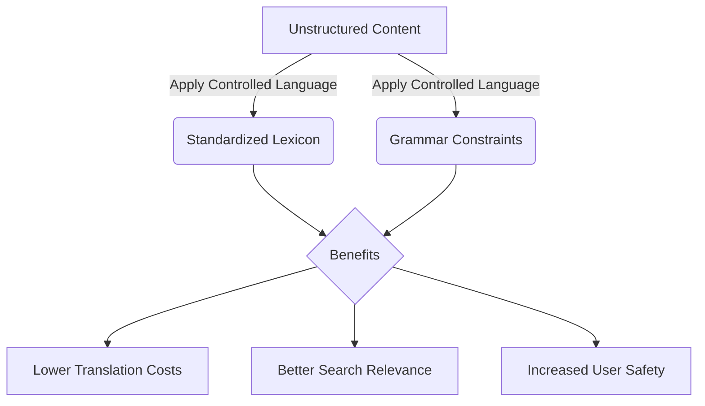

# Controlled language

> A restricted form of a natural language that uses standardized vocabulary and grammar rules to improve the clarity, translatability, and readability of content

---

## What is controlled language?

Controlled language streamlines technical communication by applying a strict lexicon and prescriptive grammar rules to natural languages like English or Japanese. Originally pioneered by the aerospace and defense sectors to safeguard maintenance operations, this method eliminates the ambiguity that often plagues complex documentation. By restricting synonyms and enforcing specific sentence structures, organizations ensure that every approved term carries a singular, predictable meaning across their entire content portfolio.

Standardizing language minimizes the mental effort required to parse instructions. While nested clauses and heavy nominalization force readers to stop and decode syntax, controlled language prioritizes the subject-verb-object (SVO) format and the imperative mood. This directness aligns a reader’s visual scan with their logical task execution, leading to faster comprehension and a significant reduction in operational errors.

??? note "Practical Application: Simplified Technical English"
    [ASD-STE100](https://www.asd-ste100.org/){: target="_blank" rel="noopener" } remains the most influential implementation of these principles. Created for the aerospace industry, it restricts vocabulary to prevent dangerous misunderstandings. For instance, the word "close" is permitted only as a verb ("close the hatch"), never as an adjective. To describe proximity, writers must use the approved term "near."

---

## The impact of linguistic consistency

Documentation often reaches a fragmented global audience, ranging from expert engineers to non-native speakers. Idiomatic expressions and inconsistent synonyms create friction, causing human users to hesitate and automated systems to fail. For global enterprises, "uncontrolled" writing balloons translation costs and introduces errors during localization.

Beyond human readability, standardized writing powers modern content engineering. Ambiguous prose degrades search relevance and disrupts semantic tagging. If descriptions are unstructured, SEO strategies often collapse under keyword conflicts. Adopting predictable language patterns ensures that search algorithms can index, retrieve, and surface information with high precision.

---

## Core pillars of the framework

Implementing a controlled language requires a focus on three specific areas:

*   **Grammatical boundaries:** Limit instructional sentences to 20 words and descriptive text to 25. Prioritize the active voice and imperative mood while stripping away complex verb tenses and gerunds.
*   **Lexical precision:** Mandate a "one word, one meaning" policy. For example, "start" might be the designated term for all activation actions, while "initiate," "launch," and "boot" are explicitly banned to prevent confusion.
*   **Structural predictability:** Use consistent phrasing patterns so that both human readers and machine translation engines can process data without encountering "hallucinated" context.

---

## Design pattern in practice

Effective transformation moves content from passive observation to active instruction:

**Before (Uncontrolled)**
Prior to initiating the installation procedure, it is recommended that the administrator verify that all system dependencies, which are outlined in the appendix, have been completely downloaded, because failure to do so may result in the system being rendered inoperative.

**After (Controlled)**
Before you install the software, verify that you downloaded all dependencies. See the appendix for the list of dependencies.

### Why the controlled version works

The revised text replaces the vague, passive phrase "it is recommended that the administrator verify" with a direct command. By swapping "initiating" for "install" and removing the wordy "rendered inoperative" warning, the message becomes immediate. Breaking a single 39-word sentence into two shorter statements significantly lowers the reader's cognitive load.

---

## Strategy for deployment

Successfully integrating these rules into a documentation pipeline involves more than just a style guide:

1.  **Develop a restricted lexicon:** Curate a master list of approved nouns and verbs. Document banned synonyms alongside their mandatory replacements to guide writers.
2.  **Automate the gatekeeping:** Do not rely on manual memory. Use prose-linting tools like [Vale](https://vale.sh/){: target="_blank" rel="noopener" } to flag non-compliant words or overly long sentences during the drafting phase.
3.  **Embed checks in CI/CD:** Integrate linguistic validation into your continuous integration pipeline. This ensures that unapproved terminology never reaches the production environment.
4.  **Standardize reusable components:** Maintain a library of pre-approved strings for warnings, notes, and boilerplate text to maintain a "single source of truth" for tone and safety.

---

## Avoiding common pitfalls

While efficiency is the goal, over-restriction can backfire. If the language is too sparse, writers may struggle to explain highly nuanced technical architectures, making the documentation feel robotic or incomplete. The goal is clarity, not the total elimination of descriptive depth. 

Furthermore, avoid the "editorial fatigue" caused by manual enforcement. Expecting writers to memorize hundreds of lexical constraints is a recipe for inconsistency. Programmatic enforcement is the only sustainable way to scale controlled language across large teams.