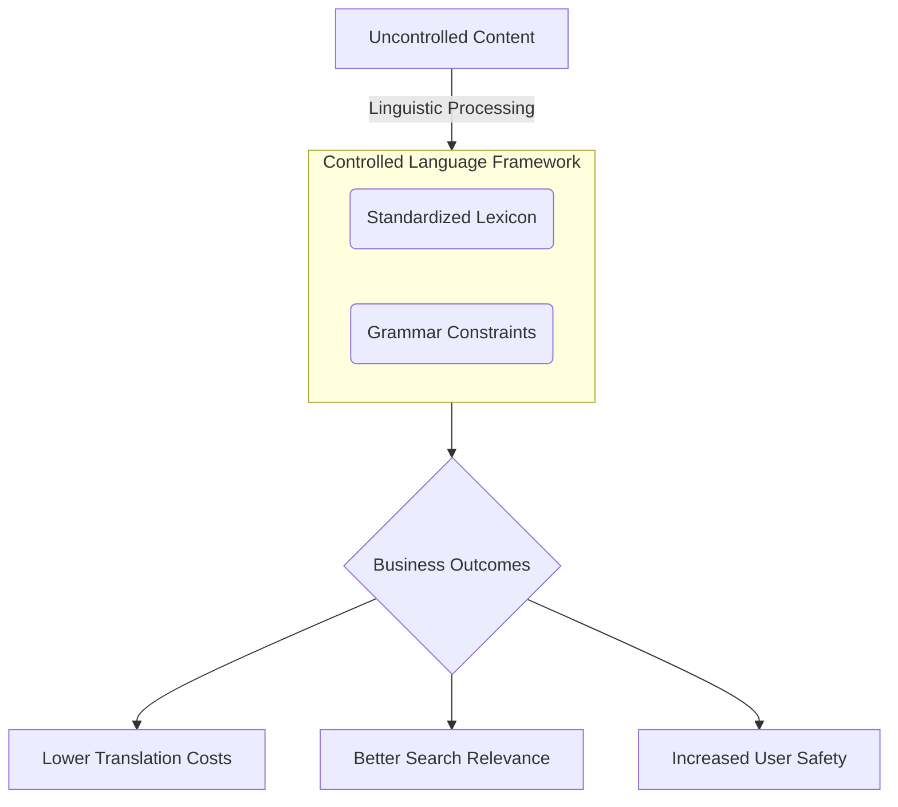

# Controlled language

> A restricted form of a natural language that uses standardized vocabulary and grammar rules to improve the clarity, translatability, and readability of content

---

## What is controlled language?

Controlled language streamlines technical communication by applying a strict lexicon and prescriptive grammar rules to natural languages like English or Japanese. Originally pioneered by the aerospace and defense sectors to safeguard maintenance operations, this method eliminates the ambiguity that often plagues complex documentation. By restricting synonyms and enforcing specific sentence structures, organizations ensure that every approved term carries a singular, predictable meaning across their entire content portfolio.

Standardizing language minimizes the mental effort required to parse instructions. While nested clauses and heavy nominalization force readers to stop and decode syntax, controlled language prioritizes the subject-verb-object (SVO) format and the imperative mood. This directness aligns a reader’s visual scan with their logical task execution, leading to faster comprehension and a reduction in operational errors.

??? note "Practical Application: Simplified Technical English"
    [ASD-STE100](https://www.asd-ste100.org/){: target="_blank" rel="noopener" } is the most widely used implementation of these principles. Created for the aerospace industry, it restricts vocabulary to prevent dangerous misunderstandings. For instance, the word "close" is permitted only as a verb ("close the hatch"), never as an adjective. To describe proximity, writers must use the approved term "near."

---

## The impact of linguistic consistency

Documentation often reaches a fragmented global audience, ranging from expert engineers to non-native speakers. Idiomatic expressions and inconsistent synonyms create friction, causing human users to hesitate and automated systems to fail. For global enterprises, "uncontrolled" writing increases translation costs and introduces errors during localization (e.g., when a translator treats two synonyms as distinct technical components).

Beyond human readability, standardized writing supports modern content engineering. Inconsistent terminology degrades search relevance and disrupts semantic tagging. If terminology is non-standardized, SEO and internal retrieval strategies often fail due to keyword fragmentation (where a single concept is split across multiple terms like "display," "monitor," and "screen"). Adopting predictable language patterns ensures that search algorithms and LLMs can index and retrieve information with higher precision.

---

## Core pillars of the framework

Implementing a controlled language requires a focus on three specific areas:

*   **Grammatical boundaries:** Limit instructional sentences to a maximum of 20 words and descriptive text to 25 words. Prioritize the active voice and imperative mood while removing complex verb tenses, gerunds, and present participles used as adjectives.
*   **Lexical precision:** Mandate a "one word, one meaning" policy. For example, "start" is the designated term for activation actions, while "initiate" and "launch" are prohibited. Note: Technical names (e.g., "Cold Boot") are often exempt but must be defined in a project-specific dictionary.
*   **Structural predictability:** Use consistent phrasing patterns so that both human readers and Machine Translation (MT) engines can process data without encountering ambiguity or "translation noise."

---

## Design pattern in practice

Effective transformation moves content from passive observation to active instruction:

**Before (Uncontrolled)**
Prior to initiating the installation procedure, it is recommended that the administrator verify that all system dependencies, which are outlined in the appendix, have been completely downloaded, because failure to do so may result in the system being rendered inoperative.

**After (Controlled)**
Before you install the software, verify that you downloaded all dependencies. See the appendix for the list of dependencies. If you do not download all dependencies, the system will not operate.

### Why the controlled version works

The revised text replaces the passive, wordy phrase "it is recommended that the administrator verify" with a direct command. By replacing the verb "initiating" with "install" and removing the complex "rendered inoperative" construction, the message becomes immediate. Breaking a single 39-word sentence into three shorter statements significantly lowers the reader's cognitive load and meets the 20-word limit for instructions.

---

## Strategy for deployment

Successfully integrating these rules into a documentation pipeline involves more than just a style guide:

1.  **Develop a restricted lexicon:** Curate a master list of approved nouns and verbs. Document banned synonyms alongside their mandatory replacements.
2.  **Automate the gatekeeping:** Use prose-linting tools like [Vale](https://vale.sh/){: target="_blank" rel="noopener" } to flag non-compliant words, passive voice, or overly long sentences during the drafting phase.
3.  **Embed checks in CI/CD:** Integrate linguistic validation into your continuous integration pipeline (e.g., via GitHub Actions). This ensures that non-compliant terminology is caught before a Pull Request is merged.
4.  **Standardize reusable components:** Maintain a library of pre-approved strings for warnings, notes, and boilerplate text to ensure a "single source of truth" for safety-critical information.

---

## Avoiding common pitfalls

While efficiency is the goal, over-restriction can backfire. If the language is too sparse, writers may struggle to explain complex technical architectures, making the documentation feel incomplete. The goal is clarity, not the total elimination of technical depth. 

Furthermore, avoid the "editorial fatigue" caused by manual enforcement. Expecting writers to memorize hundreds of lexical constraints is unsustainable. Programmatic enforcement via linting tools is the only reliable way to scale controlled language across large teams.