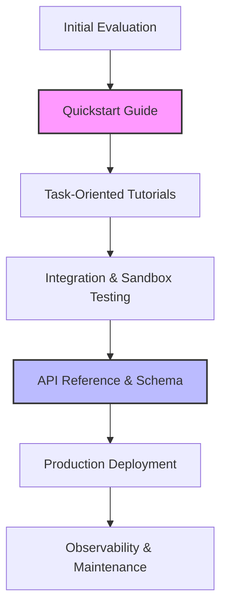

# Developer Experience (DX)

> The environment, tools, and workflows that define how developers interact with a technical product, focused on reducing friction and mental overhead

---

## Defining the Developer Environment

Developer experience (DX) encompasses the workflows and resources engineers navigate when interacting with a technical platform. While user experience (UX) focuses on general consumption, DX addresses specialized interfaces like APIs (REST, GraphQL, gRPC), command-line tools (CLIs), SDKs, and client libraries. 

At its core, DX is the application of cognitive load theory to software engineering: if an engineer spends their mental energy deciphering inconsistent endpoint naming or fragmented documentation, they have less capacity to solve architectural problems.

Prioritizing DX is a business strategy. High-quality DX lowers the barrier to entry, driving product adoption through self-service onboarding. When documentation aligns with code via "docs-as-code" workflows—where documentation is versioned and tested alongside the codebase—developers solve their own problems rather than opening support tickets. Conversely, poor DX leads to platform abandonment. If a code example is deprecated or an integration path is opaque, developers will migrate to a competitor with a lower friction threshold.

---

## Core Principles and Anatomy

A functional developer experience guides a user from their first evaluation to a stable production deployment, including the critical middle step of sandbox testing.



*   **Goal-Oriented Learning:** Organize content around specific use cases (e.g., "Process a Refund") rather than just listing system properties.
*   **Predictable Reference Material:** Use standards like OpenAPI (Swagger) or AsyncAPI. Developers should be able to predict endpoint behavior, status codes, and data types without trial and error.
*   **Time to First Hello World (TTFHW):** A concise quickstart guide is essential. Aim for a successful authenticated request or command execution within minutes of landing on the site.
*   **Constructive Error Architecture:** System feedback must be actionable. Adhere to standards like RFC 7807 (Problem Details for HTTP APIs). Errors should provide a unique error code, a human-readable explanation, and a link to relevant troubleshooting documentation.

---

## Design Pattern: From Narrative to Structure

Dense text hinders information retrieval. Transforming instructional prose into structured, scannable steps improves technical usability.

=== "Before: High Friction"
    In order to authenticate with our service, you must first obtain an API key from the developer console under the settings tab. Once you have the key, you need to pass it in the header of your HTTP request. The header key should be 'Authorization' and the value must be formatted as 'Bearer YOUR_KEY'. Make sure you do not expose this key in client-side code, as doing so compromises your account security. If you fail to include the header, the server will return a 401 Unauthorized status error.

=== "After: Optimized DX"
    ### Authentication
    All API requests require a Bearer Token passed in the `Authorization` header.
    
    1. Retrieve your API key from **Developer Console > Settings**.
    2. Format the header as follows:
    
    ```http
    Authorization: Bearer <YOUR_API_KEY>
    ```
    
    **Example Request:**
    ```bash
    curl -X GET "https://api.provider.com/v1/resource" \
      -H "Authorization: Bearer abc_123_xyz"
    ```
    
    !!! danger "Security Warning"
        API keys grant full access to your account resources. Always store keys in environment variables on the server-side. If a key is leaked, rotate it immediately in the **Security** tab.

---

## Implementation and Validation

Great DX requires continuous maintenance and automated validation to prevent documentation rot.

*   **Write for Scanners:** Use H2/H3 headings and bulleted lists. Developers typically use "F-shaped" scanning patterns to locate code blocks.
*   **Verified Code Snippets:** Never publish partial snippets. Every code block should be a functional unit and ideally verified via a CI/CD pipeline (e.g., using tools like `markdown-code-block-tester`) to ensure compatibility with the latest API version.
*   **Observational Testing (Friction Logging):** Perform "friction logs" where a developer attempts an integration from scratch. Document every instance where they consulted a search engine or felt frustrated.
*   **Tight Feedback Loops:** Provide "was this helpful" widgets and a public issue tracker. Community feedback is the primary sensor for identifying edge-case bugs or outdated SDK dependencies.