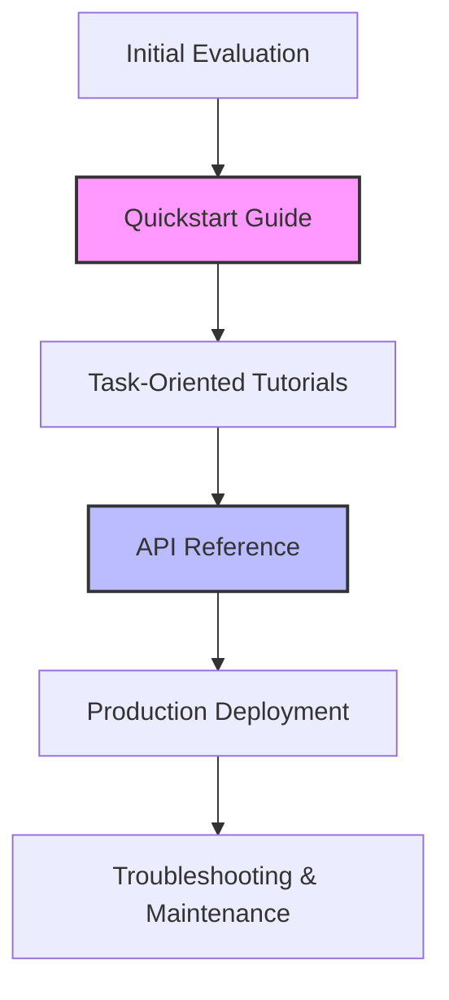

# Developer Experience (DX)

> The environment, tools, and workflows that define how developers interact with a technical product, focused on reducing friction and mental overhead

---

## Defining the Developer Environment

Developer experience (DX) encompasses the workflows and resources engineers navigate when interacting with a technical platform. While user experience (UX) focuses on general consumption, DX addresses specialized interfaces like command-line tools (CLIs), SDKs, and client libraries. At its core, DX is the application of cognitive load theory to software engineering: if an engineer spends their mental energy deciphering a tool's layout or inconsistent documentation, they have less capacity to solve actual architectural problems.

Prioritizing DX is a business strategy, not just a design preference. High-quality DX lowers the barrier to entry, driving product adoption through self-service support. When documentation aligns with code via "docs-as-code" workflows, developers solve their own problems rather than opening support tickets. Conversely, poor DX leads to "choice paralysis" or platform abandonment. If a code example is missing or an integration path is opaque, developers will migrate to a competitor with a lower friction threshold.

---

## Core Principles and Anatomy

A functional developer experience guides a user from their first evaluation to a stable production deployment.



*   **Goal-Oriented Learning:** Organize content around solving specific problems rather than just listing system properties.
*   **Predictable Reference Material:** Use standards like OpenAPI. Developers should be able to predict endpoint behavior without trial and error.
*   **The "Time to Hello World":** A concise quickstart guide is essential. Aim for a successful integration or command execution within minutes of landing on the site.
*   **Constructive Error Architecture:** System feedback must be actionable. Errors should explain why a failure occurred and provide a direct link to the relevant troubleshooting section.

---

## Design Pattern: From Narrative to Structure

Dense text is the enemy of efficiency. Transforming instructional prose into structured, scannable steps drastically improves usability.

=== "Before: High Friction"
    In order to authenticate with our service, you must first obtain an API key from the developer console under the settings tab. Once you have the key, you need to pass it in the header of your HTTP request. The header key should be 'Authorization' and the value must be formatted as 'Bearer YOUR_KEY'. Make sure you do not expose this key in client-side code, as doing so compromises your account security. If you fail to include the header, the server will return a 401 Unauthorized status error.

=== "After: Optimized DX"
    To authenticate your API requests:
    
    1. Retrieve your API key from **Developer Console > Settings**.
    2. Add the key to your HTTP header:
    
    ```http
    Authorization: Bearer <YOUR_API_KEY>
    ```
    
    !!! danger "Security Warning"
        Keep API keys server-side. If a key is compromised, rotate it immediately in the console.

### Why this works
Standardizing the layout allows engineers to scan for the **how** without reading the **why**. The use of bold text for UI navigation, code blocks for syntax, and callouts for security risks ensures that critical information isn't buried in a paragraph.

---

## Implementation and Validation

Great DX requires continuous maintenance. Avoid "anti-patterns" like unformatted walls of text, vague error codes (e.g., "An error occurred"), and stale code samples that fail on execution.

To ensure your platform remains usable, implement the following:

*   **Write for Scanners:** Use descriptive headings and bulleted lists. Developers are usually hunting for a specific answer, not reading a manual cover-to-cover.
*   **Functional Code Only:** Never publish partial snippets. Every code block should be complete and verified via a CI/CD pipeline to ensure it compiles against the latest version.
*   **Observational Testing:** Watch a developer attempt an integration using only the documentation. Note where they stall—these are your primary friction points.
*   **Tight Feedback Loops:** Provide an "Is this page helpful?" widget. Direct feedback from the community is the fastest way to identify missing edge cases or outdated instructions.