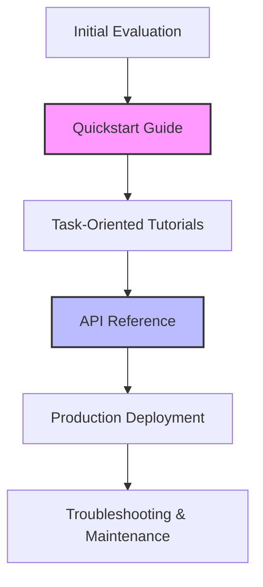

# Developer Experience (DX)

> The holistic process of designing tools, APIs, and documentation that reduce cognitive friction and accelerate developer success

---

## What is developer experience?

Developer experience (DX) focuses on the environment, workflows, and resources that developers use when they interact with a technical product or platform. While `user experience (UX)` optimizes products for general consumers, DX designs specialized interfaces—such as command-line interfaces (CLIs), software development kits (SDKs), and client libraries—to meet the specific workflows of engineers. The foundation of great DX is clear `information architecture (IA)` and technical communication. These ensure that professionals can find, understand, and apply technical knowledge without friction.

The discipline is rooted in `cognitive load theory`. When you write code, you use significant mental resources to solve complex system problems. Poorly designed tools and confusing layouts force you to waste energy deciphering the tool itself. By applying structured writing and clear layouts, you can minimize mental strain and allow engineers to focus on building applications.

---

## Why DX matters

High-quality developer experience helps drive product adoption and engineering efficiency. When platforms prioritize DX, they build trust and lower the barrier to entry. Implementing a `docs as code` workflow ensures that documentation stays updated with software releases. This alignment supports business goals by driving self-service support; developers can resolve issues using the documentation instead of submitting support tickets.

Ignoring DX principles can lead to platform abandonment. If documentation consists of dense paragraphs or lacks a logical structure, developers experience choice paralysis. If they cannot quickly find a code example or understand an integration, they will likely switch to a competitor with clearer documentation.

---

## Core principles and anatomy

A successful developer experience relies on several components that guide a developer from evaluation to deployment.



*   **Task-oriented learning:** Organize content around specific goals rather than system properties. Every tutorial should address a practical `use case` to show how to solve a real-world problem.
*   **Predictable structure:** Follow established standards for reference materials. A machine-readable `API reference` (such as OpenAPI) allows developers to inspect endpoints and parameters without guessing.
*   **Rapid onboarding:** Offer a path to immediate success. A concise **quickstart guide** helps developers run a basic command or complete an integration within minutes.
*   **Actionable troubleshooting:** System feedback must be clear. Use an `error message architecture` that provides an explanation of the issue and a link to a troubleshooting guide.

---

## Design pattern example

The following example shows how transforming a dense paragraph into structured documentation improves usability.

=== "Before: Poor DX layout"
    In order to authenticate with our service, you must first obtain an API key from the developer console under the settings tab. Once you have the key, you need to pass it in the header of your HTTP request. The header key should be 'Authorization' and the value must be formatted as 'Bearer YOUR_KEY'. Make sure you do not expose this key in client-side code, as doing so compromises your account security. If you fail to include the header, the server will return a 401 Unauthorized status error.

=== "After: Applied DX pattern"
    To authenticate your API requests:
    
    1. Get your API key from **Developer Console > Settings**.
    2. Add the key to your HTTP header using this format:
    
    ```http
    Authorization: Bearer <YOUR_API_KEY>
    ```
    
    !!! danger "Security Warning"
        Do not expose your API key in client-side code. If your key is compromised, rotate it immediately in the console.

### Why this pattern works

- **Step-by-step sequencing:** An ordered list helps you scan required actions quickly.
- **Visual cues:** A danger block ensures critical security information stands out.
- **Copy-paste examples:** The code block provides the exact syntax for your environment.

---

## Cognitive impact

Structuring documentation for high-quality DX targets these user-behavior goals:

- **Reduce mental fatigue:** Logical structures help you process information faster, saving energy for engineering tasks.
- **Shorten time to value:** Clear instructions and modular code blocks lead to faster integration cycles.
- **Improve scannability:** Visual cues, bold text, and code callouts help you extract information without reading every word.

---

## Implementation best practices

To maintain an effective developer experience, follow these practices:

- **Write for the scanner:** Use standard headings and clear paragraph breaks. Developers usually search for specific answers rather than reading sequentially.
- **Use a style guide:** Consistency in terminology and tone builds trust. Use automated tools to check grammar and voice.
- **Optimize for search:** Use descriptive titles and include keywords in your `metadata` to help developers find content.
- **Provide functional code:** Do not publish partial snippets. Ensure every code block is complete and can run successfully.

---

## Common anti-patterns

Avoid these mistakes when designing documentation:

- **The wall of text:** Long, unformatted paragraphs make it difficult to find commands.
- **Vague error responses:** Errors that state a failure occurred without explaining how to fix it.
- **Stale code samples:** Outdated syntax or untested scripts that fail when run.

---

## How to validate usability

Use these methods to verify that your documentation supports developers:

- **Task-based usability testing:** Observe developers as they try to integrate your platform using only the docs. Note where they hesitate or get stuck.
- **Feedback loops:** Use a feedback component on each page so developers can rate the content and report missing information.
- **Automated checks:** Use continuous integration (CI) pipelines to verify that links are active and code snippets compile.