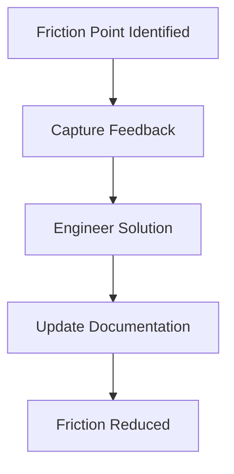

# Developer relations (DevRel)

> A strategic bridge between engineering teams and external communities to foster product adoption through documentation, education, and engagement

---

## What is DevRel?

DevRel is a practice that connects an organization with its external developer community. Instead of focusing on traditional sales or marketing metrics, DevRel helps developers adopt an API or platform by addressing their real-world needs. DevRel teams work across engineering, product management, and marketing to share community feedback with product teams and explain complex engineering concepts to developers.

In the modern software development life cycle (SDLC), DevRel is essential during the maintenance phase and influences planning and design. Developer advocates, developer evangelists, and developer program managers typically lead these efforts. They collaborate with product teams to define the user journey, work with software engineers as subject matter experts (SMEs) to review code libraries, and coordinate with technical writers to build comprehensive API documentation.

---

## Why DevRel matters

In modern technology environments, manual processes for external integrations create bottlenecks. Without a structured DevRel function, engineering teams must often leave core development tasks to answer repetitive support tickets. This creates friction and slows platform adoption. A mature DevRel strategy reduces this friction by providing scalable solutions like self-service platforms, automated sample code repositories, and clear use-case guides.

DevRel also ensures that product teams receive continuous real-world feedback. This helps prevent "content debt" and ensures instructions remain current. By aligning documentation and community feedback with a long-term content strategy, DevRel helps companies scale their platform ecosystems without increasing engineering support costs. This alignment optimizes the developer experience (DX) and increases the return on investment (ROI) for open-platform initiatives.

!!! info "The Developer Advocacy Focus"
    While marketing teams focus on acquiring users, DevRel works to retain them by reducing technical friction. Build technical trust through clear engineering resources rather than promotional messaging.

---

## When to start a DevRel program 

Start a formal DevRel program when your company moves from closed systems to open platforms. Look for these signals to identify when to establish this process:

- **You are expanding external platform integration.** When you open your platform to third-party developers, manual onboarding is difficult to sustain. You need a structured program to manage the community at scale.
- **You have a high volume of repetitive developer queries.** If internal engineering teams are overwhelmed by basic configuration questions, there is likely a gap in self-service education and public resources.
- **Third-party application deployment is slow.** If partner developers take weeks or months to complete a basic setup, your onboarding resources might not align with your audience analysis.

---

## How the workflow works

The DevRel workflow is a feedback loop that identifies community friction, builds technical solutions, and publishes updated educational materials. 

1. **Capture feedback:** The DevRel team monitors community forums, chat channels, and issues on code-sharing repositories. They use audience analysis to find recurring friction points and document the technical hurdles that external users face.
2. **Engineer solutions:** Developer advocates work with core engineering SMEs to create automated scripts, sample applications, or quick-start templates that resolve the friction.
3. **Update documentation:** The team works with technical writers in the document development life cycle (DDLC) to update the API reference and publish FAQs that explain the new solution.

---

## RACI and team roles

To maintain an active developer platform, you must define roles clearly so that community feedback leads to engineering updates:

- **Responsible:** Developer advocates and technical writers. They create resources and code samples and maintain continuous documentation.
- **Accountable:** Head of developer relations or product managers. They are accountable for community growth, document accuracy, and platform adoption metrics.
- **Consulted:** Software engineers and SMEs. They provide information on upcoming code changes and platform architecture constraints.
- **Informed:** Support teams and executive leadership. They receive updates on major developer friction patterns and community sentiment.

---

## Pipeline integration and tools

To help educational materials scale, DevRel teams integrate their workflows into development pipelines using a Docs as Code (DaC) methodology. 

This approach allows developer advocates to submit sample code and tutorial updates using a pull request (PR). Automated linters and test suites check the code for syntax and functional errors before it is merged. After the code is validated, the pipeline automatically deploys the updated knowledge base and code snippets to public environments. This ensures that live guides match the current codebase.

---

## Troubleshooting and common failures

Because DevRel connects internal product schedules with external user communities, alignment can break down in several areas:

- **Fragmented community channels:** If developer feedback is scattered across unmonitored forums, integration bugs may go unaddressed. *Solution:* Establish a centralized community platform and use webhooks to route developer bugs into internal tracking software.
- **Outdated code samples:** If tutorial repositories do not stay synchronized with new API releases, developers will be frustrated by build failures. *Solution:* Use automated testing in sample code repositories to verify that every code snippet works with the latest API build.

---

## Key metrics and success criteria

To measure the value of DevRel, track quantitative engagement metrics and qualitative support data:

- **Support ticket deflection rate:** The decrease in basic technical support queries after you introduce new tutorials and reference guides.
- **Self-service onboarding time:** The time it takes an external developer to register, authenticate, and make their first successful API call.