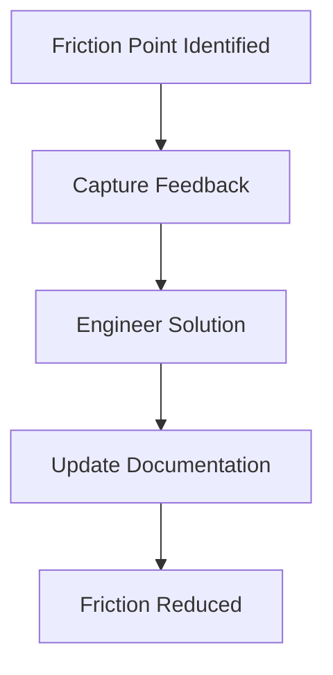

# Developer relations (DevRel)

> A multidisciplinary role bridging engineering teams and external developers to drive platform growth through education, advocacy, and documentation

---

## Defining the DevRel function

DevRel acts as the functional link between an organization’s internal roadmap and its external developer ecosystem. Rather than following traditional sales or marketing funnels, DevRel prioritizes technical utility, helping developers adopt APIs or platforms by solving specific, real-world integration hurdles. These teams operate at the intersection of engineering, product management, and community outreach, translating complex technical architectures into digestible concepts while funneling field feedback back to product owners.

Within the software development life cycle (SDLC), DevRel is most active during the maintenance and evolution phases, though it increasingly influences early-stage planning and design. Developer advocates, evangelists, and program managers lead these efforts. Their work is highly collaborative: they partner with product teams to map the developer journey, work with software engineers to vet code libraries, and assist technical writers in producing high-quality API references.

---

## The business case for DevRel

Manual integration processes are scaling bottlenecks. Without a dedicated DevRel function, internal engineering teams often become de facto support agents, diverted from core development to address repetitive configuration tickets. This friction actively stalls platform adoption. A mature DevRel strategy mitigates this by deploying scalable assets: self-service portals, automated code samples, and comprehensive use-case guides.

Beyond immediate support relief, DevRel protects against "content debt." By keeping a pulse on the community, these teams ensure that instructions remain synchronous with current builds. Aligning documentation with a broader content strategy allows organizations to expand their ecosystems without a linear increase in engineering overhead. This approach optimizes the developer experience (DX) and secures a higher return on investment (ROI) for open-platform initiatives.

!!! info "Advocacy vs. Marketing"
    Marketing focuses on acquisition; DevRel focuses on retention. Success is built on technical trust—providing robust engineering resources rather than promotional hype.

---

## When to formalize the program

The transition from a closed system to an open platform usually necessitates a formal DevRel program. Specific triggers include:

- **External integration scaling.** If you are opening your platform to third-party developers, manual onboarding is no longer sustainable. You need a program designed for community-wide scale.
- **High volume of repetitive queries.** When core engineers spend significant time on basic "how-to" questions, a gap exists in your self-service education and public resources.
- **Delayed deployment cycles.** If partners take weeks to complete basic setups, your onboarding materials likely fail to meet your audience's technical requirements.

---

## The DevRel workflow

Effective DevRel functions as a continuous feedback loop that identifies friction, engineers technical solutions, and updates educational materials.

1. **Capture feedback:** The team monitors forums, chat channels, and repository issues to identify recurring technical hurdles.
2. **Engineer solutions:** Advocates work with subject matter experts (SMEs) to build automated scripts, sample apps, or quick-start templates that bypass common friction points.
3. **Update documentation:** Collaborating with technical writers within the document development life cycle (DDLC), the team refreshes API references and FAQs to reflect these new solutions.

---

## RACI and team roles

Defining ownership ensures that community feedback actually results in product improvements:

- **Responsible:** Developer advocates and technical writers. They build the code samples and maintain the live documentation.
- **Accountable:** Head of DevRel or Product Managers. They own the metrics for community growth and documentation accuracy.
- **Consulted:** Software engineers and SMEs. They provide the technical constraints and details on upcoming architectural changes.
- **Informed:** Support teams and executives. They receive reports on developer sentiment and major friction patterns.

---

## Pipeline integration: Docs as Code

To maintain velocity, DevRel teams typically adopt a Docs as Code (DaC) methodology. This integrates educational content directly into the development pipeline.

Under this model, developer advocates submit sample code and tutorials via pull requests (PRs). Automated linters and test suites validate the code for syntax and functionality before merging. Once validated, the pipeline automatically deploys the updated knowledge base and code snippets. This ensures the documentation never drifts from the current codebase.

---

## Troubleshooting common failures

Misalignment between internal schedules and external community needs can lead to several common points of failure:

- **Siloed feedback channels:** When developer feedback is scattered across unmonitored platforms, critical bugs go unnoticed. *Mitigation:* Centralize community interaction and use webhooks to feed developer issues directly into internal tracking systems.
- **Code sample drift:** Tutorial repositories that aren't synchronized with new API releases lead to build failures and developer frustration. *Mitigation:* Implement automated testing within sample repositories to verify every snippet against the latest API build.

---

## Success criteria

Quantifying DevRel requires a mix of engagement and support data:

- **Support ticket deflection:** A measurable drop in basic technical queries following the release of new tutorials or guides.
- **Time-to-first-call:** The duration between a developer's registration and their first successful API call—the primary metric for onboarding efficiency.