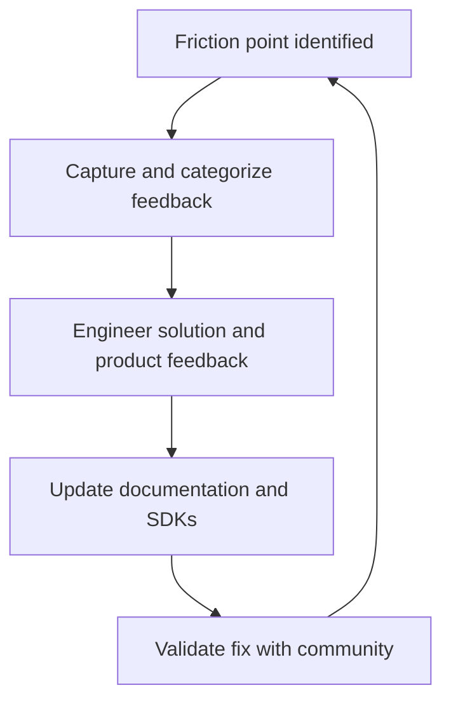

# Developer relations (DevRel)

> *A multidisciplinary role bridging engineering teams and external developers to drive platform growth through education, advocacy, and documentation*

---

## Defining the DevRel function

Developer relations (DevRel) acts as the functional link between the internal roadmap of an organization and its external developer ecosystem. Rather than following traditional sales or marketing funnels, DevRel prioritizes technical utility. This approach helps developers adopt application programming interfaces (APIs) or platforms by solving specific, real-world integration hurdles. 

These teams operate at the intersection of engineering, product management, and community outreach. They translate complex technical architectures into digestible concepts and deliver field feedback to product owners.

Within the software development lifecycle (SDLC), DevRel is most active during the design, launch, and growth phases. In the design phase, they provide developer experience (DX) feedback to shape APIs before they are finalized. During launch and growth, they drive adoption through technical enablement. Developer advocates, evangelists, and developer experience engineers lead these efforts. Their work is highly collaborative: they partner with product teams to map the developer journey, work with software engineers to vet software development kits (SDKs) and libraries, and assist technical writers in producing high-quality API references.

---

## The business case for DevRel

Manual integration processes are scaling bottlenecks. Without a dedicated DevRel function, internal engineering teams often become unintentional support agents who are diverted from core development to address repetitive configuration tickets. This friction stalls platform adoption. A mature DevRel strategy mitigates this by deploying scalable assets such as self-service portals, automated code samples, and comprehensive use-case guides.

Beyond immediate support relief, DevRel protects against content debt and API rot. By monitoring the community, these teams ensure that instructions remain synchronous with current builds. Aligning documentation with a broader content strategy allows organizations to expand their ecosystems without a linear increase in engineering overhead. This approach optimizes the DX and secures a higher return on investment (ROI) for open-platform initiatives.

!!! info "Advocacy vs. Marketing"
    Marketing focuses on acquisition and awareness; DevRel focuses on enablement and retention. Success is built on technical trust by providing robust engineering resources instead of promotional hype.

---

## When to formalize the program

The transition from a closed system to an open platform usually necessitates a formal DevRel program. Specific triggers include:

- **External integration scaling.** If you are opening your platform to third-party developers, manual onboarding is no longer sustainable. You need a program designed for community-wide scale.
- **High volume of repetitive queries.** When core engineers spend significant time on basic how-to questions, a gap exists in your self-service education and public resources.
- **Low conversion in sandbox environments.** If developers register for API keys but fail to reach production, there is likely a technical or educational barrier in the onboarding flow.

---

## The DevRel workflow

Effective DevRel functions as a continuous feedback loop that identifies friction, engineers technical solutions (either in the documentation or the product itself), and validates the results.

1. **Capture feedback:** The team monitors forums, chat channels, and repository issues to identify recurring technical hurdles.
2. **Engineer solutions:** Advocates work with subject matter experts (SMEs) to build automated scripts and sample apps, or they contribute directly to SDKs and APIs to remove the friction at the source.
3. **Update documentation:** Collaborating with technical writers within the documentation development lifecycle (DDLC), the team refreshes API references and FAQs to reflect these new solutions.
4. **Validate:** The team confirms with the community that the friction point is resolved, completing the feedback process.

---

## RACI and team roles

Defining ownership ensures that community feedback results in product improvements. The following list uses the Responsible, Accountable, Consulted, and Informed (RACI) model:

- **Responsible:** Developer advocates, DX engineers, and technical writers. They build the code samples and maintain the live documentation.
- **Accountable:** Head of DevRel or Product Management. They own the metrics for community growth and documentation accuracy.
- **Consulted:** Software engineers and SMEs. They provide the technical constraints and details on upcoming architectural changes.
- **Informed:** Support teams and executives. They receive reports on developer sentiment and major friction patterns.

---

## Pipeline integration: docs as code

To maintain velocity, DevRel teams typically adopt a docs as code methodology. This integrates educational content directly into the development pipeline.

Under this model, developer advocates submit sample code and tutorials via pull requests (PRs). Automated linters validate syntax, and continuous integration (CI) runners execute test suites against the code snippets to ensure they work against the current API version. Once validated, the pipeline automatically deploys the updated knowledge base. This ensures the documentation never drifts from the current codebase.

---

## Troubleshooting common failures

Misalignment between internal schedules and external community needs can lead to several common points of failure:

- **Siloed feedback channels:** When developer feedback is scattered across unmonitored platforms, critical bugs go unnoticed. **Mitigation:** Centralize community interaction and use webhooks to feed developer issues directly into internal tracking systems such as Jira or GitHub Issues.
- **Code sample drift:** Tutorial repositories that are not synchronized with new API releases lead to build failures. **Mitigation:** Use testable snippets where the documentation pulls code directly from a verified, compiled repository.

---

## Success criteria

Quantifying DevRel requires a mix of engagement and support data:

- **Support ticket deflection:** A measurable drop in basic technical queries following the release of new tutorials or guides.
- **Time to first Hello World (TTFHW):** The duration between a developer registration and the first successful API call. This duration is the primary metric for onboarding efficiency.
- **Community Growth:** The increase in active contributors, library downloads, or third-party integrations over time.