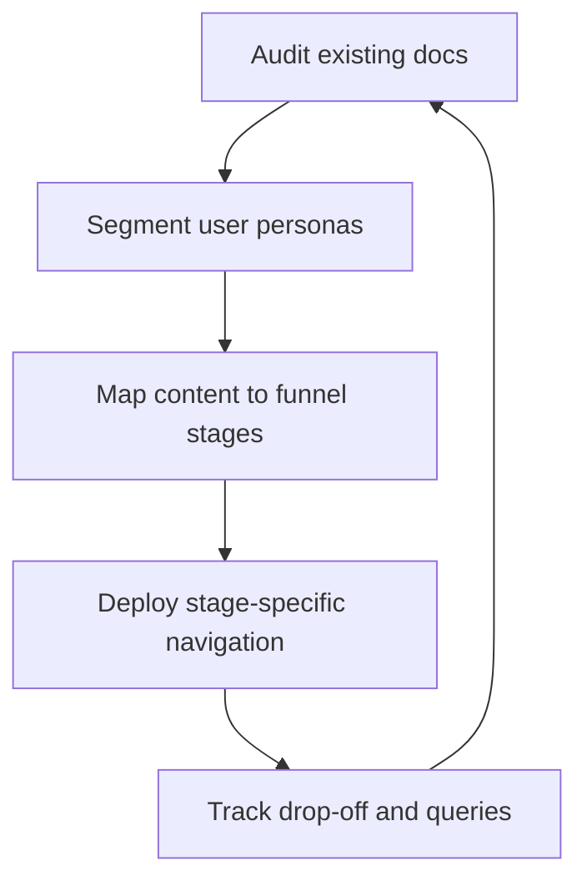

# Documentation funnel

> A strategic model for mapping technical content to different stages of the user journey, from initial discovery to advanced troubleshooting

---

## What is a documentation funnel?

A **documentation funnel** is a framework that organizes technical content based on how a user moves through a product. Similar to a marketing funnel, it categorizes documentation into distinct stages: awareness, onboarding, day-to-day operation, and advanced optimization. This model helps you align your content strategy and information architecture with the user's path, making sure they get the right information at the right time. This approach transforms technical documentation from a static library into a tool for user adoption.

The mapping process happens during the design and maintenance phases of the software development life cycle (SDLC). It requires a cross-functional effort:

*   **Technical writers** lead the content structure and execution.
*   **Product managers** help define user personas and their goals.
*   **Software engineering and developer relations teams** identify technical friction points.
*   **Customer support** provides real-world data to refine troubleshooting content.

---

## Why it matters

A structured documentation funnel helps you avoid creating disorganized or redundant articles. This reduces technical debt and prevents outdated content. Without a framework, scattered materials often confuse readers, leading to poor usability and a frustrating developer experience (DX). A defined funnel ensures that foundational topics do not clutter reference pages and that complex configurations do not overwhelm new users.

Relying on manual publishing processes often creates scaling bottlenecks. Support teams can become overwhelmed with basic questions if users cannot find beginner-friendly entry points. Conversely, advanced users might abandon a product if technical references are buried under "getting started" guides. A well-designed funnel automates the logical flow of learning, which improves the product experience and allows engineers to focus on building features.

---

## When to adopt this workflow 

As your product grows and your library expands, users may struggle to navigate your documentation. Adopt this workflow if you notice these indicators:

*   **Growing complexity:** As product features scale, a flat structure makes search and discovery difficult. You need a hierarchy to classify content from high-level overviews to specific APIs.
*   **High volume of basic support tickets:** If customer support receives inquiries about setup steps that are already documented, the entry point of your funnel is likely broken.
*   **Diverse user personas:** When your product serves both low-code business users and system architects, a single documentation path fails to serve either group effectively.

---

## How the workflow works

To start, audit your existing documentation, categorize it by user intent, and measure how users move between stages.



1.  **Auditing and segmentation:** Audit your current articles. Work with product teams to identify primary user personas and define their learning stages.
2.  **Mapping and alignment:** Organize content into four funnel stages:
    *   **Top-of-funnel (Discovery and evaluation):** High-level concepts, architectural overviews, and white papers.
    *   **Middle-of-funnel (Onboarding):** Step-by-step tutorials and a quickstart guide.
    *   **Bottom-of-funnel (Operation and reference):** API reference pages, code samples, and system configurations.
    *   **Post-funnel (Maintenance and resolution):** Troubleshooting guides and FAQs.
3.  **Continuous optimization:** Monitor page-view pathways and search queries to identify where users drop out. Use automated analytics to find gaps in the flow.

---

## RACI and team roles

Clearly define roles to keep the documentation funnel accurate:

*   **Responsible:** Technical writers design the content hierarchy, draft the guides, and maintain the structure.
*   **Accountable:** The documentation lead or product manager ensures the funnel matches product releases and meets adoption goals.
*   **Consulted:** Subject matter experts (SMEs), including software engineers, verify technical accuracy.
*   **Informed:** Customer support and QA specialists provide feedback on common user struggles.

---

## Pipeline integration and tooling

You can integrate this framework into a **docs-as-code** pipeline. By using a static site generator like [MkDocs](https://www.mkdocs.org/){: target="_blank" rel="noopener" }, you can use metadata in the YAML front matter of each Markdown file to assign articles to funnel stages.

During the CI/CD build process, automated scripts parse these attributes to build dynamic landing pages and sidebar hierarchies.

=== "YAML metadata"
    ```yaml hl_lines="4"
    ---
    title: Quickstart with our API
    description: Start sending requests in under five minutes.
    funnel_stage: onboarding
    ---
    ```

=== "Python funnel validator"
    ```python hl_lines="3"
    # Make sure onboarding docs do not contain raw API schema dumps
    def validate_funnel_stage(file_content, stage):
        if stage == "onboarding" and "schema" in file_content:
            raise ValueError("Onboarding content must not contain schema dumps.")
    ```

!!! tip "Pro tip"
    Use automated prose linting tools (like Vale) to check that top-of-funnel documents remain free of dense jargon before a pull request is merged.

---

## Troubleshooting and common points of failure

*   **The "leaky" funnel (User drop-off):** Users find a conceptual overview but cannot find a pathway to onboarding.
    *   *Solution:* Use clear Call-to-Action (CTA) buttons at the end of high-level pages to guide users to the next stage.
*   **Content overlap (Stage confusion):** Writers mix quickstart steps with exhaustive reference tables, which overwhelms beginners.
    *   *Solution:* Use collapsible blocks to hide dense data on onboarding pages or move reference data to separate files.

??? note "Technical details"
    This content remains hidden until the user selects the header, which prevents cognitive overload during onboarding.

---

## Key metrics and success criteria

*   **Onboarding progression:** The percentage of users who move from the quickstart guide to their first API call.
*   **Ticket deflection:** The decline in basic setup support tickets after implementing the funnel.
*   **Search success rate:** The ratio of searches that lead to a click versus searches that return no results.