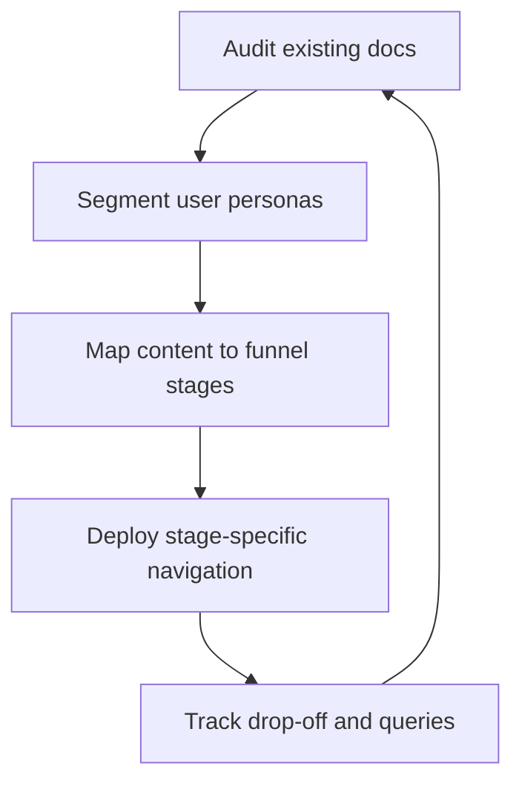

# Documentation funnel

> A framework for organizing technical content by user intent, mapping articles to specific stages of product adoption and expertise

---

## Defining the documentation funnel

A documentation funnel moves away from the "static library" approach, instead organizing technical content to mirror a user’s progression through a product. Borrowing from the marketing funnel concept, this framework categorizes documentation into distinct phases: awareness, onboarding, operation, and optimization. By aligning information architecture with the user's path, you ensure that high-level concepts don't stall advanced users and technical minutiae don't overwhelm beginners.

Implementing this model requires a cross-functional strategy during the design and maintenance phases of the software development life cycle (SDLC):

*   **Technical writers** architect the content hierarchy.
*   **Product managers** define the target personas and their milestones.
*   **Engineering and DevRel** pinpoint technical friction and edge cases.
*   **Customer support** identifies the real-world gaps where users frequently get stuck.

---

## Strategic value

Unstructured documentation leads to "content bloat"—a graveyard of redundant or outdated articles that confuse readers and degrade the developer experience (DX). A defined funnel acts as a filter, preventing foundational topics from cluttering reference pages and keeping complex configurations out of the way during initial setup.

When publishing remains a manual, ad-hoc process, scaling becomes impossible. Support teams eventually drown in "how-to" tickets because entry points are obscured. Conversely, expert users may churn if the technical meat is buried under basic marketing fluff. A well-designed funnel creates a logical learning flow, automating the transition from curious visitor to power user so engineers can focus on feature development rather than repeating basic instructions.

---

## Indicators for adoption

As a product scales, flat documentation structures eventually fail. You should transition to a funnel-based workflow if you notice the following:

*   **Navigational friction:** Users struggle to find specific APIs because search results are dominated by high-level overviews.
*   **Support ticket trends:** Customer success teams report high volumes of queries regarding setup steps that are already documented but difficult to find.
*   **Persona conflict:** A single documentation path is trying to serve both low-code business users and system architects simultaneously, satisfying neither.

---

## Implementing the workflow

The transition begins with a content audit focused on user intent rather than just topic categories.



1.  **Audit and segment:** Review current articles alongside product teams to identify primary user personas and their specific learning milestones.
2.  **Content mapping:** Distribute content across four primary stages:
    *   **Top-of-funnel (Discovery):** Conceptual overviews, architectural diagrams, and white papers.
    *   **Middle-of-funnel (Onboarding):** Tutorials and "Hello World" quickstarts.
    *   **Bottom-of-funnel (Operation):** API references, CLI commands, and system configurations.
    *   **Post-funnel (Resolution):** Troubleshooting logs and FAQs.
3.  **Iterative optimization:** Use analytics to track where users drop out or which search queries return no results, then adjust the funnel to fill those gaps.

---

## RACI and team ownership

Clear ownership prevents the funnel from becoming a siloed project:

*   **Responsible:** Technical writers design the hierarchy and maintain the Markdown files.
*   **Accountable:** The documentation lead ensures the structure aligns with product releases and adoption targets.
*   **Consulted:** Software engineers verify the technical accuracy of the reference material.
*   **Informed:** Support and QA provide data on recurring user pain points.

---

## Pipeline integration

Modern documentation-as-code pipelines can automate funnel management. By using a static site generator like [MkDocs](https://www.mkdocs.org/){: target="_blank" rel="noopener" }, you can tag articles with metadata in the YAML front matter to define their funnel stage.

During the CI/CD build, automated scripts can parse these tags to generate dynamic sidebars or validate content depth.

=== "YAML metadata"
    ```yaml hl_lines="4"
    ---
    title: Quickstart with our API
    description: Start sending requests in under five minutes.
    funnel_stage: onboarding
    ---
    ```

=== "Python funnel validator"
    ```python hl_lines="3"
    # Prevents technical 'leakage' into onboarding guides
    def validate_funnel_stage(file_content, stage):
        if stage == "onboarding" and "schema" in file_content:
            raise ValueError("Onboarding guides should link to schemas, not embed them.")
    ```

!!! tip "Linting for intent"
    Incorporate prose linters like Vale to ensure top-of-funnel documents remain free of dense jargon, keeping the entry point accessible.

---

## Failure modes and solutions

*   **The "Leaky" Funnel:** Users read an overview but have no clear path to the quickstart.
    *   *Solution:* Embed prominent Call-to-Action (CTA) buttons at the end of high-level pages.
*   **Information Overload:** Writers include exhaustive reference tables within tutorials.
    *   *Solution:* Use collapsible blocks for dense data or move reference material to dedicated "Bottom-of-funnel" pages.

??? note "Using UI components"
    Collapsible sections or tabs allow users to opt-in to technical depth, preventing cognitive overload for beginners while remaining accessible to experts.

---

## Success metrics

*   **Progression rate:** The percentage of users moving from a quickstart guide to an authenticated API call.
*   **Ticket deflection:** Reductions in "Level 1" support tickets related to initial configuration.
*   **Search-to-click ratio:** Improved accuracy in users finding stage-appropriate content on their first search.