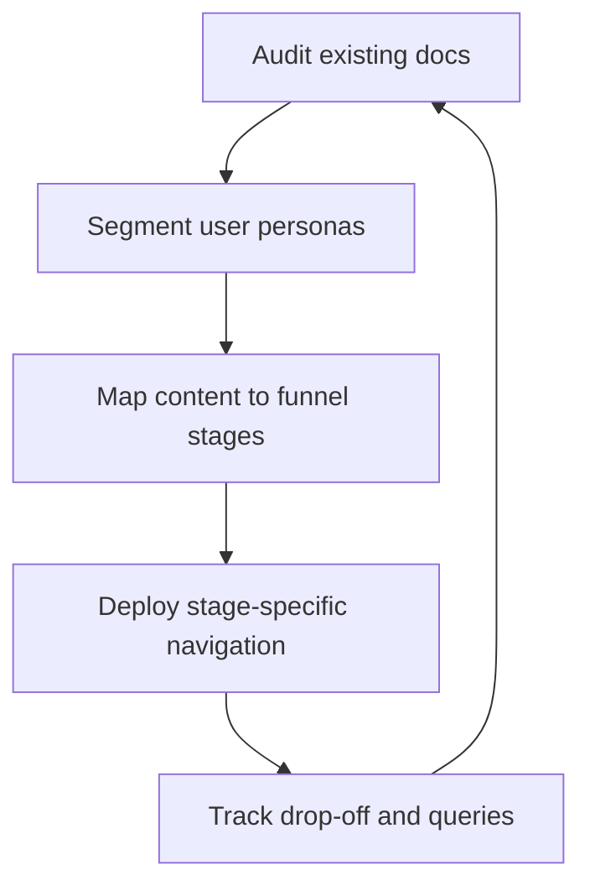

# Documentation funnel

> *A framework for organizing technical content by user intent, mapping articles to specific stages of product adoption and expertise*

---

## Defining the documentation funnel

A documentation funnel departs from the static library approach. Instead, it organizes technical content to mirror the progression of a user through a product. Based on the marketing funnel concept, this framework categorizes documentation into distinct phases: discovery, onboarding, operation, and optimization. By aligning information architecture with the path of the user, you ensure that high-level concepts do not hinder advanced users and technical minutiae do not overwhelm beginners.

Implementing this model requires a cross-functional strategy during the design and maintenance phases of the software development life cycle (SDLC):

- Technical writers architect the content hierarchy and taxonomies.
- Product managers define the target personas and their adoption milestones.
- Engineering and developer relations (DevRel) pinpoint technical friction, edge cases, and application programming interface (API) complexities.
- Customer support identifies the real-world gaps where users frequently stop or misconfigure the product.

---

## Strategic value

Unstructured documentation leads to content bloat: an accumulation of redundant or outdated articles that confuse readers and degrade the developer experience (DX). A defined funnel acts as a filter, preventing foundational topics from cluttering reference pages and keeping complex configurations out of the way during initial setup.

When publishing remains a manual, ad hoc process, scaling becomes impossible. Support teams eventually receive an excessive number of how-to tickets because entry points are obscured. Conversely, expert users might churn if the technical depth is buried under high-level marketing content. A well-designed funnel creates a logical learning flow, guiding the transition from curious visitor to power user.

---

## Indicators for adoption

As a product scales, flat documentation structures eventually fail. You should transition to a funnel-based workflow if you notice the following:

- **Navigational friction:** Users struggle to find specific API endpoints because search results are dominated by high-level conceptual overviews.
- **Support ticket trends:** Customer success teams report high volumes of Level 1 queries regarding setup steps that are documented but have low discoverability.
- **Persona conflict:** A single documentation path attempts to serve both low-code business users and system architects simultaneously, failing to provide the appropriate level of abstraction for either.

---

## Implementing the workflow

The transition begins with a content audit focused on user intent rather than just topic categories.



1. **Audit and segment:** Review current articles alongside product teams to identify primary user personas and their specific learning milestones.
2. **Content mapping:** Distribute content across four primary stages:
    - **Top-of-funnel (Discovery):** Conceptual overviews, architectural diagrams, and use-case white papers.
    - **Middle-of-funnel (Onboarding):** Tutorials and Hello World quickstarts.
    - **Bottom-of-funnel (Operation):** API references, command-line interface (CLI) command manifests, and system configuration schemas.
    - **Retention/Optimization (Expertise):** Troubleshooting guides, performance tuning, and advanced frequently asked questions (FAQ).
3. **Iterative optimization:** Use analytics to track where users drop out (such as high bounce rates on quickstarts) or which search queries return no results, then adjust the funnel to fill those gaps.

---

## RACI and team ownership

Clear ownership prevents the funnel from becoming an isolated project. The following roles are based on the Responsible, Accountable, Consulted, and Informed (RACI) model:

- **Responsible:** Technical writers design the hierarchy and maintain the source files, such as Markdown.
- **Accountable:** The documentation lead ensures the structure aligns with product releases and adoption targets.
- **Consulted:** Software engineers verify the technical accuracy of reference material and code samples.
- **Informed:** Support and quality assurance (QA) provide data on recurring user pain points and common error states.

---

## Pipeline integration

Modern documentation-as-code pipelines can automate funnel management. By using a static site generator such as [MkDocs](https://www.mkdocs.org/){: target="_blank" rel="noopener" }, you can tag articles with metadata in the YAML front matter to define their funnel stage.

During the continuous integration and continuous delivery (CI/CD) build, automated scripts can parse these tags to generate dynamic sidebars or validate content depth.

=== "YAML metadata"
    ```yaml hl_lines="4"
    ---
    title: Quickstart with our API
    description: Start sending requests in under five minutes.
    funnel_stage: onboarding
    ---
    ```

=== "Python funnel validator"
    ```python hl_lines="3"
    # Prevents technical 'leakage' (e.g., raw schemas) into onboarding guides
    def validate_funnel_stage(file_content, stage):
        # Checks for the presence of a specific schema definition block in onboarding files
        if stage == "onboarding" and "type: object" in file_content and "properties:" in file_content:
            raise ValueError("Onboarding guides should link to full schemas, not embed raw definitions.")
    ```

!!! tip "Linting for intent"
    Incorporate prose linters like Vale to ensure top-of-funnel documents remain free of dense jargon, keeping the entry point accessible.

---

## Failure modes and solutions

- **Gaps in the funnel:** Users read an overview but have no clear path to the quickstart.
    - *Solution:* Embed prominent call-to-action (CTA) buttons or next steps links at the end of discovery pages.
- **Information overload:** Writers include exhaustive reference tables within tutorials.
    - *Solution:* Use collapsible blocks for dense data or move reference material to dedicated bottom-of-funnel pages, linking to them from the tutorial.

---

## Success metrics

- **Progression rate:** The percentage of users moving from a quickstart guide to a successful authenticated API call.
- **Ticket deflection:** Reduction in Level 1 support tickets related to initial configuration and environment setup.
- **Search-to-click ratio:** Improved accuracy in users clicking on stage-appropriate content, such as an expert clicking a reference link rather than a conceptual overview.