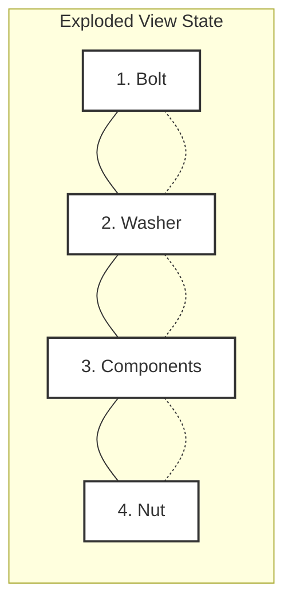

# Exploded view

> *A technical illustration that displays the individual components of an assembly separated by distance to reveal their relative positions and assembly order*

---

## Defining the exploded view

An exploded view is a diagram or 3D rendering that displaces the components of an object along one or more axes. Although a standard assembly drawing shows the finished product, the exploded view separates the components to reveal hidden internal parts and the logic of their connection. 

By maintaining the orientation of every screw, plate, and housing, these illustrations allow a user to see through the exterior of a device without losing the context of the whole.

In technical communication, these drawings act as a visual bridge between a list of parts and the physical reality of assembly. They transform dense, multi-step mechanical instructions into a single, navigable map.

---

## Reducing cognitive friction

Complex hardware often creates a problem where users know what the device does but not how it is held together. Exploded views solve this problem by externalizing the mental effort required to understand an assembly. Instead of forcing a technician to cross-reference long text descriptions while rotating a heavy object, the diagram provides an immediate spatial reference.

When these views are integrated into digital documentation, they typically map directly to a bill of materials (BOM). This creates a functional link between a 3D shape and its metadata, such as part numbers, torque specifications, or supplier links, which accelerates the troubleshooting and procurement process.

---

## Anatomy of a readable diagram

To maintain clarity, an exploded view relies on a few necessary structural elements:

- **Trail lines:** These dashed or lightweight lines, also known as leader lines or flow lines, act as the path for each part. They show exactly where a component seats or the axis along which it travels during installation.
- **Spatial displacement:** Parts must be moved far enough to eliminate overlapping edges but must stay close enough to maintain the visual connection of the assembly.
- **Isometric or axonometric projection:** Using a standard 30-degree angle for isometric drawings ensures that depth is represented without the distortion found in perspective drawings, which keeps component proportions consistent.
- **Callouts:** These alphanumeric tags, or balloons, link the drawing to the parts list and act as the primary index for the user.

---

## Design pattern example

The following diagram illustrates a standard fastener assembly exploded along a horizontal axis.

### Pattern breakdown

- **Linear progression:** The trail line, represented by the dashed links, communicates that the bolt must pass through the washer and the components before being secured by the nut.
- **Data mapping:** The callouts (1–4) correspond to a BOM, which allows the user to verify they have the correct hardware before starting work.
- **Ordered proximity:** The arrangement follows the physical order of assembly, which minimizes the risk of missing a step such as a recessed washer.

---

## Implementation best practices

Effective illustrations prioritize utility over artistic flair. To ensure a professional result, keep these rules in mind:

1.  **Lock the perspective:** Do not change the camera angle between sub-assemblies in a single document. Consistency is key to maintaining a sense of direction for the user.
2.  **Avoid crossing trail lines:** If multiple parts share an axis, offset them clearly. If the assembly is complex, use multiple axes (X, Y, and Z) to prevent the path of one part from obscuring the landing point of another.
3.  **Standardize line weights:** Use a hierarchy of lines. Thick lines define component outlines, while the thinnest, dashed lines are reserved for trail paths.
4.  **Eliminate unattached parts:** Every component must have a clear relationship to the assembly. A part placed in white space without a trail line or clear proximity to its mounting point causes confusion.
5.  **Legibility over strict scale:** Although proportions should be maintained, very small hardware, such as M2 screws, may be slightly enlarged or shown in a detailed inset view. If rendered at true scale relative to a large housing, small components may become invisible or indistinguishable.

---

## Validation and usability

A visual illustration is only useful if it is readable. Test your exploded views with two simple checks:

- **The five-second callout test:** Ask a technician to find a specific part number. If they cannot locate the callout or follow the trail line within five seconds, the visual hierarchy is too cluttered.
- **Silent assembly test:** Can a user determine the assembly order using only the diagram, without reading the text instructions? This is the benchmark for a successful technical illustration.