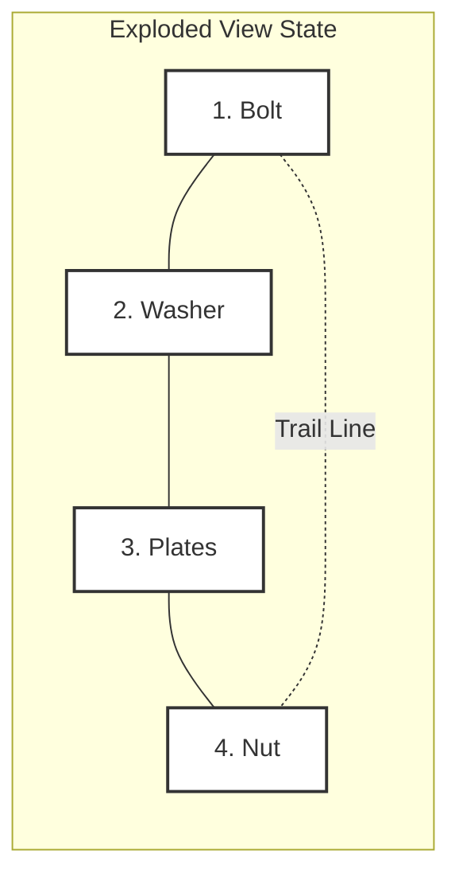

# Exploded view

> A technical illustration showing hardware components separated but aligned to demonstrate their assembly sequence and relationship

---

## What is an exploded view?

An exploded view is a diagram, 3D rendering, or illustration of an object that shows its individual components separated by specific spatial distances. Unlike a standard assembly drawing, which displays the final state of a product, this representation pulls parts outward along a shared axis. Its primary function is to reveal internal or hidden components while preserving their orientation and relationship to the rest of the unit.

In information design, this pattern uses spatial representation to convey mechanical instructions. It simplifies multi-step physical processes into a single visual illustration. For technical communication, these drawings are essential deliverables for hardware documentation, maintenance guides, and instructional manuals. They help users understand how distinct components interact before they handle the physical object.

---

## Why it matters

Exploded views reduce the cognitive load for users interacting with complex hardware. Without visual aids, users must read long descriptions and physically rotate objects to understand how parts fit together. This process taxes working memory, which often leads to frustration, assembly errors, and support tickets.

By replacing large blocks of text with a clean illustration, you clarify the spatial problem-solving process. Users no longer need to mentally deconstruct the item; they can visually trace the assembly path. In digital documentation, mapping these views to a bill of materials (BOM) improves findability. This allows users to quickly cross-reference a physical part with its part number, specifications, or ordering metadata.

---

## Core principles and anatomy

An effective exploded view relies on specific structural elements to remain readable and accurate.

*   **Trail lines (projection lines):** The dashed guide lines along which parts are displaced. These lines show the exact trajectory of the assembly or disassembly sequence.
*   **Spatial displacement:** The separation of components. Parts must be moved far enough apart to prevent overlapping edges, but close enough to maintain their context.
*   **Isometric or perspective orientation:** A consistent, angled view (most commonly an isometric projection) that provides a three-dimensional sense of depth without distorting component scales.
*   **Callouts:** Numeric or alphanumeric labels placed next to each component that link the visual representation to a parts list or a BOM.

---

## Design pattern example

The following diagram shows an exploded view of a simple hardware fastener assembly aligned along a horizontal axis.

### Breakdown of the pattern

- **Trail lines:** The dashed line represents the linear path of installation. It communicates that the bolt must pass through the washer and plates before securing into the nut.
- **Callouts:** Numbers or labels map each visual shape to a row in a database or table. This structure improves usability when a user needs to order a replacement part.
- **Ordered proximity:** Although the parts are separated, they are arranged in the exact order of assembly to minimize errors.

---

## Cognitive impact and user experience

Integrating this design pattern into your visual communication strategy achieves several goals:

- **Improved spatial cognition:** Helps users construct an accurate mental model of how internal components interact, reducing assembly time.
- **Efficient troubleshooting:** Allows technicians to identify damaged or missing internal parts without completely disassembling the physical device.

---

## Implementation best practices

To ensure your exploded views are professional and usable, follow these rules:

- **Maintain a single view angle:** Do not shift the camera perspective between different sub-assemblies in the same manual. Consistent angles maintain user orientation.
- **Avoid overlapping edges:** Displace parts sufficiently so the outline of one component does not obscure the features of another.
- **Use standardized line weights:** Use thicker lines for the outer profiles of components and thinner, dashed lines for trail lines to reduce visual noise.
- **Coordinate terminology with the BOM:** Ensure callout labels match the exact terminology used in written steps and tables.

---

## Common anti-patterns

Avoid these common visual errors:

- **The spaghetti axis:** Drawing overlapping or intersecting trail lines that cross over one another, confusing the assembly order.
- **Floating components:** Placing a part in space without a trail line or clear proximity to its landing spot.
- **Scale mismatch:** Rendering small fasteners (like screws) at an incorrect scale relative to large components, which makes parts invisible or confusingly large.

---

## How to validate usability

Verify the effectiveness of your exploded views using these testing methods:

- **The 5-second callout test:** Show the diagram to a participant for five seconds. Ask them to locate a specific part callout. If they cannot find it, simplify the visual hierarchy.
- **Blind physical assembly test:** Provide a participant with the physical hardware and the exploded view, but no written instructions. Observe if they can assemble the unit using only the diagram.