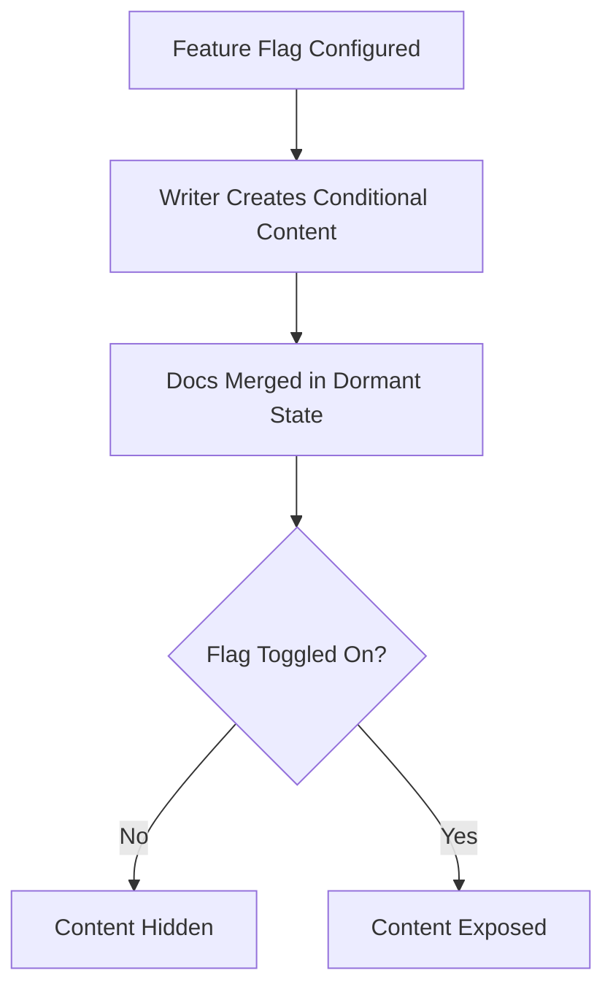

# Feature flags

> Software development mechanisms that allow teams deploy dormant code to production, requiring technical writers to use progressive disclosure to align documentation

---

## What are feature flags?

Feature flags (also known as feature toggles) let you turn specific features on or off at runtime without deploying new code. In a modern software development life cycle (SDLC), developers wrap new code in conditional logic. This technique decouples code deployment from feature release, which makes production updates safer and more frequent.

While engineers use these toggles for canary releases or A/B tests, they also create a synchronization challenge for content. Your documentation must match these runtime changes. To make sure customers see documentation that accurately reflects the software, technical writers must work closely with software engineers, product managers, and quality assurance (QA) teams.

---

## Why feature flags matter for documentation

In cloud-based environments, static documentation quickly becomes outdated. If customers find instructions for a feature that is toggled off, they might become confused or frustrated. Conversely, if a feature is active but lacks documentation, support tickets increase. 

Aligning your documentation strategy with feature flags prevents stale content and reduces the risk of exposing unreleased features too early. Relying on manual workflows—such as maintaining duplicate document versions or waiting for a major release day—stalls your publishing pipeline and creates content bottlenecks.

---

## When to adopt this workflow 

Decide whether to link your documentation pipeline with feature toggles based on your deployment frequency and team structure.

*   **High deployment frequency:** Your engineering team uses continuous integration and continuous deployment (CI/CD) pipelines to push code to production multiple times a day.
*   **Targeted feature rollouts:** Your product team releases features gradually to specific cohorts or user personas before a general release.
*   **Documentation desynchronization:** You struggle to track which UI elements or endpoints are active, leading to customer confusion in the active knowledge base.

---

## How the workflow works

To prevent users from seeing documentation for unreleased features, follow these stages:

1.  **Feature planning and mapping:** Engineers and product managers define the toggle state in the software configuration. You identify which sections of the documentation, such as UI guides or API reference materials, the flag affects.
2.  **Conditional content creation:** You draft the documentation. Using a docs-as-code (DaC) approach, you mark up the text blocks with conditional tags that match the feature flag key.
3.  **Staging and testing:** The QA team verifies the feature flag states in a staging environment. You review the rendered output to make sure that when the flag is off, the documentation is hidden, and when it's on, the documentation appears correctly without breaking the layout.
4.  **Production alignment and release:** After the pull request (PR) is merged, the code and dormant documentation are deployed. When the product team toggles the flag to "on" in production, the documentation appears automatically for authorized users.

---

## RACI and team roles

A clear distribution of responsibilities makes sure documentation is accurate and released at the right time.

*   **Responsible:** Technical writers (for tagging documentation and drafting updates) and software engineers (for sharing flag keys and state updates).
*   **Accountable:** Product managers (for determining the release timeline and toggling flags in production).
*   **Consulted:** Subject matter experts (SMEs) (for technical accuracy) and QA (for testing feature states).
*   **Informed:** Customer support and marketing teams (to understand which features are visible to specific customers).

---

## Pipeline integration and tools

To avoid manual work, integrate feature flag states directly into your publishing pipeline. Using tools like [LaunchDarkly](https://launchdarkly.com/){: target="_blank" rel="noopener" } or [Split](https://www.split.io/){: target="_blank" rel="noopener" }, the build engine can check the state of active flags during static site generation.

If you manage your site in a docs-as-code repository, a custom build script can parse source files and check the flag status to include or exclude content during compilation. Alternatively, runtime JavaScript can read the active flag state and dynamically show or hide flagged documentation in the browser.

!!! tip "Pro Tip"
    Keep your documentation toggle keys identical to the developer's feature flag keys. This makes it easier to cross-reference and automate validation.

---

## Troubleshooting

Integrating content with code toggles can cause synchronization issues if not managed correctly.

*   **Out-of-sync flag states:** The engineering team turns a feature flag on, but the documentation build system doesn't know. 
    *   *Solution:* Use webhooks from your feature flag provider to trigger an automated rebuild of the documentation site whenever a flag state changes.
*   **Orphaned documentation code:** After a feature is fully rolled out, the flag is retired in the app, but conditional tags remain in the documentation. 
    *   *Solution:* Add a "flag cleanup" task to your post-launch checklist to remove retired tags and reduce maintenance.

---

## Success criteria

Measure the efficiency of your feature-flagged documentation using these indicators:

*   **Documentation match rate:** 100% alignment between the visible UI elements and the instructions in the knowledge base for any user cohort.
*   **Support ticket deflection:** A decrease in customer support queries related to missing or premature documentation during phased rollouts.