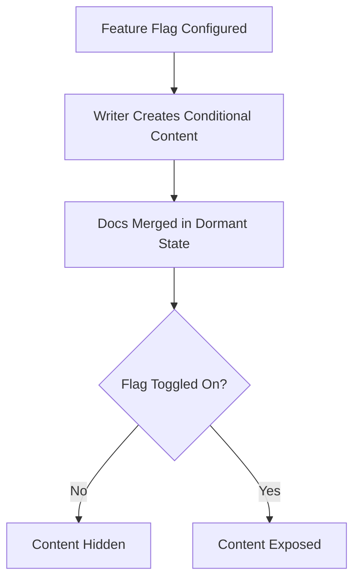

# Feature flags

> Software toggles that enable or disable functionality at runtime, allowing documentation to sync with phased feature rollouts

---

## Controlled releases and content synchronization

Feature flags (or feature toggles) decouple code deployment from feature release. By wrapping new code in conditional logic, developers can push updates to production without immediately activating them for users. This makes deployments safer and more frequent, but it creates a synchronization challenge: your documentation must reflect the live state of the software in real time.

When engineers use toggles for canary releases or A/B tests, technical writers must work alongside product and QA teams to ensure instructions remain accurate for every user cohort.

---

## Why documentation needs toggles

Static documentation fails in agile, cloud-based environments. If a user encounters instructions for a hidden feature—or finds a live feature undocumented—the resulting confusion drives up support tickets. Integrating documentation with feature flags eliminates these bottlenecks and prevents the premature exposure of unreleased tools. Relying on manual workflows, such as maintaining duplicate document versions, only slows down the publishing pipeline.

---

## Strategic adoption 

This workflow is most effective for teams pushing code via CI/CD pipelines several times a day. If your product team uses targeted rollouts for specific user personas or struggles to keep the knowledge base synced with a rapidly changing UI, linking your docs pipeline to feature toggles is a necessary step.

---

## The documentation workflow

To ensure users only see content relevant to their active features, follow these stages:

1.  **Mapping:** Identify which documentation sections—such as API references or UI guides—are affected by the software configuration.
2.  **Conditional Tagging:** Using a docs-as-code (DaC) approach, wrap content blocks in tags that match the application's feature flag keys.
3.  **Validation:** Use a staging environment to verify that toggling a flag correctly hides or exposes the corresponding content without breaking the site layout.
4.  **Deployment:** Once merged, the dormant documentation is deployed. When the product team activates the flag in production, the content appears automatically.

---

## Team responsibilities

A clear distribution of ownership ensures that documentation remains accurate throughout the release cycle.

*   **Technical Writers:** Responsible for tagging documentation and drafting updates.
*   **Software Engineers:** Responsible for providing flag keys and state updates.
*   **Product Managers:** Accountable for the release timeline and toggling flags in production.
*   **QA & SMEs:** Consulted for technical accuracy and testing feature states.
*   **Support & Marketing:** Informed of feature visibility to prepare for customer inquiries.

---

## Pipeline integration

Integrating flag states into your publishing pipeline reduces manual overhead. Tools like [LaunchDarkly](https://launchdarkly.com/){: target="_blank" rel="noopener" } or [Split](https://www.split.io/){: target="_blank" rel="noopener" } allow build engines to check flag statuses during site generation. 

For docs-as-code repositories, custom scripts can parse source files to include or exclude content during compilation based on the flag status. Alternatively, runtime JavaScript can dynamically show or hide flagged documentation in the browser. Using identical keys for both code and documentation simplifies validation and ensures your automation remains robust.

---

## Troubleshooting

Content-code synchronization often faces two main hurdles: lagging builds and "content debt."

*   **Out-of-sync states:** If the engineering team activates a feature but the documentation remains hidden, use webhooks from your feature flag provider to trigger an automated rebuild of the documentation site.
*   **Orphaned tags:** When a feature is fully rolled out and the flag is retired, conditional tags often remain in the source files. Include a "flag cleanup" task in your post-launch checklist to remove these tags and reduce long-term maintenance.

---

## Success indicators

The effectiveness of feature-flagged documentation is measured by 100% alignment between the live UI and the instructions visible to any given user cohort. Over time, this approach should result in a measurable decrease in support queries related to phased rollouts and missing documentation.