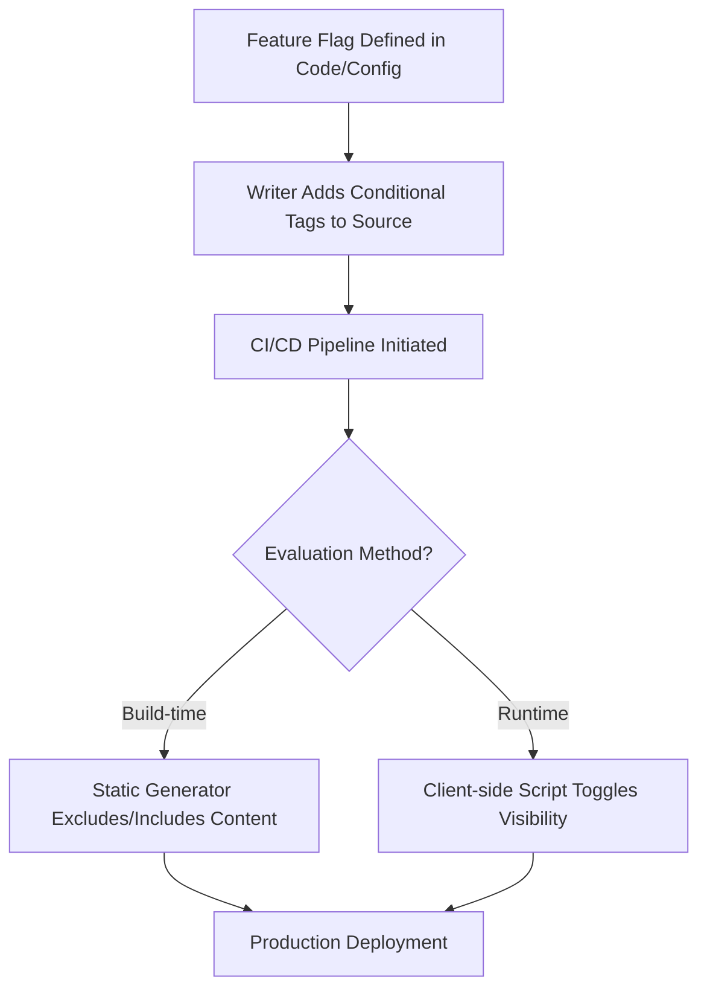

# Feature flags

> *Software toggles that enable or disable functionality at run time, allowing documentation to sync with phased feature rollouts*

---

## Controlled releases and content synchronization

Feature flags (also known as feature toggles) decouple code deployment from feature release. By wrapping new code in conditional logic, developers can push updates to production without immediately activating them for users. This allows for controlled rollouts, such as canary releases or A/B tests, but requires documentation to reflect the specific state of the software available to different user cohorts.

---

## Why documentation needs toggles

Static documentation often falls out of sync in agile, cloud-based environments. If a user sees instructions for a hidden feature or lacks documentation for an active one, it creates friction and increases support volume. 

Integrating documentation with feature flags ensures that content visibility matches the application state. This prevents the premature exposure of unreleased tools or dark features without requiring manual maintenance of duplicate versions.

---

## Strategic adoption 

This workflow is essential for teams using continuous integration and continuous delivery (CI/CD) pipelines to deploy multiple times a day. Linking the documentation pipeline to feature toggles is necessary when a product uses targeted rollouts (based on user ID, geography, or persona) or when the user interface (UI) changes too rapidly for traditional publishing cycles.

---

## The documentation workflow

To ensure users only see content relevant to their active features, the pipeline must evaluate flag states during the build or at run time.

1.  **Mapping:** Identify which documentation components (application programming interface (API) references, UI guides, or conceptual topics) correspond to specific feature flag keys in the application code.
2.  **Conditional Tagging:** Wrap content blocks in conditional statements (for example, If/Else blocks in Markdown or DITA) that reference the feature flag keys.
3.  **Validation:** Test the documentation in a staging environment by toggling flag states in the flag provider (for example, LaunchDarkly) to ensure the correct content is rendered or excluded.
4.  **Deployment:** 
    - **Static sites:** The content is included or excluded during the build process. Activating a flag requires a site rebuild (often triggered through a webhook).
    - **Dynamic/runtime:** The content is shipped to the browser but remains hidden by using CSS or JS until the flag is evaluated as true.

---

## Team responsibilities

- **Technical writers:** Tag documentation source files and manage conditional logic blocks.
- **Software engineers:** Provide the specific flag keys and notify the docs team of changes to flag logic (for example, moving from a boolean to a multivariate flag).
- **Product managers:** Define the rollout schedule and manage the state of flags in the production environment.
- **QA and SMEs:** Validate that the documentation accurately reflects the behavior of the feature in different states.

---

## Pipeline integration

Documentation as code (DaC) allows for deep integration with feature management platforms like [LaunchDarkly](https://launchdarkly.com/) or [Split](https://www.split.io/). 

- **Build-time integration:** The static site generator (SSG) fetches the current flag states through an API during the build process. Content wrapped in off flags is completely omitted from the generated HTML, providing better security for sensitive features.
- **Runtime integration:** JavaScript in the browser queries the flag provider and dynamically updates the Document Object Model (DOM). While this allows for instant updates without a rebuild, writers must be aware that hidden content may still be present in the source code of the page.

---

## Troubleshooting

- **Build latency:** In build-time configurations, there is a delay between toggling a flag in the product and the documentation update. Use webhooks from your feature flag provider to trigger an automated CI/CD pipeline rebuild immediately upon flag state changes.
- **Tag debt:** Once a feature is 100% rolled out and the flag is retired in the code, the conditional tags in the documentation become dead code. Establish a flag cleanup cadence to remove these tags and convert the conditional content into standard documentation.

---

## Success indicators

Success is achieved when there is 1:1 parity between the features accessible to a user and the documentation visible to them. Key metrics include a reduction in feature discovery support tickets and the elimination of manual documentation merges for phased releases.