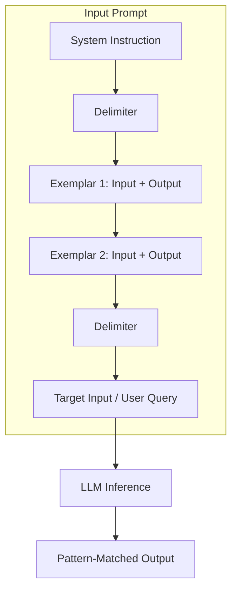

# Few-shot prompting

> *A prompt design technique providing specific input-output examples to guide an AI model’s logic, style, and formatting within the context of a single query*

---

## What is few-shot prompting?

Few-shot prompting replaces abstract descriptions with concrete demonstrations. By embedding explicit input-output pairs within your instructions, you leverage the pattern-matching capabilities of a large language model (LLM), often referred to as in-context learning, to dictate the final output. This allows the model to grasp complex syntax, brand-specific nuances, and semantic constraints without the compute-intensive requirements of fine-tuning or secondary training runs.

In technical documentation workflows, this method serves as a live frame of reference. Rather than relying on the internal weights of a model to interpret a style guide, you provide a representative sample that establishes the expected tone, formatting, and structural logic for that specific inference call.

---

## The trade-offs of prompt complexity

Relying on zero-shot commands, which are instructions without examples, introduces high variance. LLMs may ignore structural constraints, deviate from established style guides, or default to a generic tone. 

While few-shot prompting acts as a quality guardrail, it introduces a trade-off in inference cost and latency. Few-shot prompts increase the token count of the input, so they consume more of the context window and increase the time-to-first-token (TTFT) compared to zero-shot prompts. However, this is typically offset by the reduction in manual editorial cycles and retry logic.

---

## Anatomy of a few-shot prompt

A high-performing few-shot prompt relies on a deliberate, modular layout. 

- Logic mapping: Every exemplar must demonstrate a clear transformation from raw input to refined output. 
- Exemplar integrity: The model is a statistical pattern matcher; it will replicate errors present in your examples. Use only vetted, high-accuracy examples.
- Schema strictness: If your workflow requires JSON, YAML, or specific Markdown headers, your examples must mirror that schema exactly to ensure the model maintains structural integrity.
- Clear delimiters: Use distinct markers, such as `###`, `---`, or XML-style tags, such as `<example>`, to isolate instructions from examples and the user query. This prevents prompt injection or leakage, where the model confuses the demonstration data with the actual task.



!!! tip "Delimiter best practice"
    Using XML-style tags, such as `<example></example>`, is increasingly recommended for frontier models, such as GPT-4o or Claude 3.5, as they are explicitly trained to recognize these tags as structural boundaries.

---

## Design pattern example

The following comparison illustrates how few-shot examples shift a model from conversational filler to structured data.

### Zero-shot (Instruction only)
**Instruction:** Write an API error message for a missing parameter. Make it clear and tell the user what to do.

**LLM Output:** "Error: You are missing a parameter. Please make sure all required fields are filled out in your request before submitting again."

### Few-shot (Instruction + Examples)
**Instruction:** Generate API error objects in JSON format following the established schema.

**Example 1:**
**Input:** Missing "api_key" parameter.
**Output:** 
```json
{
  "error": "MissingParameter",
  "message": "The 'api_key' parameter is required to authenticate your request.",
  "action": "Include your API key in the request header."
}
```

**Example 2:**
**Input:** Missing "user_id" parameter.
**Output:** 
```json
{
  "error": "MissingParameter",
  "message": "The 'user_id' parameter is required to retrieve user data.",
  "action": "Provide a valid 'user_id' in the path."
}
```

**Target Query:**
**Input:** Missing "payload" parameter.
**Output:** 

---

## Implementation rules

- Precision over volume: Two to five high-quality examples are usually more effective than ten mediocre ones. Excessive examples increase noise and can lead to recency bias, where the model over-weights the last example provided.
- Edge case representation: Include at least one example that handles an outlier or negative scenario to prevent the model from over-generalizing.
- Contrastive prompting: If the model consistently fails a specific rule, provide positive and negative example pairs, explicitly labeling the incorrect version to steer the model away from specific errors.

---

## Common anti-patterns

- Template patterns: If every example uses the same placeholder, such as "SAMPLE_TEXT," the model may treat the placeholder as a literal string rather than a variable.
- Label inconsistency: If Example 1 uses `Input:` and Example 2 uses `User Query:`, the model may fail to identify the repeating pattern, leading to structural breakdown.
- Contextual noise: Avoid including unrelated metadata, such as timestamps or internal IDs, in your examples unless you want that metadata present in the final output.

---

## Validation and testing

1. Regression testing: Run your prompts against a static set of inputs and compare the outputs to a reference standard using an LLM-as-a-judge or semantic similarity metrics.
2. Token monitoring: Measure the token overhead of your few-shot examples to ensure the prompt remains cost-effective for high-volume pipelines.
3. Linguistic audit: Periodically check if the model is drifting, especially after model version updates, such as from a preview model to a stable release.