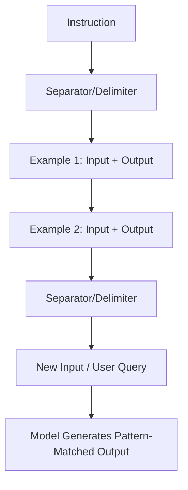

# Few-shot prompting

> A prompt design technique that uses in-context, input-to-output examples to guide artificial intelligence models to generate consistent, structured content

---

## What is few-shot prompting?

Few-shot prompting is a technique where you provide an artificial intelligence (AI) model with explicit examples of inputs and desired outputs within your instructions. Instead of only describing a task, you demonstrate the target behavior. This takes advantage of the in-context learning capabilities of a large language model (LLM). This approach helps the model understand complex styles, syntax, and semantic nuances without the need for fine-tuning or retraining.

In natural language processing (NLP), this method mirrors how people often learn new concepts by comparing them to specific memories or examples. When you build automated documentation pipelines or create AI-generated content, few-shot prompting establishes a clear frame of reference. It guides the system to follow your organization's content standards, ensuring the output uses the correct formatting and structure.

---

## Why it matters

Without few-shot prompting, zero-shot instructions (commands without examples) often produce inconsistent results. An LLM might ignore structural instructions, deviate from your style guide, or use an incorrect tone. For technical writers, this unpredictability increases editing time and manual cleanup, which slows down the publishing pipeline.

Few-shot prompting ensures that automated outputs follow structured writing paradigms. By enforcing a consistent style during generation, you reduce the time needed for editorial reviews. Without this technique, you risk generating unstructured text that can frustrate product teams and lead to inaccurate or poorly formatted information.

---

## Anatomy of a few-shot prompt

A successful few-shot prompt uses a highly structured layout. Use the following core principles to design your prompts:

*   **Input-output mapping:** Pair every example input with its corresponding desired output. This mapping shows the model the logic it should use to transform data.
*   **Exemplar quality:** Use flawless examples. Ensure they are accurate and free of errors. The model will replicate the structure and any mistakes found in your examples.
*   **Schema consistency:** If the output must follow a specific structure, such as a JSON block, a YAML configuration file, or a Markdown layout, ensure your examples follow that schema exactly.
*   **Delimiters:** Use clear boundaries, such as hashtags (`###`) or XML-like tags (e.g., `<example>`), to separate instructions, examples, and the active query. This prevents the model from confusing your guidance with the task.

!!! tip "Delimiter best practice"
    Using consistent, machine-readable delimiters like `###` or XML-style tags helps keep your examples separate from the active instruction.

---

## Design pattern example

The following example shows how few-shot prompting transforms a generic response into a structured object.

### Zero-shot (No examples)
**Instruction:** Write an API error message for a missing parameter. Make it clear and tell the user what to do.

**LLM Output:** "Error: You are missing a parameter. Please make sure all required fields are filled out in your request before submitting again."

### Few-shot (With examples)
**Instruction:** Write an API error message following our style guide.

**Example 1:**
**Input:** Missing "api_key" parameter.
**Output:** `{"error": "MissingParameter", "message": "The 'api_key' parameter is required to authenticate your request.", "action": "Include your API key in the request header."}`

**Example 2:**
**Input:** Missing "user_id" parameter.
**Output:** `{"error": "MissingParameter", "message": "The 'user_id' parameter is required to retrieve user data.", "action": "Provide a valid 'user_id' in the path."}`

**Example 3:**
**Input:** Missing "payload" parameter.
**Output:**

---

## Usability and user experience

Integrating this pattern into your content strategy provides several benefits for your readers:

*   **Reduced friction:** Structured examples help the model generate error messages and system responses that provide immediate, actionable feedback. This helps developers diagnose issues without searching external support resources.
*   **Improved scannability:** Consistent formatting makes microcopy predictable. Users can skim technical logs or alerts more efficiently when information follows a consistent hierarchy.
*   **Better system usability:** Consistent terminology and layouts lower the mental effort required to use a platform or application.

---

## Implementation best practices

Follow these rules when designing prompts for automated content workflows:

*   **Limit the number of examples:** Provide two to five high-quality examples. Too many examples consume tokens and can cause the model to lose track of the core instructions.
*   **Show diverse scenarios:** Include examples that represent different edge cases to prevent the model from over-fitting to a single pattern.
*   **Use consistent delimiters:** Separate your examples clearly using standard separators like `---` or `<example>` tags.
*   **Incorporate negative constraints:** If there are styles the model must avoid, use a "correct vs. incorrect" mapping to reinforce the boundaries.

---

## Common anti-patterns

Avoid these mistakes when using few-shot patterns:

*   **The template trap:** If you use identical placeholders in every example, the model might replicate the placeholder text instead of inserting dynamic data.
*   **Conflicting styles:** Ensure examples don't contradict each other or violate your writing standards. Mixed messages result in erratic outputs.
*   **Irrelevant context:** Avoid complex or unrelated examples that distract the model from the current task.

---

## Validate and test usability

Verify your prompt design using these methods:

1.  **Prompt regression testing:** Maintain a set of test cases. Run automated tests to compare model outputs against your baseline expectations whenever you modify the prompt.
2.  **Blind comparative evaluation:** Ask editors to rate two randomized outputs—one from a zero-shot prompt and one from a few-shot prompt. This helps you measure quality without bias.
3.  **Linguistic audit:** Check output patterns to ensure the generated text matches your organization's style criteria before the content goes live.