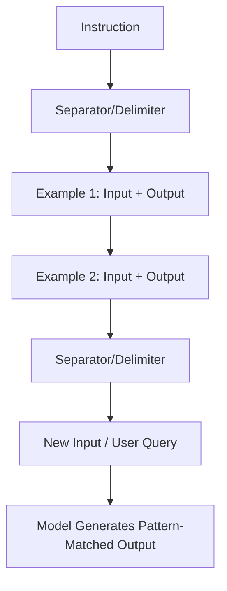

# Few-shot prompting

> A prompt design technique providing specific input-output examples to guide an AI model’s logic, style, and formatting within the context of a single query

---

## What is few-shot prompting?

Few-shot prompting replaces abstract descriptions with concrete demonstrations. By embedding explicit input-output pairs within your instructions, you leverage a large language model’s (LLM) pattern-matching capabilities to dictate the final output. This "in-context learning" allows the model to grasp complex syntax, brand-specific nuances, and semantic constraints without the latency or cost of fine-tuning.

In technical documentation workflows, this method serves as a live frame of reference. Rather than hoping the model understands a style guide, you provide a representative sample that establishes the expected tone, formatting, and structural logic.

---

## The cost of zero-shot instructions

Relying on zero-shot commands—instructions without examples—is a gamble. LLMs often ignore structural constraints, deviate from established style guides, or default to a generic, "robotic" tone. For technical writers, this unpredictability creates an editorial bottleneck. Every generated draft requires manual cleanup and verification, which defeats the purpose of an automated pipeline.

Few-shot prompting acts as a quality guardrail. It forces the model to adhere to structured writing paradigms from the start, significantly reducing the time spent on manual editorial reviews. 

---

## Anatomy of a few-shot prompt

A high-performing few-shot prompt relies on a deliberate, modular layout. 

*   **Logic mapping:** Every example must show the transformation from a raw input to a refined output. This clarifies the "why" behind the generation.
*   **Exemplar integrity:** The model replicates everything—including errors. Use only vetted, flawless examples to avoid scaling mistakes across your documentation.
*   **Schema strictness:** If your workflow requires JSON, YAML, or specific Markdown headers, your examples must mirror that schema exactly.
*   **Clear delimiters:** Use distinct markers like `###`, `---`, or XML-style tags (`<example>`) to isolate instructions from data. This prevents the model from "leaking" the guidance text into the active response.

!!! tip "Delimiter best practice"
    Using consistent, machine-readable delimiters like `###` or XML-style tags helps keep your examples separate from the active instruction.

---

## Design pattern example

The following comparison illustrates how few-shot examples shift a model from conversational filler to structured data.

### Zero-shot (Instruction only)
**Instruction:** Write an API error message for a missing parameter. Make it clear and tell the user what to do.

**LLM Output:** "Error: You are missing a parameter. Please make sure all required fields are filled out in your request before submitting again."

### Few-shot (Instruction + Examples)
**Instruction:** Generate API error objects following the established schema.

**Example 1:**
**Input:** Missing "api_key" parameter.
**Output:** `{"error": "MissingParameter", "message": "The 'api_key' parameter is required to authenticate your request.", "action": "Include your API key in the request header."}`

**Example 2:**
**Input:** Missing "user_id" parameter.
**Output:** `{"error": "MissingParameter", "message": "The 'user_id' parameter is required to retrieve user data.", "action": "Provide a valid 'user_id' in the path."}`

**Example 3:**
**Input:** Missing "payload" parameter.
**Output:**

---

## Operational benefits

Moving beyond basic generation, this pattern optimizes the end-user experience by ensuring:

*   **Actionable feedback:** Models learn to generate error messages and system responses that help developers diagnose issues immediately rather than hunting through external docs.
*   **Predictable scannability:** Uniform microcopy allows users to skim logs or alerts efficiently because the information hierarchy never changes.
*   **Systemic consistency:** Using the same few-shot examples across different features ensures that terminology remains identical throughout the application.

---

## Implementation rules

*   **Precision over volume:** Two to five high-quality examples are usually more effective than ten mediocre ones. Excessive examples bloat the context window and can confuse the model's focus.
*   **Edge case representation:** Include at least one example that handles an outlier or "negative" scenario to prevent the model from over-generalizing.
*   **Negative constraints:** Use "correct vs. incorrect" pairs if the model consistently makes a specific stylistic error.

---

## Common anti-patterns

*   **The template trap:** If every example uses the same placeholder (e.g., "SAMPLE_TEXT"), the model may treat the placeholder as a literal requirement rather than a variable.
*   **Style drift:** Ensure your examples don't contradict your current style guide. Conflicting examples result in erratic, "hallucinated" formatting.
*   **Contextual noise:** Avoid including unrelated metadata in your examples. If the task is to write headers, don't include body paragraphs in the examples.

---

## Validation and testing

To ensure your prompt remains effective as models update:

1.  **Regression testing:** Run your prompts against a static set of inputs and compare the outputs to a "gold standard" version.
2.  **Blind A/B testing:** Have editors compare randomized outputs from zero-shot vs. few-shot prompts to quantify the quality improvement.
3.  **Linguistic audit:** Periodically check if the model is drifting away from the example patterns, especially after model version updates (e.g., moving from GPT-4 to GPT-4o).