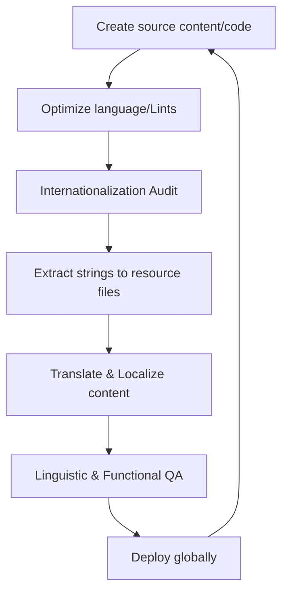

# Globalization, internationalization, localization, and translation (GILT)

> *A framework for adapting products to global markets by integrating business strategy, engineering design, cultural adaptation, and linguistic translation*

---

## What is GILT?

GILT (globalization, internationalization, localization, and translation) is an operational framework designed to scale software and technical content across international borders. Rather than treating global deployment as a final refinement, mature product teams embed GILT into the software development life cycle (SDLC) to connect engineering, linguistics, and technical communication.

Success depends on cross-functional collaboration. Developers build the technical foundation for adaptability, while product managers define market priorities. Technical writers create the source content using modular, translation-ready architectures, and quality assurance (QA) teams verify that linguistic assets and visual layouts remain stable across different regional configurations.

The framework relies on four distinct but interdependent pillars:

=== "G: Globalization (G11n)"
    The overarching business strategy. It encompasses all corporate and operational efforts required to prepare an organization and its products for expansion into international markets, including market research and legal readiness.
=== "I: Internationalization (I18n)"
    The engineering phase. This involves designing codebases, databases, and user interfaces (UIs) to support multiple languages and regional formats (such as date/time, number formats, and currency) without requiring structural code changes or hardcoded strings.
=== "L: Localization (L10n)"
    The cultural adaptation phase. This process refines an internationalized product for a specific locale by adjusting imagery, icons, formatting, and regional legal compliance to meet local expectations.
=== "T: Translation (T9n)"
    The linguistic conversion. This focuses on moving text from the source language to the target language while maintaining technical accuracy, tone, and intent. Translation is a subset of the localization process.

---

## Strategic advantages

Fragmented, manual translation workflows inevitably generate technical and content debt. When engineering and documentation teams operate without a unified GILT strategy, localized code branches often drift out of sync, resulting in expensive manual patches and stalled release cycles.

A structured GILT pipeline offers several operational improvements:

- **Content efficiency:** Single-sourcing and content reuse allow teams to write once and deploy everywhere, significantly lowering per-language costs.
- **Synchronized releases (Simship):** Automation ensures localized assets move through the pipeline at the same velocity as the core software, enabling simultaneous shipping (simship).
- **Brand integrity:** Strict adherence to style guides and controlled vocabularies (glossaries) eliminates ambiguity, ensuring a consistent user experience (UX) regardless of region.
- **Minimized engineering friction:** A robustly internationalized codebase means developers spend less time fixing broken layouts or duplicating templates for right-to-left (RTL) languages or double-byte character sets.

---

## Identifying the need for GILT

Transitioning to a formal GILT workflow is necessary if your organization faces these common scaling hurdles:

- **Layout breakage:** Text expansion (such as German translations that often require 30 percent more horizontal space) or text contraction distorts buttons and menus.
- **Maintenance forks:** Developers are forced to manually duplicate templates or logic to accommodate specific regional requirements.
- **Release lag:** English documentation goes live immediately, while translated versions remain in coming soon status for weeks.
- **Increasing costs:** Translators are forced to manually search through source code or unstructured files to locate updated strings.
- **Regulatory risk:** Content fails to meet regional standards such as the [Web Content Accessibility Guidelines (WCAG)](https://www.w3.org/WAI/standards-guidelines/wcag/){: target="_blank" rel="noopener" }, local privacy laws such as the General Data Protection Regulation (GDPR), or regional certification requirements.

---

## The operational pipeline

The GILT process functions as a cyclical pipeline that aligns documentation commits with software builds. 

1. **Extraction and encoding:** Technical teams separate user-facing strings from the source code. These strings are stored in external resource files (such as JSON, XLIFF, or YAML) and encoded via [Unicode](https://home.unicode.org/){: target="_blank" rel="noopener" } (typically UTF-8) to support global character sets.
2. **Linguistic optimization:** Writers refine source strings using controlled language. Removing idioms and passive voice at the source prevents expensive errors during translation.
3. **Translation and memory:** Optimized files enter a translation management system (TMS). Translation engines leverage historical translation memories (TM) and term bases (TB) to process only new or modified segments, ensuring consistency and cost savings.
4. **Validation:** Translated strings are reintegrated into the application. QA teams perform both automated (visual regression) and manual checks to ensure the UI remains functional despite text expansion or bidirectional (Bidi) text requirements.

---

## RACI and team roles

Assigning clear roles via a Responsible, Accountable, Consulted, and Informed (RACI) matrix prevents the bottlenecks common in global deployments:

- **Responsible:** Technical writers (modular content), software engineers (code internationalization), and localization coordinators (pipeline management).
- **Accountable:** Globalization program managers or product owners who define market priorities and approve budget allocation.
- **Consulted:** Subject matter experts (SMEs) for terminology accuracy and legal teams for regional compliance.
- **Informed:** Customer support and sales teams who need to prepare for localized product updates.

---

## Automation and "Docs as Code"

Modern GILT workflows treat documentation as software. Rather than manual file transfers, content repositories are linked directly to localization pipelines via application programming interfaces (APIs) or command-line interface (CLI) tools. When a writer merges a change or opens a pull request (PR), the continuous integration and continuous delivery (CI/CD) pipeline triggers the GILT process automatically.

??? note "Pipeline automation steps"
    1. **Trigger:** A documentation merge occurs in the main branch.
    2. **Linting:** Automated tools check Markdown or source files against style, terminology, and internationalization rules.
    3. **Parsing/Extraction:** The build system prepares data structures (such as .pot or .json) for translation.
    4. **Sync:** The system pushes files to the translation management system (TMS).
    5. **Integration:** Once translated, files are committed back to the repository via an automated PR.
    6. **Deployment:** The CI/CD engine rebuilds the site or application, serving the correct locale-specific assets to the end user.

---

## Troubleshooting common failures

GILT pipelines often face predictable technical friction. Addressing these early prevents major localization failures:

- **Hardcoded strings:** Text embedded directly in the UI logic cannot be extracted for translation.
    - *Fix:* Use static analysis linters to fail builds if unextracted strings are detected in the UI layer.
- **String concatenation:** Building sentences by joining variables (such as `"The " + $color + " box"`) breaks in languages with different word orders or grammatical genders.
    - *Fix:* Use named placeholders and International Components for Unicode (ICU) MessageFormat (such as `"{color} box"`) to allow translators to reorder elements.
- **Text expansion:** Rigid containers (fixed-width or fixed-height) break when strings grow in translation.
    - *Fix:* Use responsive CSS (Flexbox or Grid), avoid fixed pixel widths, and use pseudo-localization to simulate text growth before sending content to translators.
- **Context gaps:** Translators often work on isolated strings in a spreadsheet-like view without seeing the UI.
    - *Fix:* Attach screenshots, developer notes, or metadata comments to strings to explain their location and function.

---

## Key performance indicators (KPIs)

Use these metrics to evaluate the efficiency of the GILT pipeline:

| Metric | Measurement | Target |
| :--- | :--- | :--- |
| **Release lag** | Time between source release and localized release. | Zero-day (simship) |
| **TM leverage** | Percentage of content translated using translation memory. | Increasing percentage over time |
| **Efficiency** | Translation spend versus word count. | Decreasing cost per word via TM or machine translation post-editing (MTPE) |
| **UX quality** | Regional support tickets regarding UI breakage or documentation clarity. | >15% reduction annually |