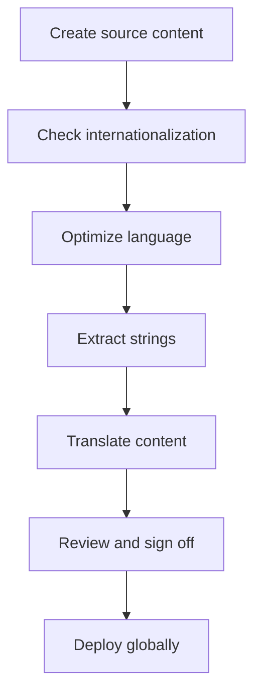

# Globalization, internationalization, localization, and translation (GILT)

> A framework for adapting products to global markets by integrating business strategy, engineering design, cultural adaptation, and linguistic translation

---

## What is GILT?

GILT is an operational framework designed to scale software and technical content across international borders. Rather than treating global deployment as a final polish, mature product teams embed GILT into the software development life cycle (SDLC) to bridge the gap between engineering, linguistics, and technical communication.

Success depends on cross-functional collaboration. Developers build the technical foundation for adaptability, while product managers define market priorities. Technical writers create the source content using modular, translation-ready architectures, and QA teams verify that linguistic assets and visual layouts remain stable across different regional configurations.

The framework relies on four distinct but interdependent pillars:

=== "G: Globalization"
    The overarching business strategy. It encompasses all corporate and operational efforts required to prepare an organization and its products for expansion into international markets.
=== "I: Internationalization"
    The engineering phase. This involves designing codebases, databases, and UIs to support multiple languages and regional formats (such as date/time and currency) without requiring structural code changes.
=== "L: Localization"
    The cultural adaptation phase. This process refines an internationalized product for a specific locale by adjusting imagery, icons, and legal compliance to meet local expectations.
=== "T: Translation"
    The linguistic conversion. This focuses on moving text from the source language to the target language while maintaining technical accuracy, tone, and intent.

---

## Strategic advantages

Fragmented, manual translation workflows inevitably generate technical and content debt. When engineering and documentation teams operate without a unified GILT strategy, localized code branches often drift out of sync, resulting in expensive manual patches and stalled release cycles.

A structured GILT pipeline offers several operational improvements:

*   **Content efficiency:** Single-sourcing and content reuse allow teams to write once and deploy everywhere, significantly lowering per-language costs.
*   **Synchronized releases:** Automation ensures localized assets move through the pipeline at the same velocity as the core software.
*   **Brand integrity:** Strict adherence to style guides and controlled vocabularies eliminates ambiguity, ensuring a consistent user experience (UX) regardless of region.
*   **Minimized engineering friction:** A robustly internationalized codebase means developers spend less time fixing broken layouts or duplicating templates for RTL (right-to-left) languages.

---

## Identifying the need for GILT

Transitioning to a formal GILT workflow is necessary if your organization faces these common scaling hurdles:

- **Layout breakage:** Text expansion (e.g., German translations often needing 30% more horizontal space) distorts buttons and menus.
- **Maintenance forks:** Developers are forced to manually duplicate templates to accommodate specific regional requirements.
- **Release lag:** English documentation goes live immediately, while translated versions remain in "coming soon" status for weeks.
- **Ballooning costs:** Translators are forced to manually hunt through unstructured files to locate updated strings.
- **Regulatory risk:** Content fails to meet regional standards like the [Web Content Accessibility Guidelines (WCAG)](https://www.w3.org/WAI/standards-guidelines/wcag/){: target="_blank" rel="noopener" } or local privacy laws.

---

## The operational pipeline

The GILT process functions as a cyclical pipeline that aligns documentation commits with software builds. 

1. **Extraction and encoding:** Technical teams separate user-facing strings from the source code. These strings are stored in external resource files and encoded via [Unicode](https://home.unicode.org/){: target="_blank" rel="noopener" } (UTF-8) to support global character sets.
2. **Linguistic optimization:** Writers refine source strings using controlled language. Removing idioms and passive voice at the source prevents expensive errors during translation.
3. **Translation and memory:** Optimized files enter a translation management system (TMS). Translation engines leverage historical "memories" to process only new or modified segments, ensuring consistency and cost-savings.
4. **Validation:** Translated strings are reintegrated into the application. QA teams perform both automated and manual checks to ensure the UI remains functional despite text expansion.

---

## RACI and team roles

Assigning clear roles via a RACI matrix prevents the bottlenecks common in global deployments:

- **Responsible:** Technical writers (modular content), software engineers (code internationalization), and localization coordinators (pipeline management).
- **Accountable:** Globalization program managers or product owners who define market priorities and approve budget allocation.
- **Consulted:** Subject matter experts (SMEs) for terminology accuracy and legal teams for regional compliance.
- **Informed:** Customer support and sales teams who need to prepare for localized product updates.

---

## Automation and "Docs as Code"

Modern GILT workflows treat documentation like software. Rather than manual file transfers, content repositories are linked directly to localization pipelines. When a writer merges a change or opens a pull request (PR), the CI/CD pipeline triggers the GILT process automatically.

??? note "Pipeline automation steps"
    1. **Trigger:** A documentation merge occurs in the main branch.
    2. **Linting:** Automated tools check Markdown files against style and internationalization rules.
    3. **Serialization:** The build system prepares data structures for translation.
    4. **Sync:** The system pushes files to the cloud translation platform.
    5. **Integration:** Once translated, files are committed back to the repo via an automated PR.
    6. **Deployment:** The CI/CD engine rebuilds the site, serving the correct locale to the end user.

---

## Troubleshooting common failures

GILT pipelines often face predictable technical friction. Addressing these early prevents "localization hell":

- **Hardcoded strings:** Text embedded directly in the UI cannot be translated.
    - *Fix:* Use linters to fail builds if unextracted strings are detected.
- **Text expansion:** Rigid containers break when strings grow in translation.
    - *Fix:* Use responsive CSS layouts and pseudo-localization to simulate text growth before sending content to translators.
- **Context gaps:** Translators often work on isolated strings without seeing the UI.
    - *Fix:* Attach screenshots or metadata comments to strings to explain their location and function.

---

## Key performance indicators (KPIs)

Use these metrics to evaluate the efficiency of the GILT pipeline:

| Metric | Measurement | Target |
| :--- | :--- | :--- |
| **Release Lag** | Time between source and localized release. | Zero-day (simultaneous) |
| **Efficiency** | Translation spend vs. word count. | Decreasing cost via translation memory |
| **UX Quality** | Regional tickets regarding doc clarity. | >15% reduction annually |