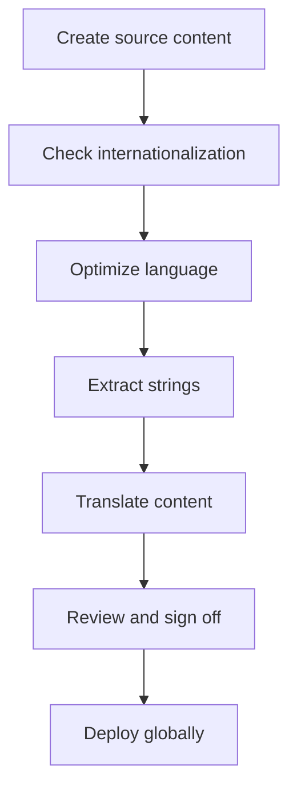

# Globalization, internationalization, localization, and translation (GILT)

> A comprehensive strategy for preparing software and technical content to meet the linguistic and cultural requirements of a global audience

---

## What is GILT?

The GILT framework is an operations pipeline that manages how software products and documentation scale across borders. Instead of treating global deployment as an afterthought, product teams integrate GILT into the software development life cycle (SDLC). This approach connects engineering, linguistics, and technical writing.

A cross-functional team drives this process. Engineering teams write the foundational code to be globally adaptable, while product teams define target markets and prioritize user requirements. Technical writers design source content using translation-ready architectures. Finally, quality assurance (QA) teams test the application to verify that linguistic assets and visual layouts work correctly across different configurations.

To understand the workflow, you must distinguish between its four pillars:

=== "G: Globalization"
    The overarching business and operational strategy. It includes all efforts to prepare an organization, its products, and its content strategy to expand into international markets.
=== "I: Internationalization"
    The engineering and design process. It ensures the codebase, databases, and user interfaces (UIs) can handle different languages, regional formats, and character sets without structural changes.
=== "L: Localization"
    The process of adapting an internationalized product and its content to a specific target market, or locale. This includes modifying date formats, currency, imagery, and regulatory compliance.
=== "T: Translation"
    The process of converting written text from one language to another. It preserves the technical accuracy and intent of the source materials while matching the reading expectations of the target audience.

---

## Why it matters

Manual, uncoordinated translation workflows create technical and content debt. Without a unified GILT strategy, engineering and documentation teams often deal with localized code branches that drift out of sync. This fragmentation leads to expensive manual updates and delayed release cycles.

Implementing a structured GILT pipeline provides several benefits:

*   **Eliminates redundant content:** By using single-sourcing and content reuse, you can write content once and deploy it to multiple regions, which reduces translation costs.
*   **Speeds up global releases:** Automation ensures that translated assets move through the pipeline at the same pace as the software code.
*   **Ensures brand and style consistency:** Aligning your writing with a style guide and a controlled vocabulary reduces ambiguity. This leads to clearer translations and a better global user experience (UX).
*   **Reduces engineering overhead:** A properly internationalized codebase prevents developers from having to modify visual components or duplicate layouts for different languages.

---

## When to adopt this workflow

If your organization experiences any of the following problems, establish a structured GILT workflow:

- **UI layout issues:** Text expansion (for example, German translations often require 30% more space than English) distorts buttons, menus, and tables.
- **Localized code forks:** Developers duplicate templates to manually accommodate specific regional requirements.
- **Delayed documentation:** English documentation updates go live instantly, but localized versions lag by weeks or months.
- **High manual translation costs:** Translators must search through unstructured files to find and edit updated strings.
- **Non-compliance:** Software and documentation don't comply with regional laws, such as the [Web Content Accessibility Guidelines (WCAG)](https://www.w3.org/WAI/standards-guidelines/wcag/){: target="_blank" rel="noopener" } or data privacy rules.

---

## How the workflow works

The GILT process is a cyclical pipeline that aligns documentation commits with software builds. The following diagram shows how source content transitions to global deployment.

1. **String extraction and internationalization:** Developers and technical writers separate user-facing strings from the code. Text is stored in external resource files and encoded using the [Unicode](https://home.unicode.org/){: target="_blank" rel="noopener" } standard (typically UTF-8).
2. **Linguistic optimization:** Technical writers refine the source strings. Use a style guide and controlled language rules to eliminate complex idioms, passive voice, and jargon.
3. **Translation:** The optimized source files move to translation environments. Translation engines use historical translation memories to translate only new or modified text segments to ensure consistency.
4. **Integration and validation:** The translated strings are compiled back into the application. The QA team runs automated and manual tests to ensure the layout accommodates text expansion and remains functional.

---

## RACI and team roles

A RACI (Responsible, Accountable, Consulted, and Informed) matrix prevents bottlenecks and ensures GILT operations proceed alongside the development cycle:

- **Responsible:** Technical writers (create clear, modular content), software engineers (ensure codebase internationalization), and localization coordinators (manage the translation pipeline).
- **Accountable:** Globalization program managers or product managers (define market priorities and approve budgets).
- **Consulted:** Subject matter experts (SMEs) (verify technical terminology) and legal officers (ensure regional regulatory alignment).
- **Informed:** Customer support and regional sales managers (prepare for localized product updates).

---

## Pipeline integration and tooling

Modern GILT workflows use a "docs as code" model. Instead of manually copying files, content and software repositories integrate with localized pipelines.

When a technical writer commits a change to a documentation branch or opens a pull request (PR), the continuous integration and continuous deployment (CI/CD) pipeline triggers the GILT process.

??? note "Standard GILT automation pipeline details"
    1. **Commit trigger:** A writer merges a change into the main branch.
    2. **Linter validation:** An automated linter checks Markdown files against style guide rules.
    3. **File generation:** The build system generates localized data structures.
    4. **Translation sync:** The system pushes updated files to a cloud platform.
    5. **Automated return:** Once translated, the files are committed back to the repository via an automated PR.
    6. **Build and deploy:** The CI/CD engine rebuilds the site and serves the correct locale to users.

---

## Troubleshooting and common failures

GILT pipelines are prone to specific, predictable failures:

- **Hardcoded strings:** Text is manually inserted into UI layouts instead of resource files.
    - *Solution:* Use automated linting tools to fail the build if unextracted text strings are detected in templates.
- **Unmanaged text expansion:** Translations break layout containers or hide text.
    - *Solution:* Design responsive layouts with flexible CSS. Use pseudo-localization during testing to simulate character growth before translation begins.
- **Lack of context:** Translators receive text segments without seeing where the text appears in the product.
    - *Solution:* Provide screenshots or context keys. Technical writers should include comments in metadata blocks to explain UI string locations.

---

## Key metrics and success criteria

To measure the health of your GILT pipeline, track the following key performance indicators (KPIs):

| Performance metric | Measurement method | Target objective |
| :--- | :--- | :--- |
| **Documentation lag time** | Time between source release and localized release. | Zero-day lag (simultaneous release) |
| **Cost per word** | Total translation spending divided by word count. | Decreasing trend via content reuse |
| **Global support tickets** | Number of regional tickets related to documentation clarity. | At least 15% reduction year-over-year |