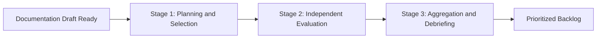

# Heuristic evaluation

> *A usability inspection method where experts audit content against predefined principles to identify friction points and improve information architecture*

---

## What is heuristic evaluation?

Heuristic evaluation (HE) is a systematic usability inspection where evaluators check a documentation set against established usability principles, which are also known as heuristics. In technical communication, this involves auditing help centers, API references, and manuals to find friction points—areas where the information architecture, navigation, or content design prevents a user from completing a goal. 

Unlike user testing, which observes participant behavior, a heuristic review relies on the expertise of evaluators to predict usability problems based on proven frameworks, such as Nielsen’s 10 Usability Heuristics. While a technical review focuses on the accuracy of code and facts, a heuristic evaluation focuses on the usability and findability of that information.

---

## The value of structured reviews

Ad hoc proofreading catches surface-level typos but often overlooks systemic structural flaws. Without a formal framework, reviews are subjective and inconsistent. 

A structured HE provides a standardized methodology to identify issues such as poor error recovery, lack of user control, or inconsistent terminology. By prioritizing heuristics such as Consistency and Standards and Recognition Rather Than Recall, teams ensure that users can navigate complex technical stacks intuitively. This proactive approach reduces support volume by resolving tickets where the documentation is unclear before they are reported by customers.

---

## When to adopt this workflow

Implement a formal heuristic evaluation if your team experiences the following:

- **High time to success:** Users take too long to reach a "Hello World" or successful API response, even if the steps are technically accurate.
- **Navigation bloat:** The documentation portal has grown organically over years, leading to a disjointed architecture with overlapping or buried categories.
- **Multi-product journeys:** Documentation spans multiple platforms, such as a cloud UI and a command-line interface (CLI), and the transition between them lacks a consistent mental model.

---

## How the workflow works

The process moves from defining the scope to independent analysis, synthesis, and task prioritization. 

1.  **Planning and selection:** Define the scope, such as the authentication flow. Select a heuristic set, such as Nielsen-Molich or Gerhardt-Powals.
2.  **Independent evaluation:** Multiple evaluators—ideally three to five—walk through the content individually. They record each violation, the specific heuristic breached, and a severity rating.
3.  **Aggregation and debriefing:** Evaluators meet to combine their findings and resolve discrepancies. This produces a single list of issues ranked by impact, such as critical, major, minor, or cosmetic.

---

## Team roles (RACI)

To maintain objectivity, the evaluator should ideally not be the primary author of the content being reviewed.

- **Responsible:** Evaluators (UX writers, peer technical writers, or usability specialists). They perform the walkthroughs and document violations.
- **Accountable:** Documentation manager or product owner. They ensure the evaluation is integrated into the documentation development life cycle (DDLC) and approve the final remediation plan.
- **Consulted:** Subject matter experts (SMEs), such as engineers or support staff. They provide context on technical constraints or common user pitfalls.
- **Informed:** Development teams. They are notified of structural changes that may affect product UI or navigation.

---

## Pipeline integration

Integrating HE into existing workflows ensures usability is treated as a Definition of Done requirement.

=== "Jira and GitHub"
    Use templates to log violations. Tagging issues with `heuristic:consistency` or `severity:2` allows for filtering by usability impact rather than just technical urgency.
=== "Severity gates"
    For major releases, configure the release checklist to require a usability sign-off. Documentation cannot be merged if critical (Level 4) or major (Level 3) violations remain unresolved.
=== "Self-check heuristics"
    Include a subset of heuristics in pull request (PR) templates. This encourages writers to check for Minimalist Design and Match Between System and Real World during the drafting phase.

---

## Troubleshooting

### Avoiding the false alarm effect

SMEs may dismiss heuristic violations as subjective. To fix this, always map every finding back to a specific, named heuristic. Use a standard 0-4 severity scale to quantify the impact on the user's ability to complete a task.

### Scalability issues

Performing a full HE on every minor update is unsustainable. Conduct discount heuristic evaluations (using one or two evaluators) for minor updates, and reserve full panel reviews for major architectural changes or new product launches.

---

## Success metrics

Track these indicators to measure the impact of the HE process:

- **Severity distribution:** A decrease in the ratio of critical to cosmetic violations over time as the team adopts better design patterns.
- **Task success rate:** In follow-up user testing, a higher percentage of users should complete the evaluated flow without assistance.
- **Heuristic density:** The number of unique usability violations found per specific user journey or page.