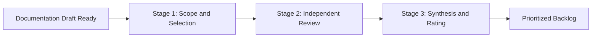

# Heuristic evaluation

> An expert-driven inspection method used to assess documentation usability against industry-recognized design principles and best practices

---

## What is heuristic evaluation?

Heuristic evaluation is a usability inspection method where specialists and technical communicators evaluate a system interface or content against a set of predefined principles, called heuristics. In technical writing and content design, you use this method to audit documentation portals, release notes, and help centers to find friction points that prevent users from finding information. Instead of starting with end-user testing, a heuristic evaluation uses the expertise of trained evaluators to find issues in information architecture, visual layout, and scannability.

This process usually occurs during the review stage of the document development life cycle (DDLC). It serves as a quality gate before public release. In software development, it aligns with the quality assurance (QA) and product management phases of the software development life cycle (SDLC). While technical writers often lead the evaluation, the process works best with cross-functional collaboration. Product managers provide insights into the target audience and user personas, while software engineers verify the technical accuracy of code samples and API references.

---

## Why it matters

Unstructured reviews often miss systematic documentation errors, which can lead to technical debt. If your team relies on ad-hoc proofreading, you might publish confusing guides that increase support tickets and hurt the customer experience. A structured heuristic evaluation provides an objective framework to catch structural flaws before they reach production. This helps you meet support deflection goals.

By checking for progressive disclosure and minimalist instruction, your team helps users find answers quickly. This proactive approach reduces support costs and prevents the need to rewrite guides after they launch.

---

## When to adopt this workflow

If your team faces any of the following challenges, establish a structured heuristic evaluation process:

*   **High support ticket volume:** Customers contact support for issues already covered in the documentation. This often indicates poor findability, weak search configurations, or low scannability.
*   **Complex product releases:** You are introducing multi-faceted features or enterprise platforms where the user journey spans software, hardware, and APIs.
*   **Scaling content contributor models:** Contributions from multiple software engineers lead to a fragmented voice or inconsistent style across the documentation portal.

---

## How the workflow works

The heuristic evaluation process moves from planning and scoping to independent analysis, synthesis, and backlog integration.

1.  **Scope and selection:** The lead technical writer and product manager define the evaluation scope, such as a specific "Getting Started" path or an FAQ page. They select the heuristics to use, such as the Nielsen-Molich heuristics.
2.  **Independent review:** Multiple evaluators, such as peer technical writers and subject matter experts (SMEs), independently navigate the documentation. They compare the content against the selected heuristics and document every violation, its location, and the affected user persona.
3.  **Synthesis and rating:** The evaluators consolidate their findings into one report and assign severity ratings to each issue. This creates a prioritized backlog of content design improvements.

---

## RACI and team roles

To keep this process running smoothly without slowing down development, assign clear ownership:

*   **Responsible:** Technical writers and content designers. They conduct the walkthroughs and document the violations.
*   **Accountable:** Documentation leads and product managers. They prioritize fixes and sign off on the final release.
*   **Consulted:** SMEs and UX researchers. They clarify technical behaviors and validate user pathways.
*   **Informed:** Software engineers and support teams. They receive the prioritized updates and tracking metrics.

---

## Pipeline integration and tooling

You can integrate heuristic triggers and track outcomes using automated tools and issue trackers.

=== "Jira and GitHub"
    Use custom issue templates to log heuristic violations. Tag issues with metadata like `heuristic:consistency` or `severity:critical` to route them to the technical writing backlog.
=== "CI/CD trigger"
    Configure your deployment pipeline to flag large documentation migrations. This can trigger a mandatory heuristic review before the branch merges into the production environment.
=== "Automated checklists"
    Integrate static quality checklists into your pull request templates. This helps writers perform a self-heuristic check before they request a peer review.

---

## Troubleshooting

Heuristic evaluations can become subjective or cause bottlenecks if they aren't managed correctly.

??? danger "Problem: Evaluator bias and inconsistency"
    If evaluators rely on personal preference rather than defined heuristics, the feedback is difficult to act on.
    
    **Solution:** Use at least three independent evaluators. Conduct a brief calibration session before the walkthrough to align on heuristic definitions and severity scales.

??? warning "Problem: Stagnant backlog"
    The evaluation is complete, but the identified issues stay in the backlog without being scheduled for updates.
    
    **Solution:** Establish an automated rule in your project management tool that prevents a release branch from merging if there are unresolved "critical" or "major" heuristic violations.

---

## Key metrics and success criteria

Measure the impact of your evaluations with these performance indicators:

*   **Usability issue density:** Track the number of heuristic violations identified per 1,000 words. A downward trend indicates stronger writing standards.
*   **Support ticket deflection rate:** Look for a drop in customer support inquiries related to the evaluated topic within 30 days after release.
*   **Evaluation turnaround time:** Measure the business days required to run an evaluation. Aim for a three-day window to avoid blocking release cycles.