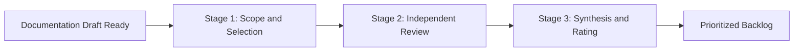

# Heuristic evaluation

> A usability inspection method where experts audit content against predefined principles to identify friction points and improve information architecture

---

## What is heuristic evaluation?

Heuristic evaluation is a systematic audit where specialists check documentation against established usability principles. In technical communication, this involves testing help centers, API references, and release notes to find "friction points"—areas where information architecture or layout prevents a user from completing a task. Unlike user testing, which observes real-world behavior, a heuristic review relies on the expertise of evaluators to predict where users will struggle.

This audit typically functions as a quality gate within the documentation development life cycle (DDLC). While technical writers generally lead the process, it requires input from across the product team. Product managers provide context on user personas, while engineers verify the technical accuracy of code blocks and installation steps.

---

## The value of structured reviews

Ad-hoc proofreading often catches typos but misses structural flaws that create long-term technical debt. Without a formal framework, reviews remain subjective, leading to inconsistent guides that ultimately drive up support tickets. 

A structured evaluation provides an objective lens to catch these systemic issues before they reach production. By prioritizing minimalist instruction and progressive disclosure, you ensure users find answers without wading through unnecessary complexity. This proactive approach directly impacts the bottom line by reducing the volume of avoidable support inquiries.

---

## When to adopt this workflow

Implement a formal heuristic evaluation if your team experiences the following:

*   **Persistent support volume:** Customers frequently ask questions already answered in the docs. This suggests problems with findability or search indexing rather than a lack of content.
*   **High-complexity releases:** You are documenting enterprise platforms where the user journey spans hardware, software, and multiple APIs.
*   **Fragmented voice:** Contributions from various developers or departments have created a "Frankenstein" documentation portal with inconsistent styles and navigation.

---

## How the workflow works

The process moves from defining the scope to independent analysis, synthesis, and finally, task prioritization.

1.  **Scope and selection:** Define the boundaries. Are you testing the entire "Getting Started" flow or just a specific FAQ? Select a set of heuristics, such as the Nielsen-Molich principles, to serve as the benchmark.
2.  **Independent review:** Evaluators—ideally a mix of writers and SMEs—walk through the content individually. They record every violation of the chosen heuristics, noting the location and severity.
3.  **Synthesis and rating:** The team aggregates findings into a single report. Assigning severity ratings (e.g., "Critical" vs. "Cosmetic") helps transform observations into a prioritized development backlog.

---

## Team roles (RACI)

Clear ownership prevents the evaluation from becoming a bottleneck:

*   **Responsible:** Technical writers. They perform the walkthroughs and document violations.
*   **Accountable:** Documentation leads. They ensure the evaluation happens and sign off on the final fixes.
*   **Consulted:** SMEs and UX researchers. They provide technical context and validate user paths.
*   **Informed:** Engineers and support staff. They receive the list of prioritized updates.

---

## Pipeline integration

Connecting heuristic reviews to existing tools ensures they aren't ignored.

=== "Jira and GitHub"
    Use custom templates to log violations. Tagging issues with labels like `heuristic:scannability` or `severity:high` allows for easy filtering in the documentation backlog.
=== "CI/CD triggers"
    For large-scale migrations, configure your pipeline to require a heuristic sign-off before a branch can be merged into production.
=== "Self-check checklists"
    Embed a "mini-heuristic" checklist into pull request templates. This encourages writers to self-correct common layout and navigation issues before requesting a formal peer review.

---

## Troubleshooting

### Avoiding evaluator bias
If feedback feels like personal opinion, it becomes impossible to act on. To fix this, use at least three independent evaluators and hold a brief "calibration" meeting before the review starts to align on what each heuristic actually means.

### Managing the backlog
Evaluations are useless if the findings sit in a backlog indefinitely. Establish a "go/no-go" rule: documentation cannot be published if it contains "Critical" or "Major" heuristic violations.

---

## Success metrics

Track these indicators to measure the impact of the process:

*   **Violation density:** The number of issues found per 1,000 words. A decreasing trend suggests the team is internalizing better standards.
*   **Deflection rate:** Monitor for a decrease in support tickets related to the evaluated topic within the first month post-release.
*   **Turnaround time:** Aim to complete the evaluation within three business days to keep pace with agile development cycles.