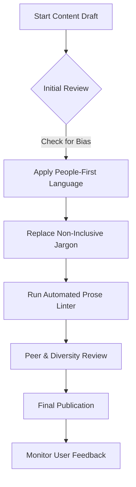

# Inclusive language

> A writing methodology that ensures technical documentation is respectful, accessible, and welcoming to diverse global audiences

---

## What is inclusive language?

Inclusive language is a writing style that focuses on eliminating bias and barriers to understanding. By avoiding terms that rely on gender, race, ability, or specific cultural references, you create content that focuses on the reader's task. In software development and product management, this practice is a key part of digital accessibility and information design.

Inclusive language is based on principles of cognitive science and human-computer interaction (HCI). When readers encounter exclusionary or outdated terminology—such as "master/slave" in software architectures or "sanity check" in testing—it can be distracting. This increases cognitive load and makes it harder for the reader to process information. Using neutral, respectful phrasing allows the reader to focus on instructions.

---

## Why it matters

Inclusive language is essential for global product expansion. For organizations managing globalization, internationalization, localization, and translation (GILT) workflows, non-inclusive phrasing creates friction. Idioms and culturally specific metaphors often do not translate well, which increases translation costs and reduces the quality of localized content. Prioritizing inclusive terminology during the drafting stage streamlines internationalization (I18n) and ensures that localization (L10n) feels natural to native speakers worldwide.

Exclusionary language can also alienate users and impact product adoption. When documentation assumes a user's gender or uses ableist metaphors, it can undermine trust. This often leads to a poor user experience, higher support volumes, and lower product value. Applying inclusive principles keeps users engaged and helps them complete tasks efficiently.

---

## Core principles

To implement inclusive language, focus on how you select words and frame instructions. Follow these three primary rules:

- **Use people-first language:** Focus on the person rather than a label or characteristic. Describe users with dignity and avoid terms that equate a person with a condition or background.
- **Use bias-free, neutral terminology:** Replace historically loaded jargon with precise, functional alternatives. This creates a professional environment for all developers and engineers.
- **Prioritize global accessibility and plain English:** Avoid regional idioms and metaphors. Use simple sentence structures to make documentation easier to parse for non-native English speakers.

---

## Implementation workflow

The following diagram illustrates the process of integrating inclusive language into a standard documentation lifecycle.



---

## Design pattern example

The following comparison shows how to refactor technical instructions to remove biased metaphors, ableist language, and gendered assumptions.

```text
[ Before / Non-Inclusive Pattern ]
--------------------------------------------------
To ensure the configuration is correct, perform a sanity check on the servers.
If a master node fails, the slave nodes will automatically drop their connections.
He must then manually run the script.

[ After / Inclusive Pattern ]
--------------------------------------------------
To ensure the configuration is correct, verify the server settings.
If a primary node fails, the secondary nodes will automatically drop their connections.
You must then manually run the script.
```

!!! tip "Tip: Use functional alternatives"
    Prioritize technical accuracy. Replacing social metaphors with functional words makes your documentation easier to understand for both human readers and translation software.

### Why these changes work

- **Functional substitution:** Replacing "sanity check" with "verify server settings" eliminates ableist terminology and provides a more precise technical instruction.
- **Objective architecture terms:** Swapping "master/slave" for "primary/secondary" (or "primary/replica") removes metaphors based on slavery and uses industry-standard engineering terms.
- **Second-person pronouns:** Replacing the gendered pronoun "he" with "you" improves clarity and addresses the user directly, as recommended by the Microsoft Writing Style Guide.

---

## Implementation best practices

To adopt inclusive language across your organization, use these strategies:

- **Audit repositories for legacy terms:** Scan your codebase and documentation for terms such as "whitelist," "blacklist," "master," and "slave." Replace them during regular maintenance.
- **Use "you" to address the user:** Address the reader directly. Avoid third-person singular pronouns ("he," "she," "his," "her") unless you are referring to a specific persona.
- **Align with Web Content Accessibility Guidelines (WCAG):** Ensure that images and diagrams have descriptive alternative text that avoids bias.
- **Use automated style checks:** Integrate prose linters into your "docs-as-code" pipeline to flag non-inclusive words during the pull request phase.

---

## Common anti-patterns

Avoid these mistakes when adopting inclusive language:

- **Performative over-correction:** Changing technical terms that are not biased or exclusionary can reduce clarity. Always prioritize technical accuracy.
- **Excessive passive voice:** Do not use the passive voice just to avoid gendered pronouns. For example, instead of "The button must be selected," use the active voice: "Select the button."

---

## How to validate usability

Verify that your content meets inclusive standards by using these strategies:

- **Automated linter audits:** Use tools with customizable rulesets to identify non-inclusive terms before merging changes.
- **Peer reviews:** Conduct reviews with team members from different backgrounds to identify regional jargon or cultural assumptions.
- **Translation testing:** Use translation tools to see how easily your phrasing translates into other languages. This helps identify text that may cause "translation friction."