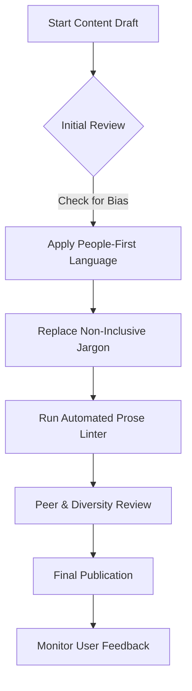

# Inclusive language

> A writing methodology that ensures technical documentation is respectful, accessible, and welcoming to diverse global audiences

---

## Defining inclusive language

Inclusive language removes bias and unnecessary barriers to comprehension. By stripping away terms tied to gender, race, or physical ability, writers create content focused purely on the user's objective. In software and product management, this is an extension of information design—ensuring that every reader, regardless of background, can execute a task without navigating linguistic obstacles.

The foundation of this approach lies in cognitive science. When a reader encounters exclusionary or outdated jargon—such as "master/slave" or "sanity check"—it creates cognitive friction. These terms distract from the technical instructions, forcing the brain to process cultural or historical baggage instead of the code. Using neutral, precise phrasing minimizes this load.

---

## Strategic impact

Inclusive language is a prerequisite for global scale. For organizations managing localization (L10n) and internationalization (I18n), non-inclusive phrasing introduces technical debt. Idioms and metaphors rarely survive translation; they inflate costs and result in localized content that feels "off" to native speakers. Aligning terminology during the drafting phase streamlines these GILT (Globalization, Internationalization, Localization, and Translation) workflows.

Beyond the technicalities of translation, exclusionary language erodes user trust. Documentation that assumes a user's gender or uses ableist metaphors can alienate entire demographics, leading to higher support volumes and decreased product adoption. Precise, inclusive language ensures that the focus remains on product value.

---

## Core principles

Three rules guide the implementation of inclusive language:

- **People-first phrasing:** Focus on the individual rather than a characteristic. Prioritize dignity and avoid equating a person with a specific condition.
- **Bias-free terminology:** Replace loaded historical jargon with functional alternatives. Precision creates a more professional environment for all engineers.
- **Global accessibility:** Stick to plain English. Avoid regional idioms that confuse non-native speakers and use simple structures to improve machine translatability.

---

## Implementation workflow

This diagram outlines how to bake inclusive language into the standard documentation lifecycle.



---

## Design pattern comparison

Refactoring instructions often requires swapping social metaphors for technical descriptions.

```text
[ Before / Non-Inclusive Pattern ]
--------------------------------------------------
To ensure the configuration is correct, perform a sanity check on the servers.
If a master node fails, the slave nodes will automatically drop their connections.
He must then manually run the script.

[ After / Inclusive Pattern ]
--------------------------------------------------
To ensure the configuration is correct, verify the server settings.
If a primary node fails, the secondary nodes will automatically drop their connections.
You must then manually run the script.
```

!!! tip "Tip: Use functional alternatives"
    Prioritize technical accuracy. Functional words make documentation easier to parse for both human readers and translation engines.

### The logic of the refactor

- **Functional Substitution:** "Verify settings" provides a clearer technical instruction than "sanity check" while removing ableist terminology.
- **Objective Architecture:** Using "primary/secondary" (or "primary/replica") replaces metaphors of human ownership with industry-standard engineering terms.
- **Direct Address:** Swapping the gendered "he" for "you" clarifies who is performing the action, as recommended by major industry style guides.

---

## Operationalizing inclusion

To move beyond manual checks, use these organizational strategies:

- **Audit legacy repositories:** Use scripts to scan codebases for terms like "whitelist," "blacklist," or "master/slave." Schedule these replacements during routine maintenance.
- **The "You" Standard:** Address the reader directly. This avoids the trap of third-person singular pronouns ("he/she") and makes the text more engaging.
- **WCAG Alignment:** Verify that alt-text for diagrams remains objective and free of gender or racial assumptions.
- **Automated Linters:** Integrate tools like Vale or Alex into your CI/CD pipeline to flag non-inclusive language during pull requests.

---

## Anti-patterns to avoid

- **Performative correction:** Do not change standard technical terms that carry no bias, as this can confuse users. Clarity remains the priority.
- **Passive voice traps:** Don't default to passive voice just to avoid pronouns. "Select the button" is better than "The button must be selected."

---

## Validation

Verify impact through these channels:

- **Linter Audits:** Use customizable rulesets to catch errors before they reach production.
- **Cross-functional Reviews:** Invite team members from different regions to identify jargon that may have been missed.
- **Translation Stress-Tests:** Pass content through translation software to identify "friction points" where metaphors or complex phrasing break the logic.