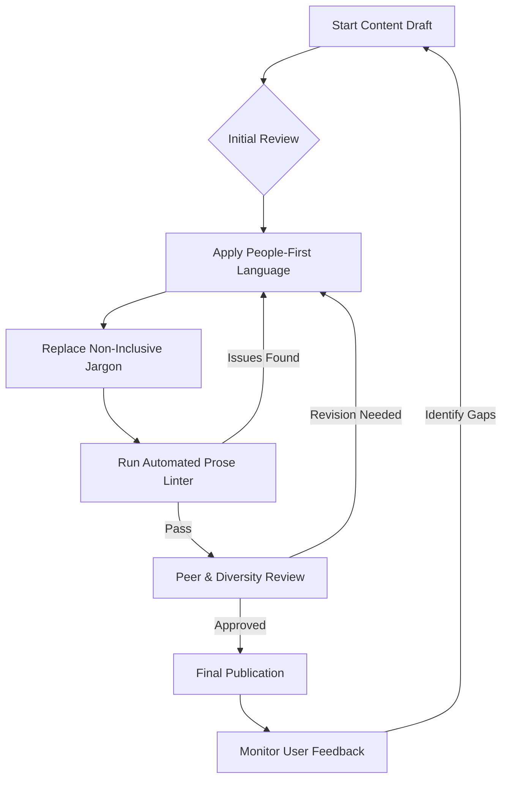

# Inclusive language

> A writing methodology that ensures technical documentation is respectful, accessible, and welcoming to diverse global audiences

---

## Defining inclusive language

Inclusive language removes bias and unnecessary barriers to comprehension. By replacing terms tied to gender, race, or physical ability with objective alternatives, writers create content focused purely on the user's objective. In software and product management, this is a core component of information design—ensuring that every reader, regardless of background, can execute a task without navigating linguistic obstacles.

The foundation of this approach lies in cognitive science. When a reader encounters exclusionary or outdated jargon—such as "master/slave" or "sanity check"—it creates cognitive friction. These terms distract from technical instructions by invoking cultural or historical baggage. Using neutral, precise phrasing minimizes this cognitive load and keeps the user focused on the technical implementation.

---

## Strategic impact

Inclusive language is a prerequisite for global scale. For organizations managing localization (L10n) and internationalization (I18n), non-inclusive phrasing introduces technical debt. Idioms and metaphors rarely survive translation; they inflate costs and result in localized content that is confusing or offensive to native speakers. Aligning terminology during the drafting phase streamlines GILT (Globalization, Internationalization, Localization, and Translation) workflows.

Beyond translation, exclusionary language erodes user trust. Documentation that assumes a user's gender or uses ableist metaphors can alienate demographics, leading to higher support volumes and decreased product adoption. Precise, inclusive language ensures that the focus remains on product value and technical accuracy.

---

## Core principles

Three rules guide the implementation of inclusive language:

- **People-first phrasing:** Focus on the individual rather than a characteristic. Prioritize dignity and avoid equating a person with a specific condition (e.g., use "users with visual impairments" rather than "the blind").
- **Bias-free terminology:** Replace loaded historical jargon with functional alternatives. Precision creates a more professional environment for all engineers.
- **Global accessibility:** Stick to plain English. Avoid regional idioms and use consistent grammatical structures to improve machine translatability and comprehension for non-native speakers.

---

## Implementation workflow

This diagram outlines the iterative process of integrating inclusive language into the documentation lifecycle.



---

## Design pattern comparison

Refactoring instructions requires swapping social metaphors for technical descriptions that accurately reflect system architecture.

```text
[ Before / Non-Inclusive Pattern ]
--------------------------------------------------
To ensure the configuration is correct, perform a sanity check on the servers.
If a master node fails, the slave nodes will automatically promote a new leader.
He must then manually run the script.

[ After / Inclusive Pattern ]
--------------------------------------------------
To ensure the configuration is correct, perform a smoke test on the servers.
If a primary node fails, the replica nodes will automatically elect a new leader.
You must then manually run the script.
```

!!! tip "Tip: Use functional alternatives"
    Prioritize technical accuracy. Terms like "Allowlist/Denylist" and "Primary/Replica" are more descriptive of actual software behavior than their biased predecessors.

### The logic of the refactor

- **Technical Precision:** "Smoke test" or "Confidence check" provides a clearer technical instruction than "sanity check," which is an ableist metaphor for basic functional verification.
- **Objective Architecture:** Using "Primary/Replica" (or "Leader/Follower") replaces metaphors of human ownership with industry-standard engineering terms that describe data relationship and hierarchy.
- **Direct Address:** Swapping the gendered "he" for the second-person "you" clarifies the actor and aligns with the Microsoft and Google technical style guides.

---

## Operationalizing inclusion

To move beyond manual checks, use these organizational strategies:

- **Audit legacy repositories:** Use regex-based scripts to scan codebases and documentation for terms like "whitelist," "blacklist," or "master/slave." Schedule these replacements during routine maintenance or breaking-change windows.
- **The "You" Standard:** Address the reader directly. This avoids the trap of third-person singular pronouns ("he/she") and simplifies sentence structure.
- **WCAG Alignment:** Ensure alt-text for diagrams remains objective, focusing on the logical flow rather than the physical appearance of icons or personas.
- **Automated Linters:** Integrate tools like **Vale** (using the `Microsoft` or `Google` styles) or **AlexJS** into your CI/CD pipeline to flag non-inclusive language during the Pull Request (PR) phase.

---

## Anti-patterns to avoid

- **Performative correction:** Do not change standard technical terms that carry no bias (e.g., "Parent/Child" in tree structures), as this can confuse users. Clarity remains the priority.
- **Passive voice traps:** Do not default to passive voice to avoid pronouns. "The button should be clicked" is less effective than "Click the button."

---

## Validation

Verify impact through these channels:

- **Linter Audits:** Use customizable YAML rulesets to catch specific banned terms before they reach the main branch.
- **Cross-functional Reviews:** Invite team members from different regions to identify "hidden" jargon or idioms.
- **Translation Stress-Tests:** Use machine translation (MT) to check if technical instructions remain logically sound when translated into target languages.